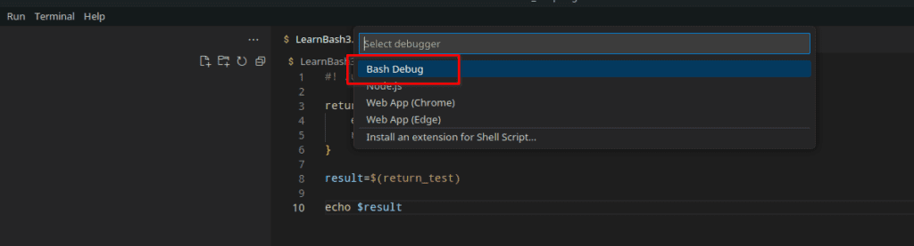
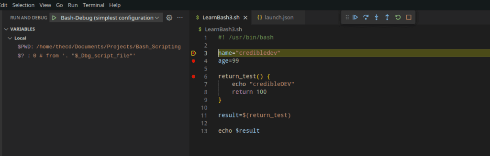
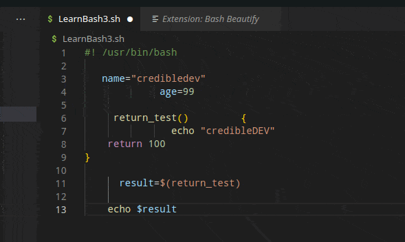
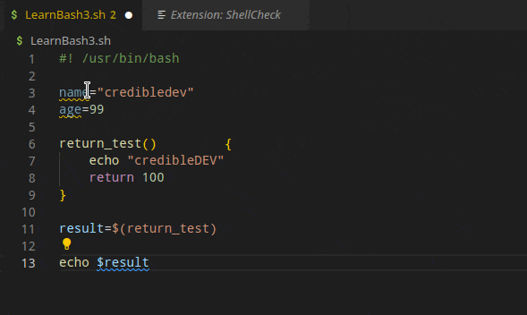

Have you been following our [Beginner's Guide to Bash Scripting](https://credibledev.com/beginners-guide-to-bash-scripting/) series? If not, check it out.

I do most of my programming in all languages using Visual Studio Code (VS Code) on Linux. I enjoy how easy it is to use as well as some of the integrations it offers, but also the extensions that are available. For Bash, there are quite a few extensions available that will extend VS Code to make your coding more efficient and error-free. We are going to take a look at 3 of those Bash extensions today.

If you don't have VS Code installed on Linux yet, check out our [guide](https://credibledev.com/install-vs-code-on-manjaro-linux/) to get started.

## 1\. Bash Debug

The first extension that we are going to look at is [Bash Debug](https://marketplace.visualstudio.com/items?itemName=rogalmic.bash-debug), which is exactly what it sounds like, a debugger for Bash. It has over 500,000 downloads from the VS Code marketplace to date. First, you need to install it from the marketplace, then **restart VS Code**. Next, head to the "Run" option found in the menu and choose "Start Debugging". A menu will pop out where you can select "Bash Debug". Alternatively, you can press F5 on your keyboard to get the same option.

Once you run the Debug Bash, your interface will change to the debugger view. Here you will have options to control the debugging process. You will be able to add standard breakpoints and conditional breakpoints, log messages, and more.

If you write complex bash scripts, the Bash Debug extension is a must-have for your toolkit. It also works with Windows if you're using WSL.

## 2\. Bash Beautify

The next extension on our list is [Bash Beautify](https://marketplace.visualstudio.com/items?itemName=shakram02.bash-beautify&ssr=false#review-details), which is a code formatting helper. This extension has over 400,000 downloads and a 3-star rating. Most of those ratings are over a year old and stated that it wasn't working. I use this extension without any issues so it appears the developer has resolved those problems.

Maybe you are working on existing code that is poorly formatted or you prefer to let an extension clean up your own code, this extension is for you. Simply install the extension, then use the default formatting keybinding to run it "Ctrl+Shift+I", unless you have customized that keybinding.

Many plugins also suggest an error-checking plugin, which we will discuss next.

## 3\. ShellCheck

[ShellCheck](https://marketplace.visualstudio.com/items?itemName=timonwong.shellcheck) is a linter for Bash scripts that works really well in VS Code to provide some helpful error checking and suggestions as you code. It also has over 500,000 downloads from the marketplace and a 5-star rating. The necessary shellcheck binary is included by default in more recent versions, so you can just install it from the marketplace, no restart needed. It offers various configuration options such as excluding certain checks or auto-fixing on save.

What VS Code extensions do you like using for bash shell scripting? Let me know in the comments.
