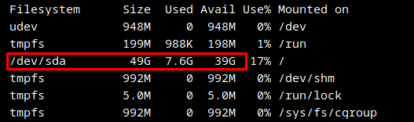
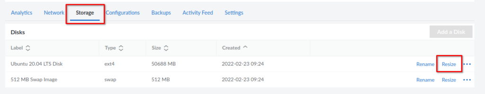
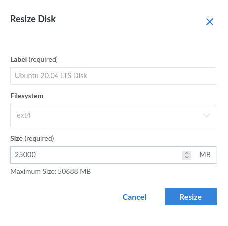
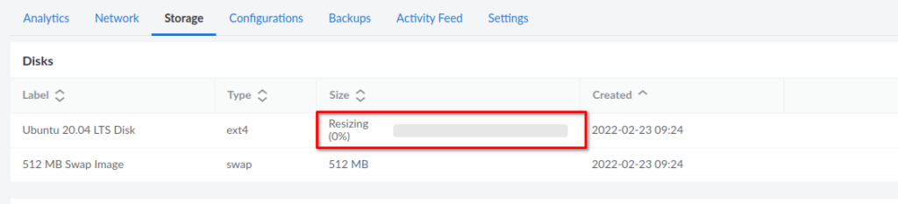
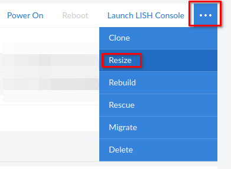
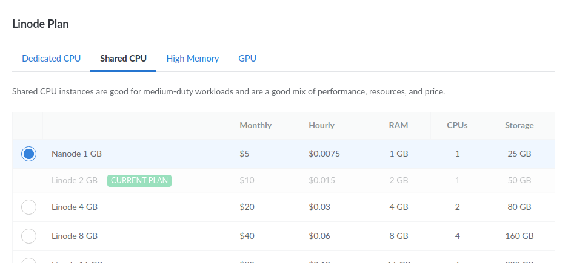
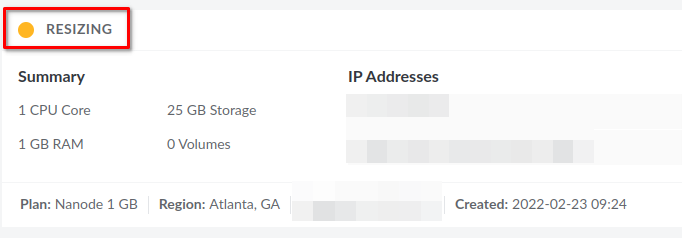

Need to downgrade a Linode server? No longer need a large Linode plan? Not using all of that storage, RAM, or CPU like you thought you would? Maybe the workload of your Linode server has changed. In any case, you can easily downgrade the plan that you use on Linode.

If you are thinking about using Linode but don't have an account yet. Take advantage of the [free $100 60-day credit using this link.](https://www.linode.com/lp/refer/?r=25859d5135efc6f773fd56ab42ec3e7a1cc5e83b) Plus, you’re helping me to keep creating content.

Upgrading on Linode is even easier since Linode handles resizing the disk for you. However, when downgrading, there is just a small amount of manual work required.

- Check how much storage you currently use.

- Are you using less storage than the plan you want to downgrade to allows?

- If you are, resize the disk.

- Now you can downgrade the Linode plan you are on.

It's not too bad and I'll walk you through resizing your Linode step by step and then how to downgrade a Linode plan. Let's get started.

## Check Linode Storage Usage

We first need to check that we are not using more space than the small Linode we want to downgrade to allows. In this case, we are downgrading from the 2GB Linode, which offers 50GB of storage space, to the smaller 1GB Linode which offers 25GB of storage.

We can check the current amount of storage that we are using by connecting to the Linode server via SSH and running the following command.

```
df -h
```

The "-h" option will print the drive space in gigabytes so it's easier to read. After running this command, a disk usage summary will be printed out. We are interested in this one: "/dev/sda".



We can see that in our case, we are only using 7.6 gigabytes of space. So we are under the 25GB limit of the Linode plan we want to downgrade to. This means we can proceed with downgrading. If you are over the limit of the smaller plan, you will want to delete data that may no longer be needed or consider that a downgrade is not an option.

## Resize Linode Storage

The next step in the process is to resize the disk to match the plan we are downgrading to. In our case, this will be 25GB. Head over to the Linode dashboard for your server.

You will have to power off your server in order to resize the current disk. So go ahead and power it down.

Once your server is powered down, click the Storage link in the Linode dashboard. You should then see your disk listed along with a resize button.



Go ahead and click on resize, then type in the new disk size, for our example this will be 25GB.



Once this is done, you will see a bar that will update you with the progress of the resize. Once this is finished, you can proceed with the downgrade in the Linode Dashboard.



## Downgrade a Linode Plan

Now you are finally ready to downgrade or change the Linode plan that your server uses. From the Linode dashboard, click the 3 dots at the top right to drop down the menu. Make sure you are on the Linode instance that you want to change the plan for. Choose to resize from the menu.



You will get a popup that lists the available Linode plans, choose the one you wish to downgrade to.



After starting the resize of your Linode, it may take a minute or two before you see anything happen, but soon you will see the status change to resizing.



Once the resizing is finished, your Linode server will be returned to the last state it was in, so it may be powered off. Go ahead and power the server on and confirm everything is working as expected, such as SSH and whatever services you were running.

## Conclusion

That wasn't too bad, right? You have successfully downgraded and resized your Linode server. Upgrading is much easier, as Linode will dynamically resize the disk to be larger for you.

Have questions about Linode? Let me know in the comments. Don't forget to check out the [Linode series](https://credibledev.com/create-a-linode-linux-vps/) if you're interested in setting up your own Linode Linux VPS.
