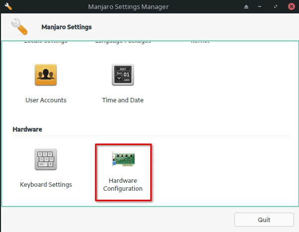
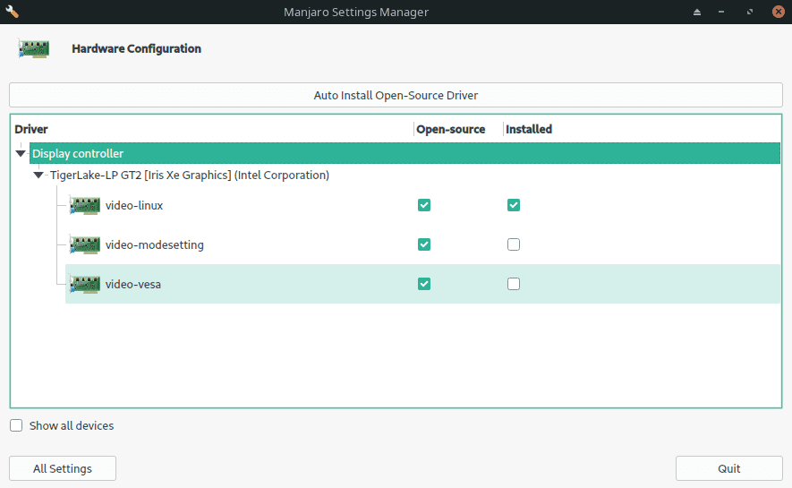
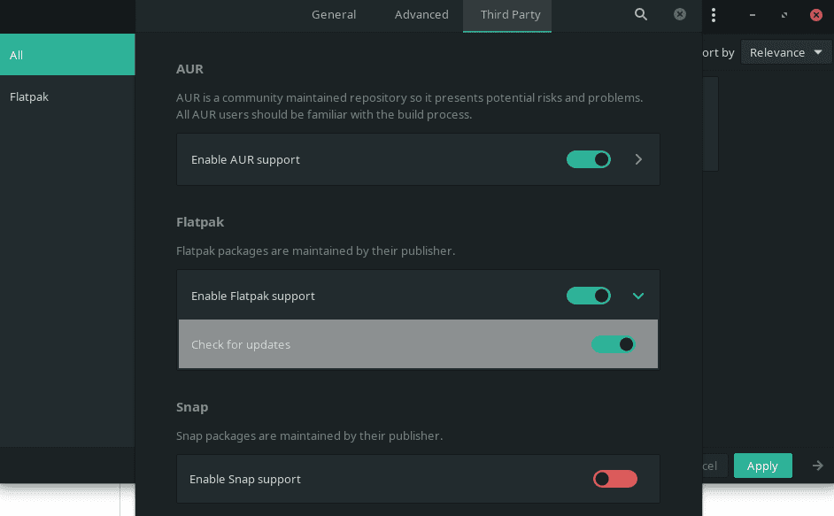
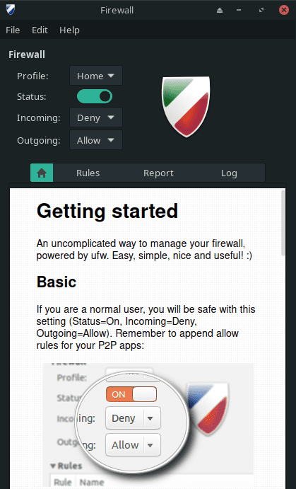
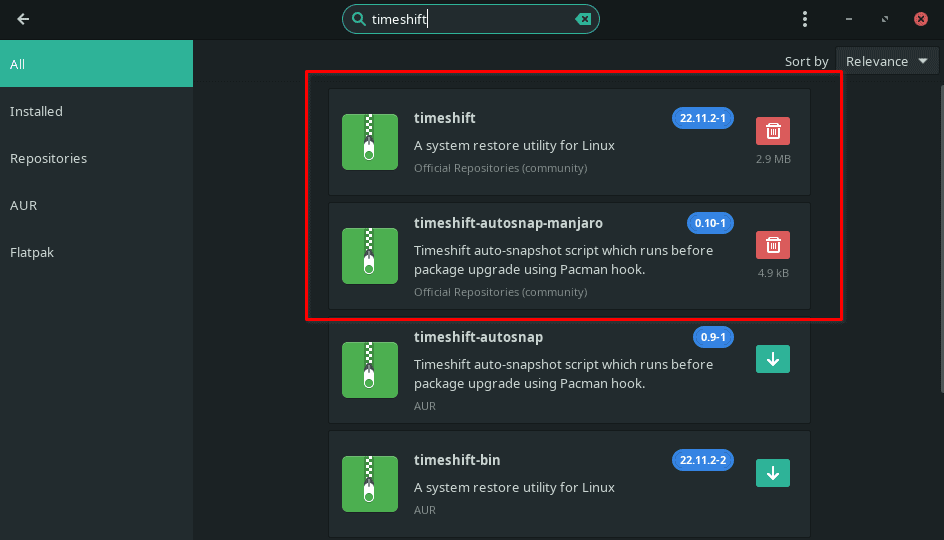

Manjaro is one of the most popular Linux distributions based on data from [DistroWatch](https://distrowatch.com/table.php?distribution=manjaro) and their very active online communities such as Reddit. I personally use Manjaro on my daily laptop PC and I have found it to be not only reliable but easy to use and install the necessary software on. Since Manjaro is derived from Arch Linux, many new users shy away from it, but I think this may be a mistake. Sure, Ubuntu is great for new users but I do not agree that it delivers the best all-around experience.

It's true that you can heavily customize Manjaro, but you don't have to. You can start using it, leaving everything at its default, and have a great experience. In that aspect, it's not more difficult to set up, install or use than Ubuntu.

So if you decide to give Manjaro Linux a try, I'm going to cover some of the first things you should do once the installation is complete. By the way, I would suggest starting with the KDE Plasma or XFCE versions, unless you just love Gnome or prefer something more advanced like the i3 WM.

## 1\. Update the System

In Manjaro you can update the system using Pamac but the one universal way to do it is through the terminal. Pop open a fresh terminal and run the following commands to first update your mirrors so the downloads are fast and then update all of the packages.

```
sudo pacman-mirrors --fasttrack
sudo pacman -Syu
```

After this, your mirror list will be updated to include the fastest mirrors for you and the system will be up to date. You may be required to reboot, I would suggest doing this even if you're not required.

## 2\. Install Additional Drivers

This is particularly important if you have an AMD or NVIDIA GPU in your system. You may want to install the proprietary drivers for improved performance. To install these drivers, you can use the Manjaro Settings Manager. If you installed KDE or XFCE, you will find the app under Settings. Once you launch the Manjaro Setting Manager, you will then use the Hardware Configuration option to install the drivers.



Inside the Hardware Configuration app, you will find the option to install additional drivers if there are any for your device.



## 3\. Enable Flatpak

Flatpak is an amazing addition to any Linux setup, it allows you to easily install many popular software packages the way the developer intended. This means the app will run on any Linux system without issues like incorrect dependencies or mismatched versions. If it's available as a Flatpak, use that version over one from the AUR or official Manjaro repository.

To enable Flatpak on Manjaro, you can use the command line or pamac. In Pamac, you'll find it under Preferences -> Third Party. While you're there, you may want to consider enabling the AUR and Snap support but only install packages from these if you can't find them elsewhere.



```
sudo pacman -S flatpak
```

If you install flatpak from the command line, you will want to enable the Flathub repository as this is where you will find most of the popular flatpak packages.

```
flatpak remote-add --if-not-exists flathub https://flathub.org/repo/flathub.flatpakrepo
```

## 4\. Install Software

Now you will want to install your favorite software. Try to find the software on [Flathub](https://flathub.org), this will give you the best experience for most applications. You can also use Pamac to install software, try to avoid the applications from the AUR if you can help it. Applications from the AUR may work fine but sometimes they can be problematic and break other applications when new dependencies are installed. The instances are rare but can be totally avoided by using Flatpaks.

Here are a few examples of software I install on any new Manjaro setup that I do.

### Microsoft Edge

```
flatpak install flathub com.microsoft.Edge
```

### VS Code

```
flatpak install flathub com.visualstudio.code
```

### OBS Studio

```
flatpak install flathub com.obsproject.Studio
```

### Discord

```
flatpak install flathub com.discordapp.Discord
```

### Flatseal

Flatseal is a must because it allows you to manage permissions that Flatpack applications have on your system. This allows you to loosen or tighten the restrictions on the application's sandbox.

```
flatpak install flathub com.github.tchx84.Flatseal
```

## 5\. Install Microsoft Fonts

You may be opening Microsoft Word documents or applications that are designed for using Microsoft fonts on your Linux machine, these fonts are not included by default. This is one instance where you will want to use the AUR. If you don't already have the AUR helper yay installed, I've included the command below to install it as well as the Microsoft True Type Fonts as well.

The second command which builds and installs the MS Font package will take a while to run as it's compiling everything required. Afterward, if you open something like OnlyOffice or LibreOffice, you will find that you now have these fonts available.

```
sudo pacman -S yay
yay -S ttf-ms-win10-auto
```

## 6\. Enable the Firewall

By default, Manjaro will come with ufw installed and depending on the ISO and WM, you will have Gufw installed as well. Gufw is the GUI frontend that makes using ufw easier. You will find it under settings as "Firewall Configuration". You can also work with ufw and gufw from the command line.

The default configuration will be to block all incoming and allow all outgoing which is fine for most setups. You may need to add additional firewall rules if you have services such as MySQL or Apache running on the machine that need to be open to external access.

```
sudo ufw enable
sudo gufw
```



## 7\. Configure Backups

Last but certainly not the least important is to set up backups. The easiest way to do this is using TimeShift, which can be installed through pamac or the command line from the official Manjaro Repository.



```
sudo pacman -S timeshift
```

## 8\. Install a VPN

Everyone should consider using a VPN to protect their device and information. Add a layer of protection between the prying eyes of the government, your ISP, and others by using an encrypted tunnel that a VPN provides. There are many ways to set up a VPN on Manjaro and most large VPN providers have instructions for Installing their VPN on Linux so follow their guides to do so.

I use ExpressVPN and have a guide for installing it which you can find [here](https://credibledev.com/install-expressvpn-on-manjaro-linux/).

## Want More App Suggestions?

Check out the list of [my favorite Manjaro apps](https://credibledev.com/favorite-manjaro-apps/).

## Conclusion

Those are 8 things everyone should do after installing Manjaro on their PC. There are many other things you may want to do after installation, let us know in the comments what you do after a fresh install.
