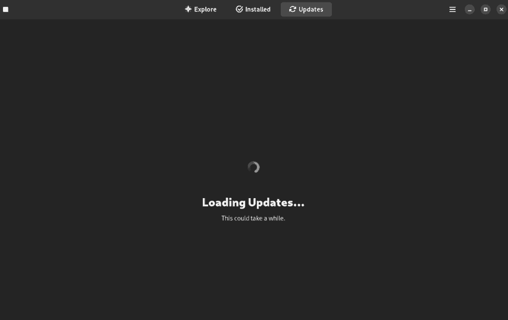
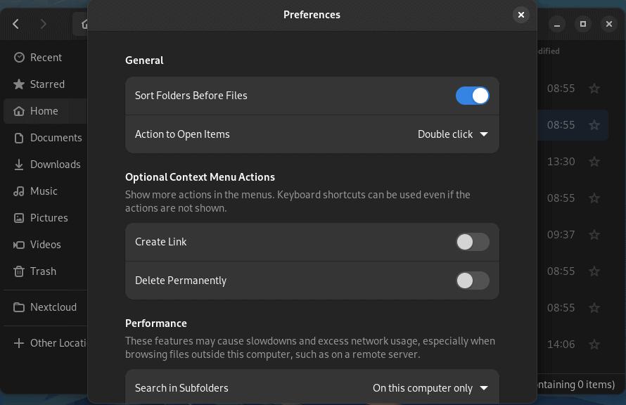
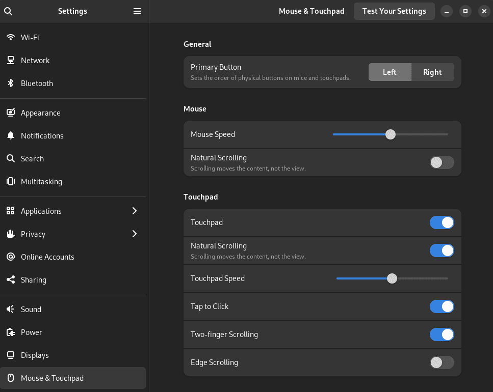

[Fedora 37](https://getfedora.org/) was released in November of 2022, and since then it has gained a lot of attention. Fedora supports Flatpaks by default and is running the latest Gnome desktop environment which is version 43 at this time. While it does run Gnome by default, you can find Fedora Spins with alternative desktop environments such as KDE Plasma and XFCE.

Fedora is an excellent option for new users and seasoned users as well. Many developers with plenty of experience with Linux choose Fedora for the availability of apps, ease of use, and stability.

Given how great Fedora 37 is out of the box, there are still some things you might want to do after getting it installed. You might be asking yourself, what should I do after installing Fedora? Below, you will find 9 things to do after installing Fedora.

## 1\. DNF Configuration

DNF is the package manager used by Fedora, which stands for "Dandified YUM". It works great out of the box but there are some tweaks you can make to improve the experience and get faster downloads. You will need to open up the configuration file using "sudo" to make the necessary edits.

```
sudo nano /etc/dnf/dnf.conf
```

At the end of the file, add these lines.

```
max_parallel_downloads=10
fastestmirror=true
```

Max\_parallel\_downloads will increase the number of file downloads that can be run simultaneously, the default is 3 and the max value is 20. The fastest mirror will set the best mirror based on location.

## 2\. Update the System

One of the first things you should do on any OS after installation is to check for any updates and install those. Packages could have security vulnerabilities that updates have been released for, so it's important to get them installed right away.

```
sudo dnf update && sudo dnf upgrade
```

You can also update the system using the graphical Software Manager.



## 3\. Add Flathub Repo

Fedora has decided to only allow a limited number of packages from the growing Flathub repo by default. This will be changing in Fedora 38 but for now, we need to add the full Flathub repo to get access to all of the great packages there.

```
flatpak remote-add --if-not-exists flathub https://flathub.org/repo/flathub.flatpakrepo
```

## 4\. Enable RPM Fusion Repo

There is some software that RedHat cannot include in Fedora but you can get through the RPM Fusion Repo instead. Software like VirtualBox, VLC, and others. The code below will add both the free and non-free repos.

```
sudo dnf install https://mirrors.rpmfusion.org/free/fedora/rpmfusion-free-release-$(rpm -E %fedora).noarch.rpm https://mirrors.rpmfusion.org/nonfree/fedora/rpmfusion-nonfree-release-$(rpm -E %fedora).noarch.rpm
```

## 5\. Install Gnome Tweaks and Gnome Extensions

I think that Gnome is somewhat boring and lacking in useful UI features. Luckily, many others feel the same way so we have Gnome Tweaks and the Gnome Extensions app to help us get the UI we want.

```
sudo dnf install gnome-tweaks gnome-extensions-app
```

You can find some cool extensions here: [https://extensions.gnome.org/](https://extensions.gnome.org/)

One that I always install is Dash to Dock, give it a shot and see if you like it.

## 6\. File Manager Tweaks

By default, the file manager does not list directories first. I find this annoying so I always change that right away. If you open the file manager and go to preferences, you will find the option "Sort folders before files", tick that on and you'll be good to go.



## 7\. Enable Tap to Click

If you are on a laptop and using a trackpad, you may want a tap on the trackpad to be registered as a click. If so, you can enable that in the settings under "Mouse & Trackpad". There you will find the tap-to-click option, which you can enable.



## 8\. Install a Different Desktop Environment

Fedora comes with Gnome by default, but that doesn't mean that you can't try out different desktop environments like KDE Plasma and XFCE though. Personally, I prefer KDE over XFCE but both are great. If you don't like how Gnome operates, give one of these a try.

### KDE

```
sudo dnf install @kde-desktop-environment
```

### XFCE

```
sudo dnf install @xfce-desktop-environment
```

You can get a full list of desktop environments that Fedora has available by running this command.

```
dnf group list --available *desktop
```

## 9\. Install Some Apps

You're ready to get started enjoying your new Fedora 37 system, so go ahead and install some apps. You can install software using DNF, Flatpak from the command line, or find your favorite app using the Software Manager interface.

Here are some apps that I almost always install on every system.

- Flatseal - Manage Flatpak app permissions.

- OB Studio - For recording YouTube videos.

- Kdenlive - For editing YouTube videos.

- Spotify

- Boxes - Easily run Virtual Machines.

- Remmina - For remote desktop.

## Conclusion

What are your favorite apps to run on Fedora? Have any tweaks or modifications that I missed? Let me know!
