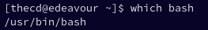
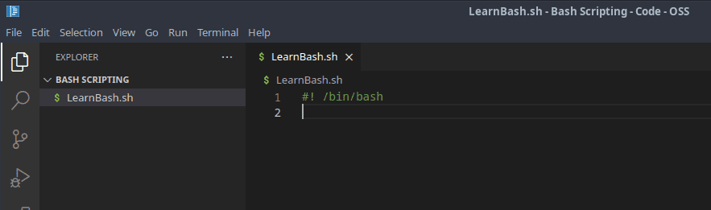
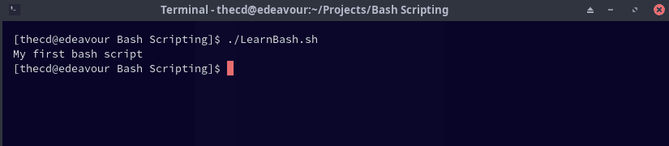
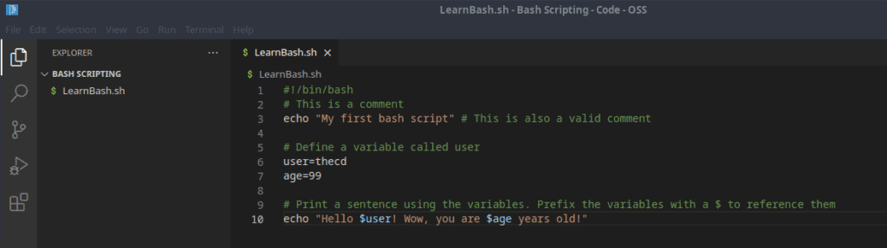
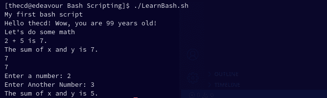

Are you tired of manually performing repetitive tasks on the command line? Well, have no fear because bash scripting is here! This beginner's guide to bash scripting will take you from a basic command line user to a bash scripting pro in no time. Say goodbye to manual labor and hello to automation. Whether you're a seasoned developer or just starting out, this guide will provide you with the fundamentals of bash scripting and how to use it to streamline your workflow. So, grab a cup of coffee, get comfortable, and let's dive into the exciting world of bash scripting!

This guide is part of a series, be sure to check out the other parts as well.

- Part 1 - Introduction to Bash, Variables, Comments, User Input (This Page)

- [Part 2 - If/Else Statements, Looping](https://credibledev.com/part-2-beginners-guide-to-bash-scripting/)

- [Part 3 - Functions in Bash](https://credibledev.com/part-3-beginners-guide-to-bash-scripting/)

- [Part 4 - Creating Menus in Bash](https://credibledev.com/part-4-beginners-guide-to-bash-scripting/)

## What is BASH Scripting?

Imagine being able to automate all those tedious, repetitive tasks you do on the command line. No more typing the same commands over and over, no more manual labor! Bash scripting allows you to write a series of commands in a script file and run it as many times as you want, with just one command. It's like having a personal assistant that takes care of the boring stuff for you. With bash scripting, you can turn a 30-minute task into a one-minute task. Trust me, your future self will thank you. It's not just about saving time, though - bash scripts can also help you streamline complex tasks and make them more reliable. Whether you're a sysadmin, a developer, or just a power user, bash scripting is a must-have tool in your toolkit.

## Getting Started with Bash Scripting

To follow this beginner's guide to bash scripting, all you need is a Linux computer or virtual machine and a text editor of your choice. Gather your tools and let's get started.

At the start of every bash script, you will find something that looks like this "#! /bin/bash". This line points to the interpreter that should be used, in this case, bash. This line is commonly referred to as "shebang", so if you hear this term, this is likely what they are referring to, or at least the "#!" portion of the line. The "/bin/bash" portion is the location on the filesystem where bash is found. This could vary from system to system, you can verify the location by opening a terminal on your machine and running the following command.

```
which bash
```

This should return the location of bash on your system.



Now that you know where bash is installed, you can add the first line to your bash script. Your bash script should use the file extension ".sh". In your editor of choice, add the shebang line as shown below. Be sure to update the path to match where bash is installed on your system. The editor I'm using here is the open-source version of Visual Studio Code, which doesn't include anything proprietary from Microsoft, it's referred to as Code-OSS.



### Comments in Bash

Let's add a bit more to our first bash script before we try executing it. First, we will add a comment. Comments in bash scripts generally start with the hash symbol, followed by the comment. There are methods for multi-line comments but they are typically avoided as they are difficult to discern from other code. So the single-line comment method is generally preferred by most. Let's add a couple of comments.


As you can see, I've added two comments to the script. The first one is on its own line, while the second is on the same line as an echo statement. Both of these comments are legal in bash scripts. The echo command, if you're not familiar, outputs text to the screen. So in this case, "My first bash script" will be printed to the terminal screen without the quotes.

### Making a Bash Script Executable

Now that we have our first bash script, we need to make it executable before we can use it. You can make a bash script executable by using the [chmod](https://credibledev.com/chmod-syntax-in-linux/) command. The "+x" option is what is setting our bash script as executable in the command below. Open up your terminal and run this command, replacing the file name with the name you chose for your bash script.

```
chmod +x LearnBash.sh
```

### Running a Bash Script

Now that we have made our bash script executable, we can run it from the terminal. To do so, run the following in your terminal window, remember to replace the name of the file with your file name.

```
./LearnBash.sh
```



As you can see, the comments were not printed on the screen, only the text that was echoed. Congrats, you have created and executed your first bash script.

## Fundamentals of Bash Script Syntax

Now that we have gotten our feet wet with the first bash script, it's time to expand the functionality. Maybe you have been programming in other languages such as Python or Javascript, you'll be happy to know that things such as conditionals, variables, and functions exist in bash scripts as well. So let's go over how to implement them.

### Using Variables in Bash

If you are unfamiliar with variables, to put it in simple terms, they hold data. A variable is made up of a variable name and a value. This value could be a letter, multiple letters, a sentence, numbers, etc. Variables are a handy way to reference this data by a meaningful name. They also make your code easier to understand when used appropriately. Wherever we use the variable, it will be replaced with the data that we stored in it.

Let's create a couple of variables in our bash script. To properly set a variable, on a new line, you will enter a variable name followed by an "=" and then the value. You should not have any space between the variable name, the "=" and the value. If your value has spaces, wrap it in quotes.

```
#!/bin/bash
# This is a comment
echo "My first bash script" # This is also a valid comment

# Define a variable called user
user=thecd
age=99

# Print a sentence using the variables. Prefix the variables with a $ to reference them
echo "Hello $user! Wow, you are $age years old!"
```



In the code shown above, we set two variables, one for user and another for age. We then echo those variables out and use them in a sentence.

### Math in Shell Scripts

It's common to use calculations of all sorts in programming and you can use the various arithmetic operators in bash to do the same thing. Let's take a look at the available operators and their meanings, then we will look at the usage syntax.

##### Bash Basic Arithmetic Operators

<table><tbody><tr><td>+</td><td>Addition (1+2)</td></tr><tr><td>-</td><td>Subtraction (2-1)</td></tr><tr><td>/</td><td>Division (10/5)</td></tr><tr><td>*</td><td>Multiplication (2*5)</td></tr><tr><td>**</td><td>Exponentiation (10**2)</td></tr><tr><td>%</td><td>Modulus (15%4)</td></tr></tbody></table>

There are a few different ways that you can use these arithmetic operators in a bash script. I find myself using the following method much of the time, mostly because it's the first way that I learned. If you wanted to store the sum of the numbers 2 and 5 into a variable called sum, you could use the following.

```
sum=$((2+5))
```

Another way of doing the same thing is with "let".

```
let sum=2+5
```

We can also use "expr" for this as well.

```
sum=`expr 2 + 5` # Must use a space between the numbers and the operator as shown.
```

```
#!/bin/bash
# This is a comment
echo "My first bash script" # This is also a valid comment

# Define a variable called user
user=thecd
age=99

# Print a sentence using the variables. Prefix the variables with a $ to reference them
echo "Hello $user! Wow, you are $age years old!"

# Exploring Math Operators
echo "Let's do some math"
x=2
y=5
echo "$x + $y is $(($x+$y))."

# We can also set the result of a math operation as the value of a variable
sum=$(($x+$y))
echo "The sum of x and y is $sum."

# Do the same thing using let
let sum2=2+5
echo $sum2

# Same calculation using expr instead
sum3=`expr 2 + 5`
echo $sum3
```


### Get User Input with Bash

A really useful feature of any scripting language is to get input from the user. This is really simple to do with bash scripting so let's add that functionality to our script using the "read" command. In the below example, we will prompt the user to enter a number, and then store the value they enter into a variable named "x". Here you will see the use of "-p" with the read command which is what tells it to prompt the user.

```
# Let's get some user input
read -p "Enter a number: " x
read -p "Enter Another Number: " y
sum=$(($x+$y))
echo "The sum of x and y is $sum."
```



Check out [Part 2 of the Beginners Guide to Bash Scripting](https://credibledev.com/part-2-beginners-guide-to-bash-scripting/), where we discuss if/else statements and loops.

That's it for part 1 of the beginner bash script series. Be sure to check back here soon for part 2, where we will discuss the following topics.

- If/Else Statements

- Looping
