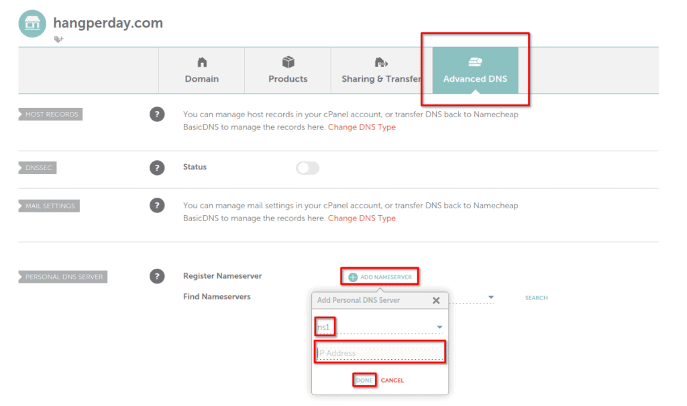

Let's be honest, there are tons of web hosting providers out there who all claim to be the best, the fastest, or offer the most extras. Trying to weed through all of the providers and all of the opinions of folks on YouTube and blogs isn't easy either. It will likely leave you feeling cheated or confused. So I'm going to throw my hat into the ring of who is the best web hosting provider for WordPress using my own experience with 3 different providers. The option I'm going to give you isn't just the best hosting provider for WordPress sites though, you can host all sorts of sites or servers. Maybe you have a guess of where I'm going here.

https://www.youtube.com/watch?v=Ulm3ardtm7A

## The Backstory of My Web Hosting Journey

For a little background, I originally hosted my sites with Vultr, which is a cloud service provider much like AWS, Azure, and others, just on a smaller scale I would say. Vultr allowed you to set up a Linux or Windows virtual private server, also known as a VPS. Vultr was OK, but I found myself running into issues with the IP being blacklisted or on spam lists, which hurts email delivery and SEO.

After some time, I decided to try out Linode for hosting my websites and other projects. My decision was based on the many YouTubers who recommended them on basically every channel I watched. I was able to give them a try using a new customer credit at the time so I wasn't losing much.

Long story short, I have stuck with Linode for years now. Not just for typical web hosting, like a WordPress site, but also for many personal projects that ran on Node JS or Python Flask. You can really do almost anything with a cloud VPS because the server is in your full control. Unlike many shared hosting providers who limit you on the types of services or apps that you can host on their service. Shared hosting is getting better, I'll give them credit for that, you can now host other types of web apps on many shared hosts, but it's still limited in comparison.

I said long story short, but here I am, still going on. Let's cut to the chase here. I've been hosting this website on Linode since I started it. Using a Linux VPS that I set up from scratch, running on Apache. I had grown dissatisfied with the speed of my site, so I set out to try one of the most commonly recommended WordPress hosts, Bluehost. I didn't go for the cheapest plan, I picked a middle-of-the-road plan, so I expected decent results. Sadly I didn't get the results I would have expected and my WordPress site performance was even worse than on my Linode VPS.

So here I am, upset with my decision but also not satisfied with the old solution either, what do I do? All I want is reliable, secure, and fast web hosting for my WordPress site. After some research, I discovered a website panel called CyberPanel. My last server on Linode was set up completely by hand so there were probably some optimizations missing that could have made it better. I read plenty of great reviews about CyberPanel, especially since it uses OpenLiteSpeed as the web server back-end.

So back to Linode I go, to set up a brand new server and I wasn't surprised to find that Linode has CyberPanel in the marketplace. This means, I don't have to manually set up this server and I also don't have to worry about the install steps and requirements of CyberPanel. Linode took care of everything and the setup was simple. Within about 20 minutes, my new Linode was ready to be the new web host for my WordPress site.

Not only was the setup fast and easy, but my website is also blazing fast thanks to OpenLiteSpeed and the LS-Cache plugin. Couple that with Cloudflare, and you can't beat it in my opinion.

Let's go over the steps to get CyberPanel set up on Linode so you can be your very own, and fast WordPress web host.

## Setup a New CyberPanel Server on Linode

The first step here is going to be getting a Linode account if you don't already have one. I have an offer listed here that will get you a free $100 credit to use within 60 days. You can use it if you wish, I will get a little money in my pocket if you stick with them and spend a little of your own money. You can also just head straight to Linode.com as well if you wish, I don't mind.

Take advantage of the [free $100 60-day credit using this link.](https://www.linode.com/lp/refer/?r=25859d5135efc6f773fd56ab42ec3e7a1cc5e83b) Plus, you’re helping me to keep creating content.

Once you have your Linode account set up, you should see a green button in the middle of the screen that allows you to create a new Linode. If you already have a Linode, the button to create a new Linode will be at the top right of the page and the top left.

Once you're on the screen to create a new Linode, you want to choose the Marketplace tab and find CyberPanel. You can find it under popular apps or type "cyberpanel" into the search box. Go ahead and click on it once you find it.

After you have selected CyberPanel, scroll down the page and choose your image. I recommend choosing the Ubuntu 20.04 LTS option for your VPS OS. Pick a region that is close to where your customers will be. Next, you will pick the plan for your Linode. Based on my experience, you should choose at least the $10 2GB plan for good performance.

Go ahead and give your server a label, this can be whatever you wish. After this, set a secure root password and the rest of the options can be left as they are. When you are finished, go to the bottom of the page and click on the "Create Linode" button.

Now we wait, go get a cup of Coffee, or maybe even check out the credibleDEV YouTube or Twitter. This process will probably take 20 minutes or so, depending on the plan you chose. The $5 1GB Linode plan is quite slow in getting set up, I wouldn't recommend it for CyberPanel.

How will you know when it's done? Easy, just open a web browser to the IP of your Linode on port 8090 like this, http://ipaddress:8090. If the CyberPanel page opens, things are ready. If not, just wait a little longer and try again.

## Logging into CyberPanel for the First Time

Great, so now, how do you login? We need to get the admin password, this will be different than the root password you created earlier. To get this, you need to SSH to the server. If you are not familiar with how to use SSH, I have a [guide that will help you](https://credibledev.com/create-a-linode-linux-vps/) which was part of a Linode VPS setup series I did.

Once you are connected with SSH, login as root and you should see the following output in the terminal.

In this output, it is telling you that you need to run a command in the SSH session to get the admin account password for CyberPanel. Go ahead and do that and then head back to your browser to login as the admin user.

## Creating a New Website in CyberPanel

Now that you are logged in, go ahead and click on the "Websites" button, then click on "Create a Website" on the following page. Here you will fill out the required details to get the website created.

- Package - It's ok to select the default here.

- Owner - You can select admin here unless you want to create a new user first.

- Test Domain - This is an add-on feature that comes at a cost, uncheck this for now.

- Domain Name - Put in your website domain name here.

- Email - Your email address.

- PHP - Select the version of PHP you wish to use for this site. 7.4 or 8.1 should be OK for WordPress.

- SSL - You want to check this so your site is protected by SSL.

- DKIM Support - This is related to email, if you plan to use email on your domain, check this box.

- open\_basedir Protection - This is for security, you will want to check this box.

- Create Mail Domain - If you plan to use email, check this box.

After all of the details are filled in, click the button to create the website. This should only take a minute or so.

## Point Your Domain Name to CyberPanel

Now that the website is set up on the CyberPanel side, we need to point our domain name to the Linode server. This isn't too difficult but the process is going to be different depending on which domain registrar your domain is with. My domain is with NameCheap so I can show you how this works there. If you have GoDaddy, [this page may help you out](https://www.godaddy.com/help/add-my-custom-host-names-12320).

The goal here is the create host entries for NS1.YOURDOMAIN.COM and NS2.YOURDOMAIN.com, both of which will point to the IP address of your Linode server.

On NameCheap, head to the domain, then choose "Advanced DNS". At the bottom of the page, you will see an option for "Add Nameserver". Choose that option and add an entry for ns1, pointing to your Linode server IP, then do the same thing for ns2.

After you have these added, head back to the "Domain" tab, and update your name servers to NS1.YOURDOMAIN.COM and NS2.YOURDOMAIN.COM.

Now that you have this updated, it may take some time for DNS propagation to take place. Sometimes it's quick, other times it can take a couple of hours. One way to check is to use a website like https://dnschecker.org/. Go there, put in your domain name, and check if the IP's listed are pointing to your Linode IP address. If all of them are, there is a good chance things are ready to go.

## Add an SSL Certificate to Your CyberPanel Website

Now that our domain is pointed to our Linode Website on CyberPanel, we can issue a free SSL certificate to the site. Head back to your CyberPanel page. From the menu on the left, choose "Websites", then choose "List Websites". You see your domain listed here, along with an "Issue SSL" button. Go ahead and click that, then wait for the confirmation, which should take a minute or so.

Great, now we can set up our WordPress site.

## Install and Setup WordPress on CyberPanel

Click the "Manage" link on the list websites page for your website from within CyberPanel. At the bottom of the page, you will find a link for "WP + LSCache". This link will automatically install and set up WordPress and the LiteSpeed Cache plugin for you.

How easy was that? You now have a Linode setup, which is hosting CyberPanel and your WordPress site. Let me know if you think this is the best web hosting for a WordPress site once you've given it some time.

## Conclusion

I hope this guide helped you, if it did, let me know in the comments. I will probably make some future posts about CyberPanel on Linode, such as adding additional security to the server. You definitely will want to install and enable the Firewall. You will also want to create a new CyberPanel user, change the admin account password, and setup a new SSH user with a keypair. Some of my [other Linode guides](https://credibledev.com/create-a-linode-linux-vps-part-2/) can help you with some of that so be sure to check them out.
