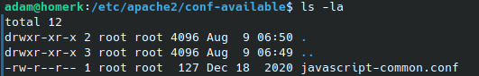

If you are a Linux user, then you have probably heard of [chmod](https://ss64.com/bash/chmod.html). But what is it, and how can you use it? Being a Linux user you also know how important the syntax of commands is, so we will discuss the proper chmod syntax that you should use. In this blog post, we will discuss the basics of chmod and show you how to use it in a few simple steps.

You might be interested in learning about other common commands, check out our guide on [using the tail command in Linux.](https://credibledev.com/tail-command-in-linux/)

## What is chmod?

Chmod is a Linux command that stands for "change mode". This command is used to change the permissions of a file or directory. With chmod, you can give different levels of access to different users. For example, you can give read and write permissions to one user, and read-only permissions to another. You can also apply file and folder permissions to groups using chmod.

Let's break down the structure and syntax for chmod in Linux so you can use it effectively as a Linux admin.

## Linux File Permissions Using ls -la

We need to understand a bit about Linux file permissions and how to view them. These references below are based on what user and group have rights to the file. You can view this by using the directory listing command, ls, with the -la option. An example output is shown below for reference.



In the screenshot above, looking at the area where the root user is shown, root on the left side represents the user who owns the file and the root on the right represents the group. In this case, they are both root, this will not always be the case.

Also in the screenshot, you will see the specific read, write and execute permissions for the user, group, and everyone else (also referred to as "others").

```
drwxr-xr-x
```

In the above permission listing, the first character "d", represents the file type. The characters following that represent the permission set for the user, group and others. The first set of 3 characters after the file type is for the user/owner of the file or directory. The next set is for the group and the last set is for "others" or everyone else. Each set will have 3 characters, one for read, write and execute permission. If a particular permission is enabled, the respective letter will be shown, if it is disabled or not allowed then a dash, "-", will be present instead. In the example above, you can see that the write permission is not allowed for the group and "others", where the owner has all 3 permissions allowed.

To recap these options, let's go over each permission type.

- r
    - r represents the read permission. If it's enabled you will see an "r", otherwise, it will be a "-" for not enabled.

- w
    - w represents the write permission. If it's enabled you will see a "w", otherwise, it will be a "-" for not enabled.

- x
    - x represents the execute permission. If it's enabled you will see an "x", otherwise, it will be a "-" for not enabled.

Now we can move on to chmod and the chmod syntax to be used in Linux.

## chmod Syntax

```
chmod [options] mode file
```

The syntax for the chmod command can look quite different if you use a symbolic/text (r,w,x) and (u,g,o,a) or the numeric method such as 777 or 755 for example. Both are valid and will work in the same way, it is very much about user preference and which one you can remember. We will cover both here so you can decide which chmod syntax would like to use.

## chmod Symbolic Mode Syntax

The first method of using the chmod command is to use the symbolic mode, where we use letters for the user, group etc. and also letters for the permissions such as r, w, and x. In the example below, we are giving read, write and execute permissions to the owner. Read and execute permissions to the group and read permission to everyone else.

```
chmod u=rwx,g=rx,o=r /path/to/test/file
```

The above command combined user, group and others into one line. You can set these seperately as well. Another example of how to use the chmod command with symbolic mode is to use the + to add and the - to remove permissions. In the following example, we add write permission to the group and execute permission to everyone else.

```
chmod g+w /path/to/test/file
chmod o+x /path/to/test/file
```

- \-u
    - This option stands for "user". With this option, you can change the permissions for the owner of the file.

- \-g
    - This option stands for "group". With this option, you can change the permissions

- \-o
    - This option stands for "others". With this option, you can change the permissions for all other users.

- \-a
    - This option stands for "all". With this option, you can change the permissions for all users.

## chmod Numeric Mode Syntax

As I mentioned earlier, we can use chmod with numeric values representing user, groups and others. We will also use number to represent the individual permissions instead of the characters r, w, and x.

Let's look at an example for better understanding. The following chmod command gives the owner full permission to read, write and execute. The group receives read and execute permissions, while everyone else only receives read permission.

```
chmod 754 /path/to/test/file
```

But where do these numbers come from and how does chmod translate them to permissions? Let's take a look.

- Execute has a value of 1. So one is equivelent to an x in the symbolic mode.

- Write has a value of 2. Two is equivelent to a w.

- Read has a value of 4. Four is equivelent to an r.

In our example, we gave full read, write and execute permission to our user/owner of the file. If we add 1, 2 and 4 together we get 7. In numeric mode we use 3 numbers, the first is for the user/owner, second for the group and last for all others. So in our example, we gave the user a 7, representing full permission. We made the same caclulations for the group and all others in the example.

Some very common chmod syntax you will see are 777 and 755. Let's take a look at those.

### chmod 777

Chmod 777 will apply full read, write and execute permissions to everyone. This is a dangerous permission set, as everyone has full control of the file. Be careful with this option.

### chmod 755

Chmod 755 will apply full permission to the user/owner while giving the group and everyone else read and execute permission. This is much safer that 777, since only the owner would be able to modify or delete the file.

### chmod 400

Chmod 400 gives only the user/owner read permission, everyone else is completely restricted. This option is fairly common when protecting an SSH private key. Once the file is created, it can be locked down using chmod 400 for better protection.

There is pretty cool [chmod calculator](https://chmod-calculator.com/) that exists to help you decide what to use if you have trouble, be sure to check that out.

## chmod Recursive Use

One last thing I would like to mention is using chmod recursively. All of our examples have been used for one file or directory. Chmod is much more powerful, as you can apply file or directory permissions recursively so that it changes for all files or folders within the directory that you provide. We do so using the -R option. Let's look at an example of using chmod recursively. Imagine we have a folder called test and we want to apply the same permissions to that folder and everying inside of it. We could use the following.

```
chmod -R 755 /test
```

## Conclusion

We have covered the basic chmod syntax here and the many ways you can use it on your Linux machine. Remember, chmod is powerful, especially when used in combination with the sudo command. Be sure you are telling the machine to do what you really want it to do, otherwise you can really do some damage by changing the wrong permissions. I would suggest practicing on a virtual machine before making changes on a real machine if you are unsure.
