Welcome to part 2 of our guide on Creating a [Linode](https://www.linode.com/lp/refer/?r=25859d5135efc6f773fd56ab42ec3e7a1cc5e83b) Linux VPS. You can check out part 1 of the [guide here](https://credibledev.com/create-a-linode-linux-vps/). [Part 3](https://credibledev.com/create-a-linode-linux-vps-part-3/) is now live as well, going over how to set up Apache, PHP, MySQL, and a domain name.

[Linode Coupon Code – $100 in Free Credit for 60 Days](https://www.linode.com/lp/refer/?r=25859d5135efc6f773fd56ab42ec3e7a1cc5e83b)

A big part of running your own Virtual Private Server (VPS), is securing the server. One of the first steps that you should take is creating a new user and securing SSH. These are very basic steps that go a long way in protecting your VPS. Not long after bringing a VPS online, there will be bots and other automated attacks attempting to connect via SSH. By simply disabling root access via SSH, having a new user and only allowing SSH connections with a private key, your server will be much more secure against the attacks.

In this guide we will walk through creating a new user, giving them administrator access through sudo, disabling root SSH access, and setting up private key authentication. Let’s get started.

## Add a New User to our Linode Linux VPS

First, we need to access our VPS via SSH as we did in [part 1 of this guide](https://credibledev.com/create-a-linode-linux-vps/).

```
ssh@serverip
```

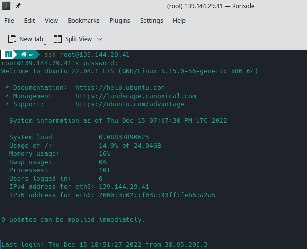

Now that we are connected to our server, let’s create a new user. We will create a new user with the name thecd by running the following command in the terminal. Name your account whatever you’d like.

```
adduser thecd
```

You will then be asked to create a password, be sure to choose something secure. You will also be asked for information such as name, phone number, etc. you can leave these blank.

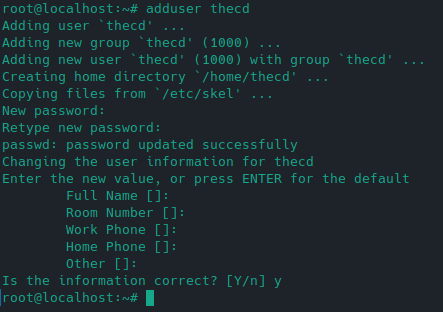

### Give Our User Sudo Privileges

Now that we have a new user account created, we need to add this user to the sudo group so that the user can maintain and administer the server with elevated privileges when needed. We add user account thecd to the sudo group by running the following command.

```
usermod –aG sudo thecd
```

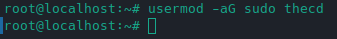

Now we have a new user and they can do admin tasks through sudo, we can log out of the root again and reconnect with our new account. Simply type logout in the terminal and press enter to disconnect. Now reconnect as your new user and log in with the following command.

```
ssh thecd@serverip
```

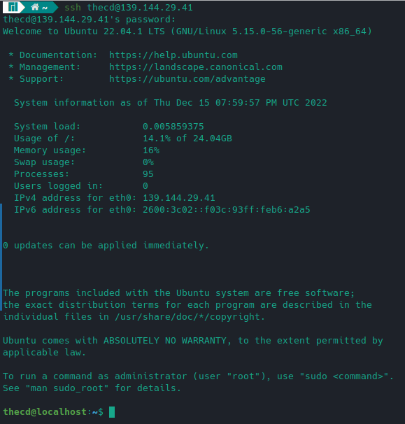

Go ahead and run a command using sudo, then enter your password when prompted to confirm the permissions are correct. You can simply check for updates using APT for example.

```
sudo apt update
```

Once you have confirmed that you can connect, we can start configuring the SSH keys so that our server is better protected. This process will be different depending on the OS you are connecting with, such as Linux or Windows. We will go through the process on both.

## Configuring SSH Keys

Once you have confirmed that you can connect, we can start configuring the SSH keys so that our server is better protected. This process will be different depending on the OS you are connecting with, such as Linux or Windows. We will go through the process on both.

### Generate SSH Keys from a Linux Host

To generate the key pair needed for this setup, you will run the following command from your Linux machine, not the server. This will generate a private/public key in your home directory under the .ssh folder. Be careful, if you already have a key there, this will overwrite it.

```
ssh-keygen –b 4096
```

You will be asked where to save, it is fine to keep the default. You will also be asked for a passphrase, which is optional. The passphrase is an additional layer of security since an attacker would need both the private key and the passphrase used.

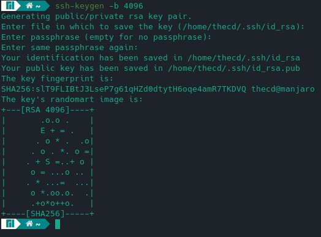

Now that we have a keypair, we need to put the public key on our VPS, which is very easy to do from a Linux machine. We run the following command to complete this step.

```
ssh-copy-id thecd@serverip
```

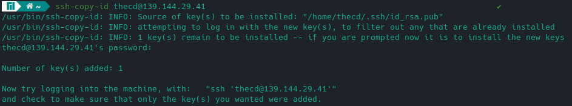

Now that our public key has been copied to the server, we can switch back to the terminal where we are connected to the server with the new user and log out. Simply run the logout command from the server terminal window.

Once you are disconnected, reconnect to the server as the new user, this time you won’t be prompted for the password. If you chose to set up a passphrase during the previous step, you will be asked for that instead of the password.

Your setup for private key authentication is complete. Keep your private key safe and be sure not to lose it.

### Generate SSH Keys from a Windows Host

If you are on a Windows device, you will use a utility that comes with [PuTTY](https://www.chiark.greenend.org.uk/~sgtatham/putty/latest.html) to generate your keys. If you followed [part 1 of this guide](https://credibledev.com/create-a-linode-linux-vps/), you already have PuTTY installed. Otherwise, you can download PuTTY here.

First, we want to launch the PuTTYgen, which you can find in your Windows start menu under PuTTY.

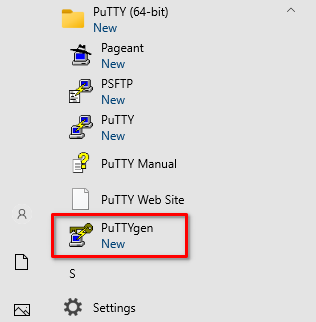

In PuTTYgen, you will want to change the number of bits to 4096, which is located in the bottom right corner. Also make sure RSA is selected, then click the generate button. You will keep moving your mouse as instructed to randomize the key generation. When complete you will be presented with the public key and the option to configure a passphrase if you wish.

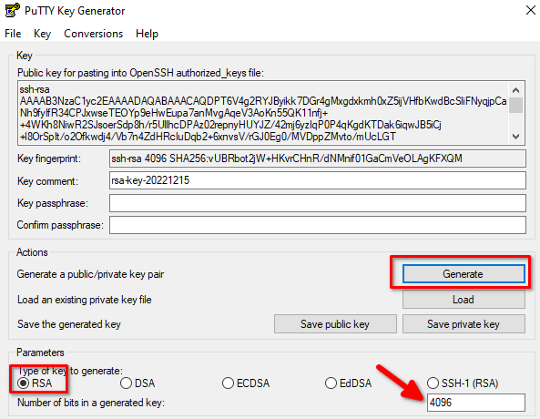

Once this is complete, open up notepad, copy and paste the public key into notepad. Keep this notepad open, you’ll need it later. Do not use the save public key button, as this will mess up the formatting. Next, click the save private key to save it, and keep the default format which should be a .ppk file.

Now that we have generated and saved the keys, we need to include our private key in PuTTY and copy our public key onto the server. Go ahead and fire up PuTTY. If you followed part 1 of this guide, you saved the connection to your server in PuTTY, so you can select it from the list and click on load.

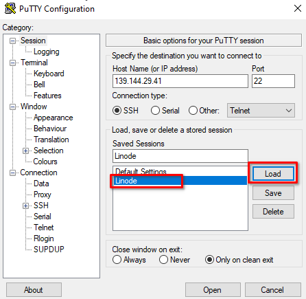

Next, you will want to expand SSH on the left side and select Auth, then select Credentials. Here you will find a box to input your private key. Go ahead and click on browse and navigate to where you saved the private key file. After you input your key, on the left menu, scroll to the top and click session, then click on save. Otherwise, the key file won't be saved for future sessions.

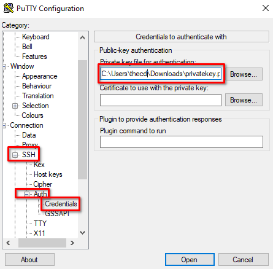

Once complete, click Open at the bottom to launch the terminal sessions. Input your username and password to log in.

Now that we are connected to the server, we need to run a few commands to create the directory and file used to store our public key. We also need to protect the folder and file using Linux file permissions with the chmod command. After this is complete, we need to open the file using your favorite editor, such as nano, to input the public key and save it.

```
mkdir –p ~/.ssh
touch ~/.ssh/authorized_keys
chmod 700 ~/.ssh
chmod 600 ~/.ssh/authorized_keys
nano ~/.ssh/authorized_keys
```

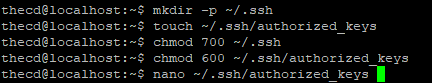

Once you have the authorized\_keys file open, paste in the public key from notepad. It should look something like this. You can press Ctrl+O to save the changes to the file and Ctrl+X to exit the editor.

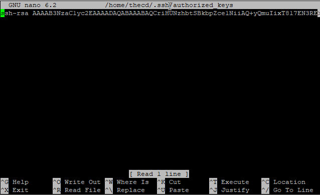

You can now test that your key works. Once you’re back at the terminal run the logout command to disconnect, then reconnect using PuTTY. If everything was successful you should not be prompted for your password. If you set up a passphrase, you will be prompted for that though.

## SSH Security Config

So far we have set up and confirmed that we can connect via SSH to our Linode Linux VPS with our keypair, so we are good to start securing SSH a bit more. We will do this by preventing root login via SSH and disabling password authentication for SSH. This means you will not be able to connect to SSH with the root account and you will only be able to connect with a private key for the new user you created previously.

In your server terminal session, we want to edit the SSH config file to complete these changes. Run the following command to open the SSH config file.

```
sudo nano /etc/ssh/sshd_config
```

In this file, find the line that says PermitRootLogin and change it from yes to no. Next, find the line that says PasswordAuthentication, and change it to no as well. So these lines should look like the following.

```
PermitRootLogin no
PasswordAuthentication no
```

Make sure you save the changes (Ctrl+O) and then exit nano (Ctrl+x). Now we need to restart the SSH service by running the following command.

```
sudo systemctl reload sshd.service
```

After running this command, do not log out of the server, instead, open a new PuTTY window and connect in a new session to ensure you can still connect.

## Ubuntu Firewall Configuration Using UFW

The next step we need to take in securing our Linode VPS is to enable the firewall on the server. This is an easy task that we will use UFW for. Since we only have one service that we are using, SSH, we only need to allow the SSH port which is 22.

We will add a rule to allow SSH using the following command.

```
sudo ufw allow OpenSSH
```

We can then run the following command to confirm that SSH is allowed. After running this command you should see OpenSSH listed under available applications.

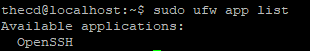

Once confirmed, we will enable the firewall using the following command.

```
sudo ufw enable
```

After you have enabled the firewall, open a new terminal and confirm you can still connect to your server via ssh.

You can confirm the firewall is active by running the following command, which should show the status is active and list the OpenSSH rule we added.

```
sudo ufw status
```

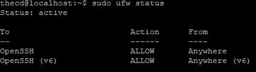

## Configure Firewall on Linode

As an extra layer of protection, in case of an issue with the UFW firewall, we will set up the firewall directly from Linode as well. Head to your Linode dashboard and choose firewalls from the menu on the left.

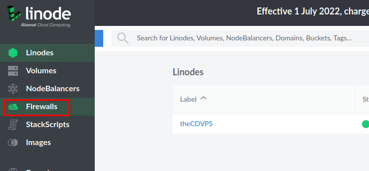

On the firewalls page, click on create a firewall. You will then name the firewall and select the server to apply the firewall to. Once you’re finished, click on create firewall.

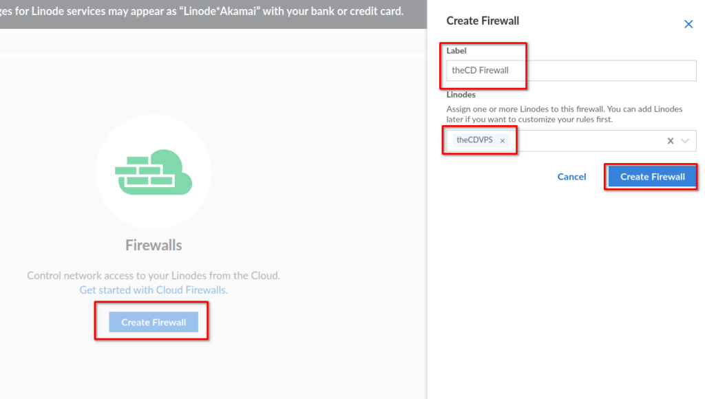

After creating your firewall in Linode, you will see it listed. Go ahead and click on the name of the firewall you just created to open its rules page.

Here, we want to add an inbound rule that allows SSH connections to our server.

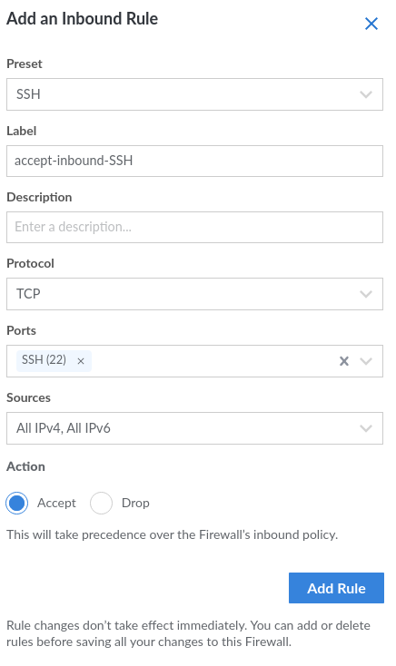

After adding the SSH rule, change the default inbound policy to deny. This will deny all inbound traffic except for SSH traffic. Since we are not currently hosting other services like a website, this is fine. After making all of your changes, click on save changes to apply the firewall to our Linode server.

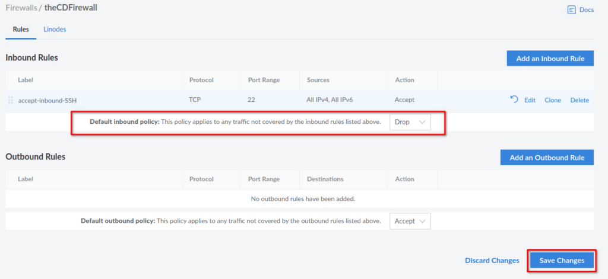

Go back to your PC, and launch a new SSH session to make sure you can still connect.

## Conclusion

In this guide, you have successfully completed the following tasks on your Linode Linux VPS.

- Add a new user

- Added your user to the sudo group

- Created and configured SSH keys from Linux or Windows

- Setup and configured the Ubuntu and Linode Firewall

Check out [Part 3 of this guide](https://credibledev.com/create-a-linode-linux-vps-part-3/) to set up Apache, PHP, MySQL, and point a domain name to your Linode VPS.
