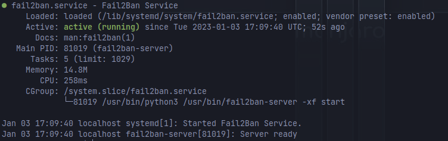
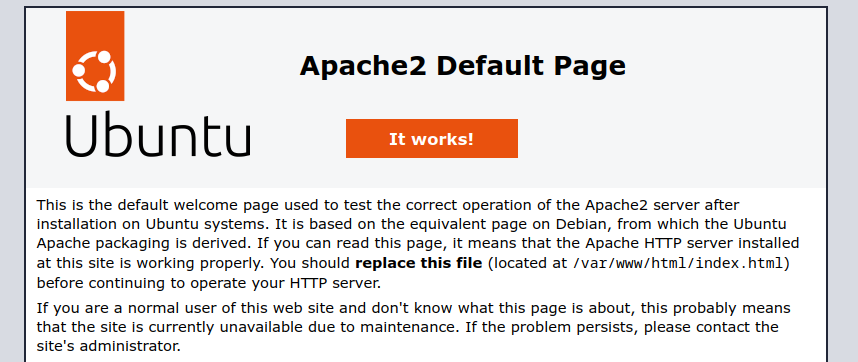
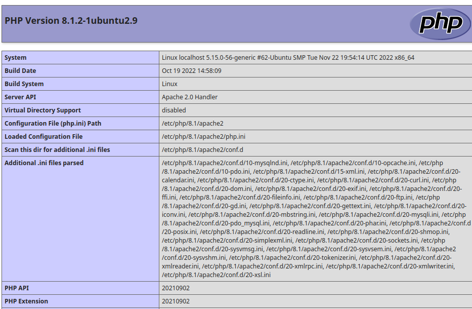
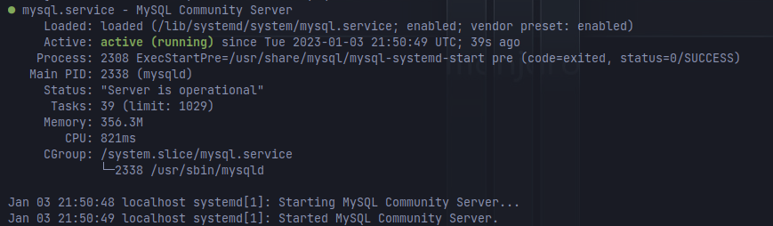
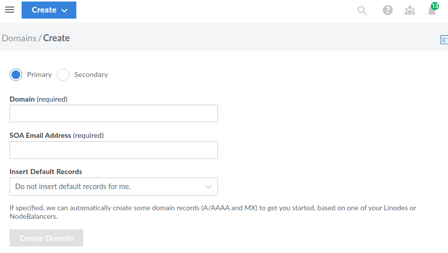
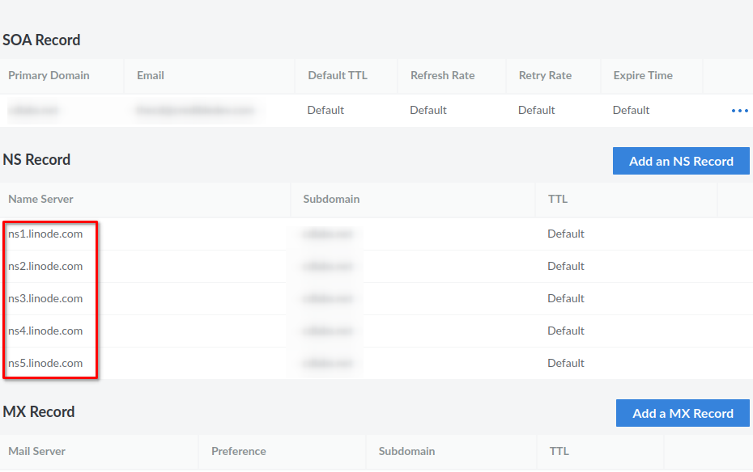
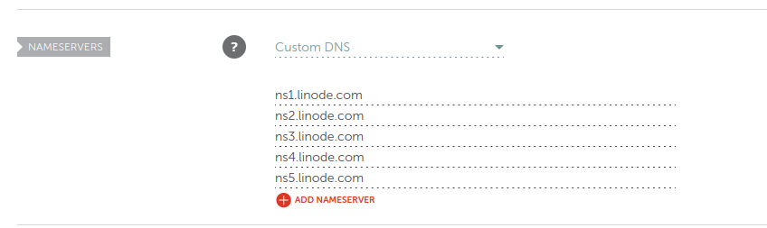

Hopefully, you have been following along with [Part 1](https://credibledev.com/create-a-linode-linux-vps/) and [Part 2](https://credibledev.com/create-a-linode-linux-vps-part-2/) of the Creating a Linode Linux VPS series. If not, be sure to go back and check out the previous 2 parts of the guide to get up to speed.

In part 3 we will be installing a package called fail2ban on our Linode Linux VPS, which will help to protect our VPS from unauthorized access attempts. Particularly brute force attacks. We will also be installing Apache, MySQL, and PHP, this will set up our VPS with the LAMP stack. Which stands for Linux, Apache, MySQL, and PHP.

In the end, we will point a domain name from Namecheap to the Linode server as well.

## Our Linode Linux VPS So Far

At this point, you should have your Linux VPS setup, a new Linux user account created, secure SSH access with a private key, and firewalls in place.

Don't forget, if you haven't set up your Linode account yet. Take advantage of the free $100 60-day credit using the link below. Plus, you're helping me to keep creating content.

[Linode Coupon Code – $100 in Free Credit for 60 Days](https://www.linode.com/lp/refer/?r=25859d5135efc6f773fd56ab42ec3e7a1cc5e83b)

Let's go ahead and get started with installing fail2ban.

## Install fail2ban

What is fail2ban? Fail3ban is a software package that monitors connection attempts to services like SSH. When continuous failed attempts are made, fail2ban jumps into action to configure our firewall for us to ban the IP addresses making those connections. This will stop a brute force attack in its tracks, which protects our server.

To install fail2ban on your Linode Linux server, run the following command in the terminal.

```
sudo apt install fail2ban
```

That's all it takes to get fail2ban installed, but we also need to enable it. Before we do that, let's check out some of the configurations we can do to fail2ban.

## Configure fail2ban

The default configurations for fail2ban exist in the /etc/fail2ban/jail.conf file. However, we do not want to edit this file directly, we will want to create our own copy and do our modifications there. So let's create a new "jail.local" file that is a copy of the default configurations.

```
sudo cp /etc/fail2ban/jail.conf /etc/fail2ban/jail.local
```

Now we can use our favorite editor like nano, to open this config file and start exploring options.

```
sudo nano /etc/fail2ban/jail.local
```

The default configuration may be fine for you but you might also consider changing the number of tries that would trigger a ban and how long the ban is for. For these settings, find the following lines and configure them as you wish.

```
bantime = 10m
findtime = 10m
maxretry = 5
```

For most setups, the defaults will be fine though, which protects SSH out of the box. Once you are finished with the configuration, you can start and enable the fail2ban service using the following command.

```
sudo systemctl enable fail2ban
sudo systemctl start fail2ban
```

You can then check the status to ensure that fail2ban is running.

```
sudo systemctl status fail2ban
```



That's it, you now have additional protection on the SSH service of your Linode Linux VPS. Let's move on with installing Apache, MySQL, and PHP.

## Installing Apache on a Linode Linux VPS

Apache is one of the world's most popular web servers, it is production ready and dependable with many configurations. As complex as it can be, Apache is really simple to install and start using.

```
sudo apt install apache2
```

No need to start or enable the service, it is done for you automatically. However, you won't be able to access it due to the UFW firewall and the Linode firewall. We need to allow Apache to communicate on ports 80 and 443 (HTTPS).

For UFW, run the following command to allow both HTTP and HTTPS traffic for Apache.

```
sudo ufw allow 'Apache Full'
```

You will need to head over to the Linode website and add a rule to allow the preset HTTP and HTTPS traffic to our Linux VPS. If you don't remember how to do this, check out part 2 of the guide for some guidance.

Once you have the firewalls configured, you should be able to open up your browser, put in your Linode server IP, and get the following default Apache page.



The default location for this page is /var/www/html - so if you would like to put your own page here, this is the default location to do so. In a future post, we will discuss virtual hosts so you can host multiple domains. Let's move on to installing PHP and MySQL for now, then we will configure a domain name for Apache and our Linux VPS on Linode.

## Install PHP on a Linux VPS with Apache

Installing PHP is about as simple as installing Apache, we will also install some common modules for MySQL for example. May save you some headaches down the road of installing these later. Feel free to remove the ones you know you won't need. the only required ones will be "php libapache2-mod-php and php-mysql".

```
sudo apt install php libapache2-mod-php php-mysql php-curl php-json php-cgi php-gd php-mbstring php-xml php-xmlrpc
```

We will also need to restart Apache after installing these packages.

```
sudo systemctl restart apache2
```

### Test PHP Installation

We can run a simple test of PHP and ensure it's working properly with Apache. In the /var/www/html directory, we will create a test.php file with the following content in it.

```
<?php phpinfo(); ?>
```

You can now open a browser to HTTP://ipaddress/test.php, if the installation of PHP was successful, you should see a page like the one below.

Note: If you get a blank page, reboot the server and try loading the page again.



Once you have confirmed PHP is working, it is highly suggested that you delete the test.php file.

## Install MySQL Server on Linode VPS

Our last piece of software to install is MySQL, which will serve as a database for websites and apps such as WordPress.

```
sudo apt install mysql-server
```

After running this command, the MySQL server should automatically be started but you can verify this by checking the status.



Due to some recent changes to the Ubuntu MySQL package and some of its default settings, we need to modify a few things so the mysql\_secure\_installation script can run properly.

```
sudo mysql
```

You should now be at a MySQL> prompt. Here we will run a command that changes the default authentication method of the root account. This will be set to mysql\_native\_password and a default password of "password". This is needed so the script can run, afterwards, we will change the default authentication method back to auth\_socket.

```
mysql> ALTER USER 'root'@'localhost' IDENTIFIED WITH mysql_native_password BY 'ThisIsN0tAStr0NGP4ssw0rd!';
```

Next, we will exit the MySQL console.

```
mysql> exit
```

Next, we will use the secure MySQL install helper application to finish the setup.

```
sudo mysql_secure_installation
```

You will be asked a series of security questions such as password strength, disallowing remote root login to MySQL, removing test databases, etc. I suggest you answer yes to each question for the best security.

Once this is finished, you can log back into the MySQL console as root to change the default authentication method to auth\_socket.

```
mysql -u root -p
```

```
mysql> ALTER USER 'root'@'localhost' IDENTIFIED WITH auth_socket;
```

You can also go ahead and create a new MySQL user that isn't root with the following command. This command will create the user with the authentication method of mysql\_native\_password. This is for compatibility reasons with some PHP apps, you can try the suggested caching\_sha2\_password method instead to see if it works for your use.

```
mysql> CREATE USER 'thecd'@'localhost' IDENTIFIED WITH mysql_native_password BY 'credibleDEV_2023!';
```

You will want to grant the new user privileges on tables, otherwise, they can't really do anything useful. You can check out this [blog post for more information on granting privileges](https://chartio.com/resources/tutorials/how-to-grant-all-privileges-on-a-database-in-mysql/).

## Point a Domain Name to our Linode Linux VPS

For your specific use case, accessing the Linux VPS with the IP address may be just fine. For those who have a domain name that they would like to point to their Linode Linux VPS, I will walk you through how to do this. My domain name is registered with Namecheap, you have a different provider but the setup is generally the same.

By far, the easiest way to go about doing this is to use Linode to handle your domain's DNS. You can do this by adding your domain to Linode, then from your registrar like Namecheap, point the domain to Linode's name servers.

To start, log in to Linode, the choose domains from the menu. On the domains page, you will see an option for "Create Domain". Click that button which will take you to this screen.



Here, you will fill out the domain name, email address and under the "insert default records" dropdown, you can choose your Linode Linux VPS. This will create necessary A records for you to make this much easier.

After you have added your domain, select it from the list of domains which will take you to the page listing all the DNS records. Here you will find a section titled "NS Record". These are the name servers you want to add to your domain in the registrar like Namecheap.



Over on Namecheap, this is what it looks like when the nameservers have been added. This will vary by registrar though.



Once you have added the nameservers, it can take some time before they have propagated, sometimes up to 24 hours.

You should be able to ping your domain and get the IP for your Linode VPS once this is complete. You should also be able to access the domain in a browser and see the default Ubuntu Apache page.

I would suggest editing the default index.html file found in /var/www/html to whatever you want to just making it a blank page. No need to expose to the internet that we run Apache on Ubuntu and that we are too lazy to change the default page, lol.

## Part 3 Conclusion

Stay tuned for part 4, where we will further configure Apache, set up SSL with Let's Encrypt, and more.

To recap, at this point, you have a secure VPS setup with SSH, firewalls, and fail2ban. We have set up Apache, PHP, and MySQL. Now we have pointed a domain name to our Linode and let Linode manage the DNS for the domain name.
