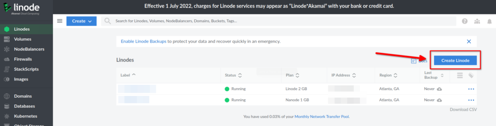
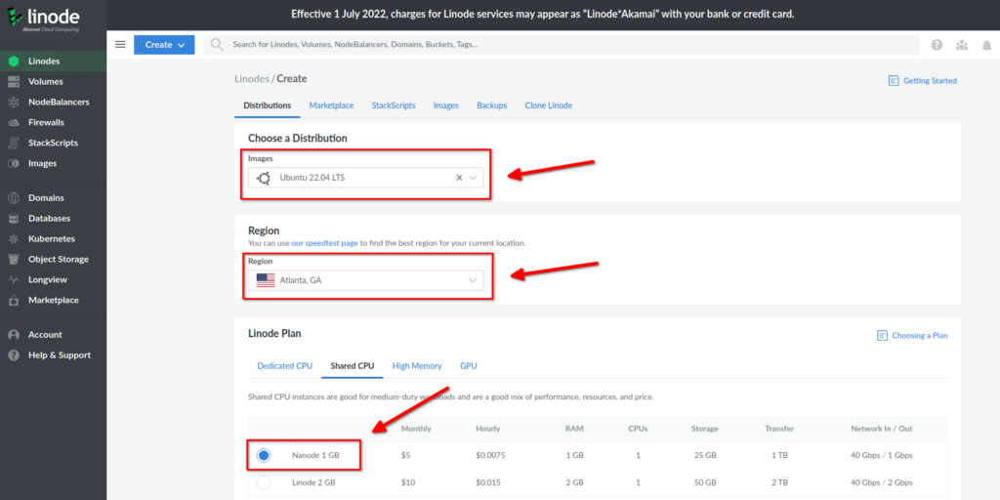
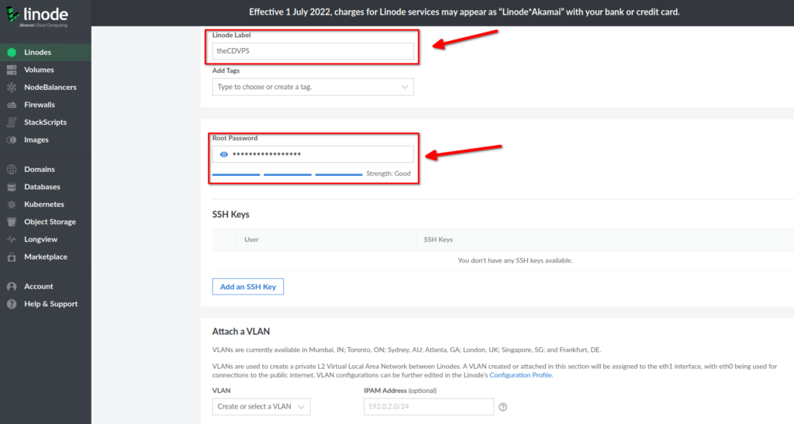
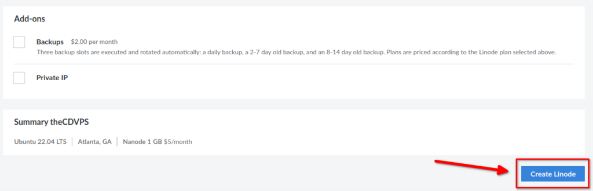
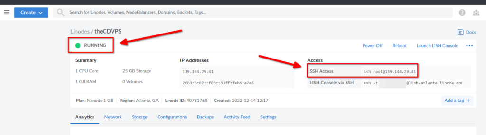
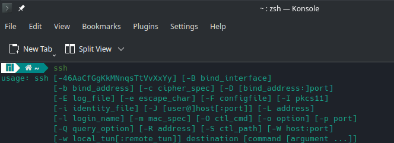
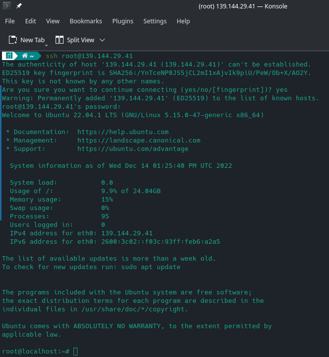
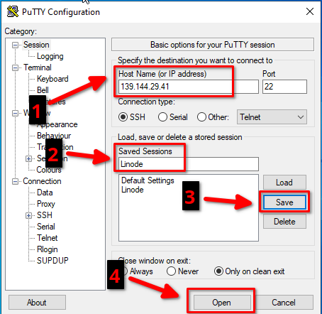
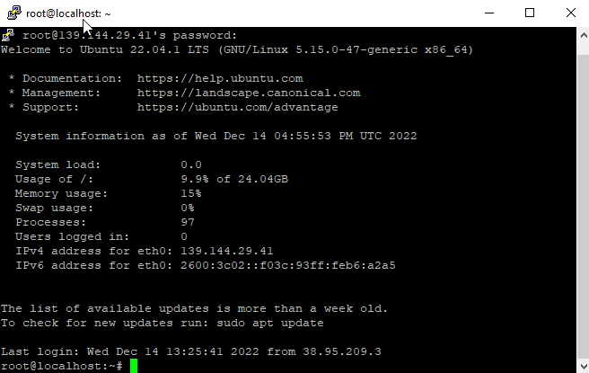

This is a multi-part series. Part 1 (this guide) is the basics of setting up the VPS on Linode. [Part 2](https://credibledev.com/create-a-linode-linux-vps-part-2/) covers SSH and Firewalls, and [Part 3](https://credibledev.com/create-a-linode-linux-vps-part-3/) covers installing Apache, PHP, MySQL, and setting up a domain name for our Linode VPS.

Personally, I use Linode Linux VPS's (virtual private servers) to run multiple app projects, and websites and for testing certain technologies. Linode is one of the easiest platforms to get started with Linux servers in my opinion and a great place to learn about and deploy your projects. Their interface is well laid out, easy to understand, and they offer many ready-to-go options in their marketplace if you don’t want to start from scratch.

In this post, we will cover how to set up a Linux VPS and then secure it so that your shiny new server is protected and ready for the internet and your next project or website.

## What is a VPS?

A virtual private server, also known as a VPS, is a server instance that you lease in a remote data center. This could be a Windows or Linux server for example. Typically, a VPS will be a virtual server running alongside many other servers on a single physical server. You decide how much CPU, RAM, and storage you need as well as the geographical location and the cloud provider like Linode will select the best physical server to place your instance in. You could purchase a dedicated server instance, but these are typically not necessary for a small or medium-sized website or project.

https://www.youtube.com/watch?v=zY-UGVHSHPU

## Setup a Linode Linux VPS

There are only a few quick steps that need to be completed to get up and running with a VPS on Linode. You will need an account and I have a referral code with them that will give you $100 to start out with, so you can test Linode out for free. We will then create our VPS, configure it and finally, connect to the VPS from our Windows or Linux PC. Let's get started!

### Create Your Linode Account

The first step is to create an account with Linode. If you use this link to join Linode, you will receive a free $100 credit to use during your first 60 days. So, essentially you can get a free Linode server for 2 months to test out their services.

[Linode Coupon Code - $100 in Free Credit for 60 Days](https://www.linode.com/lp/refer/?r=25859d5135efc6f773fd56ab42ec3e7a1cc5e83b)

### Create a VPS on Linode

To get started you will want to click on Create Node from your main dashboard after logging in to Linode.



On the following screen, we will select from various options to customize our VPS.

Although we are not doing this for our guide. You will notice a Marketplace tab on this page, this is where you can install pre-configured images for popular apps and tech stacks. Here are a few examples of what you can choose from the Linode Marketplace for quick setup.

#### Linode Marketplace

- LAMP Stack – Linux, Apache, MySQL, PHP

- MERN Stack – MongoDB, Express, React, NodeJS

- Nextcloud

- OpenVPN

- Wordpress

- Docker

- Cloudron

- Minecraft Server

- Django

- Joomla

- CS:GO Server

- cPanel

- And Over 80 more

  
Back to our setup, let’s go back to the distributions tab and continue our VPS setup.

- Image – This is the OS image we want to install on our VPS (I chose Ubuntu 22.04)

- Region – Which Linode data center our VPS will be located in.

- Size – The amount of RAM, CPU, Storage and Transfer that our VPS will have. (This can be changed later if needed)  
    



Further down the page, we have additional options to configure our Linux VPS on Linode.

- Label – Give your Linode VPS a descriptive and appropriate label.

- Tags – This is a way to categorize your Linode VPS in case you have many servers in your account. Most users won’t have a need for this.

- Root Password – This is the root password for your Linux server. You want to create a complex and unique password. Later we will configure a public/private key pair to better protect access to our VPS.

- SSH Key – If you are new to Linode, you won’t have anything here yet, so you can skip this for now.

- VLANs – VLANs are an advanced networking option, and most users will not have a need for this.  
    



Just a few more options and we’ll be finished with the initial setup of our VPS.

- Backups – For an additional cost, you can enable managed backups. Linode will take care of creating automated backups for you.

- Private IP – This will not be needed for most users but if you have networking set up between multiple Linode instances, you may have a need for this.  
    

Once you have finished the last few options, you can click on Create Linode to start building the VPS.



Now Linode will start provisioning your new Linux VPS, this process will only take a few minutes and this page will update automatically. Once it says that your VPS is running, you will be able to SSH to your shiny new VPS using the root account and password you created in the previous steps.



###   
Connecting to Your Linux VPS via SSH

Now we are ready to connect to our VPS. SSH is the most common method of connecting to a Linux VPS. SSH connections can be initiated from your Linux, Windows or Mac PC and we will cover how to make this connection from the various Operating Systems.

#### Steps to Connect via SSH

- Get the Linux Server IP Address

- Obtain an SSH Client

- Connect to the Linode Linux VPS Using the root Account and Password  
    

#### Connect to Linode from Linux

To get started, open a terminal and check if SSH is already installed, it likely is. Type ssh into the terminal and press enter to see if it is installed. You should see output similar to the below image if it is installed.



If it is not installed, you should use your package manager like APT, pacman, etc. to install it. The package name is different depending on the Linux distribution, such as Ubuntu or Arch/Manjaro Linux for example. The package may be called openssh-client or simply openssh.

Once you have installed SSH or confirmed that it is installed. You can connect by running the following command, replacing the IP address with the IP of your Linode Linux VPS.

```
ssh root@ipaddress
```

On your first connection, you will be asked to add the fingerprint, this is ok and you should say yes to this question. You will then be prompted for the root password that you configured in the previous steps.



Congratulations, you are now connected to your Linux VPS on Linode!

#### Connect to Linode from Windows

In order to connect to Linode from Windows, I suggest that you use a 3rd party tool such as [PuTTY](https://www.chiark.greenend.org.uk/~sgtatham/putty/latest.html), which you can download for free.

Once you have it downloaded and installed, go ahead and launch it. Fill in the IP address for your Linode VPS, give it a name under saved sessions, click Save and then click open to launch the session.



Once you click open, a terminal window will appear and you may be prompted to accept the thumbprint, go ahead and accept that. You will now see a prompt for a username, you will use root and then enter the password at the next prompt.

If everything went well, you will be connected to your Linode Linux VPN through PuTTY.



## Update

The last thing we need to do before wrapping up part 1 of creating a Linode Linux VPS is to update the server OS. In this case we set up our server with Ubuntu so we will run the following commands as root.

```
apt update
apt upgrade
```

After this is complete, which may take a few minutes, we may need to reboot the server. Pay attention to the text on the screen, it will let you know if you need to reboot. If you do, just run the following command as root to restart the server. It should only take a few minutes before it's back online and you can reconnect.

```
reboot
```

## Conclusion

Check out [Part 2 of this guide](https://credibledev.com/create-a-linode-linux-vps-part-2/) to secure SSH with keys and firewalls for Ubuntu and Linode.

You now have a Linode Linux VPS server up and running and have successfully connected to the server using SSH. That’s it for this guide. Follow on to Part 2 and I will show you how to secure SSH on your VPS with private keys and disable SSH login for the root account.
