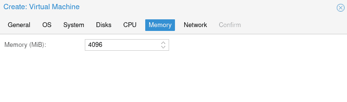

I planned on creating a VM with the latest version of Ubuntu on it, which currently is 22.10. This VM is going to be used in a future post about Flatpaks. Since I'm creating this VM, I decided to document the process on Proxmox as well as how to access the VM through an app like Remina for example.

Let's go ahead and jump into setting up this Ubuntu VM on Proxmox.

## Download the Ubuntu 22.10 ISO

To obtain the proper ISO, we will need to head over to the [Ubuntu Desktop Download](https://ubuntu.com/download/desktop) page. Scroll down to the 22.10 version and download the iso to your machine.

Once you have the ISO downloaded, we need to upload that iso to Proxmox so we can then create a VM.

## Upload ISO to Proxmox

Go ahead and log in to your Promox servers web interface, and locate the local storage or whichever storage you use for ISO files. Click on ISO Images and then Upload. From there, you can navigate to where you downloaded the Ubuntu ISO file and start the upload process.


Once you have the ISO file uploaded, we can move on to creating the actual VM.

## Creating a Ubuntu 22.10 VM

Back in Proxmox, we will right-click on our node, then choose "Create VM".


Next, we will go through a series of VM configurations provided by Proxmox, such as device name, OS, CPU, RAM, etc. I will include the screenshots below, feel free to copy the settings or make changes where needed for your specific setup.

### VM Naming


Proxmox VM Name Setup

### VM ISO and OS Settings


Proxmox VM OS Setup and ISO Selection

### VM System Setup - GPU and BIOS


Proxmox VM System Setup

### VM Disk and Storage Setup


Proxmox VM Disk Setup - SCSI is preferred for performance. Enable discard if the underlying storage is an SSD.

### VM CPU Setup


Proxmox VM CPU Setup

### VM RAM Setup



Proxmox VM RAM Setup

### VM Network Setup


Proxmox VM Network Setup

### VM Review and Confirmation

Confirm all of your settings look good, you can select "start after created" if you wish. Otherwise, you will need to manually startup the VM after it finishes building.


### Access the VM Console

After your VM finishes building, you can click on the VM, then choose console from the menu. The VM should be booting into Ubuntu and the installer.


## Install Ubuntu 22.10 on the Proxmox VM

Now we are ready to start the actual installation of Ubuntu on our VM. So you should be at the console of the VM in Proxmox. You will see an option for "Install Ubuntu" which is what we want to do.


You will go through a series of standard setup items such as the keyboard layout, timezone, etc. I will only show the important ones here.

Since this is a VM, we will choose "Erase disk and install Ubuntu" on the installation type screen.


Continue through the other prompts to create your account and password. When the installation is finished you should see this screen, from which you can reboot the VM.


If you see a message about removing the installation media and pressing enter, you can either ignore this and press enter or you can remove the CD/DVD drive from the VM on the Hardware tab.

After the VM restarts, you should be at the Ubuntu login screen. You can use the Ubuntu VM from the console as you have been, or you can proceed with remoting to it using a tool like Remina.

## Update Your Ubuntu VM

Before you proceed with anything else, you should update the Ubuntu OS. There are many ways to do this. You could use the terminal and run the following command.

```
sudo apt update && sudo apt upgrade
```

You can also update the OS using the GUI Software Updater. This application can be found in the app menu.


Once you have finished updating, restart the VM.

## Enable Remote Desktop on Ubuntu 22.10 VM

Now that we have our Ubuntu VM updated, let's turn on the remote desktop feature so we can connect to our VM from outside of Proxmox.

On the Ubuntu VM, go to Settings and find the "Sharing" menu.


You will then want to enable Sharing at the top of the page, followed by turning remote desktop on.


Inside the remote desktop settings, make sure it is set to on. Also, check or set the password, this will be different from the password you sign into the VM with. This password is specific to the remote desktop session.


Now, to connect to this VM, we need to know its IP address. It is easy to get from the terminal, just run the following command and look for the IP. 127.0.0.1 is not the correct IP, we will want the other one, usually 192.168.x.x depending on your network setup.

```
ip a
```


## Connecting via RDP to Ubuntu VM

Now that you have the IP, we can now RDP to the Ubuntu VM from outside of Proxmox. If your machine is a Linux machine, Remmina is a great choice for this. If you're on Windows, the built-in remote desktop utility will work just fine as well.

Note: For this to work, you must be logged into the Ubuntu VM. Otherwise, the connection will fail. If the Ubuntu VM is in sleep mode, screen locked or you are not logged in, the connection will fail.

### RDP from Linux to Ubuntu VM

As I mentioned, Remmina is probably the best tool for remotely connecting from a Linux machine to the Ubuntu VM. I would highly suggest the [flatpak](https://credibledev.com/install-flatpak-endeavouros-manjaro-arch-linux/) version of Remmina, especially if you are running an arch-based Linux distro like Manjaro. I can into issue connecting via RDP using the Remmina install from the official repo for Manjaro. After installing the flatpak version, it worked like a charm.

In Reminna, add a new connection, choose RDP for the protocol, enter the IP of the Ubuntu VM, the username and password that you configured for RDP inside of Ubuntu and you're good to go.


### RDP from Windows to the Ubuntu VM

As I mentioned earlier, the built-in remote desktop utility in windows works just fine for this purpose. Launch RDP, and enter the Ubuntu VM IP address. You will be prompted to enter the username and password you set up for RDP on Ubuntu.


## Conclusion

That's it, you have set up a Ubuntu 22.10 VM inside of Proxmox, connected via console in Proxmox as well as set up RDP using Reminna or Windows remote desktop. If RDP doesn't work well for you, try setting up a VNC server on the Ubuntu VM and connecting via VNC rather than RDP.
