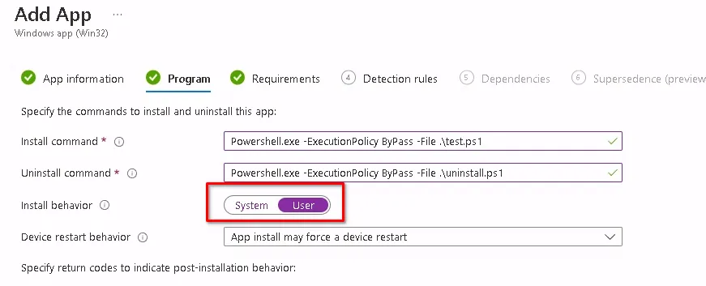
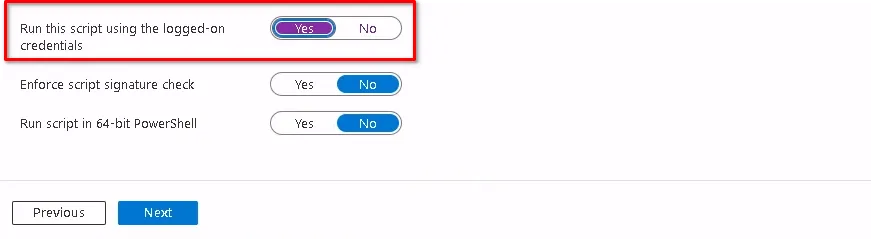

Intune makes a lot of things really easy, but some things are just easier with GPO. Adding or changing registry keys for the current user in the HKEY\_CURRENT\_USER hive is one of the things that was far easier with GPO than it is in Intune. I'm really going to miss the days of OnPrem AD, OU's, and GPO's. Sad times we live in, or maybe I'm just old and frustrated with Microsoft.

Sadly, there are some configurations that we need to do as engineers or admins that require us to dive into the HKCU hive to make modifications.

Never fear, there is a way to deploy registry keys to HKCU using Intune though. You can package this as a Win32 app or you could use a Proactive Remediation. I've covered those methods in this post: [Deploy PowerShell Scripts in Intune](https://credibledev.com/powershell-scripts-in-intune/)

You will want to create a new PowerShell script similar to the one below. In our example, we are creating a new value in HKCU:\\Software called Test and setting the value equal to 1.

```
New-ItemProperty -LiteralPath 'HKCU:\Software' -Name "Test" -Value 1 -PropertyType "Dword" -Force -ea SilentlyContinue
```

Simple enough, right? The important part is during the Win32 app creation or Proactive Remediation, whichever you choose. We want to make sure that this runs in the user context, otherwise, it won't work properly.

## Win32 App Config

For a Win32 app, you must make sure to change the Install Behaviour to "User" instead of system.



## Proactive Remediation Config

If you choose a Proactive Remediation deployment for this, you want to make sure that the option to Run this script using the logged-on credentials is set to "Yes".



## Other Options

Another option is to make your script load the registry key for all new users who sign in. This will not impact users who already have profiles on the device, only new users.

To do this, we use PowerShell again to enable access to the HKEY\_USERS hive, and then you can create your key there.

```
New-PSDrive -PSProvider Registry -Name HKU -Root HKEY_USERS

New-ItemProperty -LiteralPath 'HKU:\.DEFAULT\Software' -Name "Test" -Value 1 -PropertyType "Dword" -Force -ea SilentlyContinue
```

## Conclusion

Oh, the good old days of GPO are quickly going away and Microsoft doesn't seem to want to make our lives easy. No worries, we found a workaround and now you know how to deploy registry keys using Intune to the current user registry hive.

Have Intune questions? Let me know in the comments.
