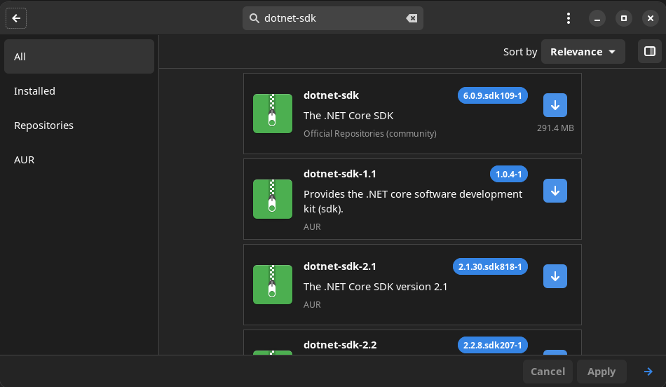
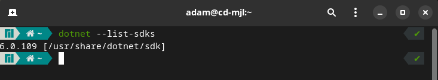
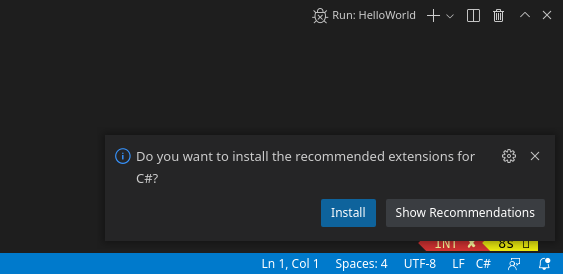
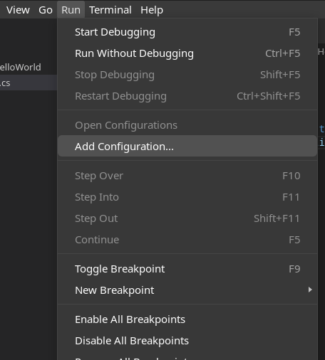
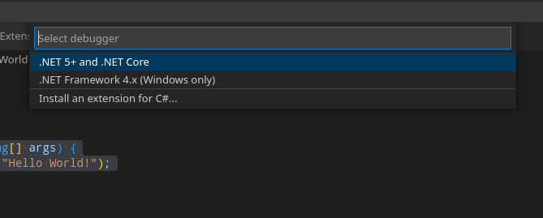
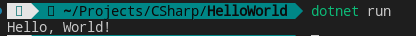

If you are a C# developer like me and you also use or would like to use Linux as your OS, this guide is for you. Today we will be walking through setting up dotnet in Linux and VSCode. I am using Manjaro Linux as my distribution, you may be able to take away information from this post and apply it to other distributions as well.

If you haven't installed [VSCode on Manjaro](https://credibledev.com/install-vs-code-on-manjaro-linux/) yet, check out our guide for that as well. We also just added a guide on [installing JetBrains Rider for Linux](https://credibledev.com/install-jetbrains-rider-for-c-on-linux/) as well, if you prefer a fully featured .NET IDE.

Guide: [Build Your 1st .NET C# GUI Linux App](https://credibledev.com/linux-c-net-gui-app-using-avalonia-ui/)

https://www.youtube.com/watch?v=QppKSrsuPZ8

## Installing the dotnet sdk in Manjaro

The first thing we need to get started with dotnet in Linux is to install the dotnet-sdk package. In Manjaro, this package is available in the community repository and the AUR repository as well. Go ahead and launch Add/Remove Software in Manjaro, then do a search for dotnet-sdk and install it.



## Verify dotnet Is Installed on Linux

After the installation completes, we can open a terminal to verify the installation is good. We do this by typing the following command.

```
dotnet --list-dsks
```



If the installation was good, we should see a dotnet-sdk version and its location listed in the terminal output. Here we see that I have installed version 6.0.109 of the dotnet-sdk in Linux.

## Install Multiple Versions of dotnet SDK

If you find yourself needing to install multiple versions of the sdk on the same machine. The easiest way is to use the script referenced in [this Microsoft document](https://learn.microsoft.com/en-us/dotnet/core/tools/dotnet-install-script). This dotnet-install script will install the version you tell it and you can pass an install path by using the "--install-dir" flag to pass in the directory that is shown when running "dotnet --list-sdks". In my example above, that would be /usr/share/dotnet/sdk. You can run the below command to install the current LTS version in addition to what you installed above. For more options refer to the Microsoft document.

```
sudo ./dotnet-install.sh -Channel LTS --install-dir /usr/share/dotnet/sdk
```

Now you can open a new terminal, then run "dotnet --list-sdks" again to see that the additional dotnet sdk has been installed.

## Test dotnet with VSCode

Let's go ahead and fire up Visual Studio Code or [JetBrains Rider](https://credibledev.com/install-jetbrains-rider-for-c-on-linux/). If you don't already have it installed, I'll link to a guide on installing VSCode on Linux below. JetBrains Rider will give you an experience similar to the fully featured Visual Studio IDE on Windows. Use the link above for a guide on installing Rider for Linux.

[Installing VSCode in Manjaro](https://credibledev.com/install-vs-code-on-manjaro-linux/)

Once you have VSCode open, create a new folder for your C# Hello World program then open a new terminal in VScode, run the command dotnet new console. In the terminal, make sure you are inside the new folder that you created when running the command. Once you've done this, VSCode may recommend installing extensions, if so, go ahead a do that.

Running dotnet new console initializes a new dotnet console app. This will generate the appropriate project files in your directory. The command dotnet is the heart of the dotnet CLI, you can read more about it and it's options on [Microsofts dotnet site](https://learn.microsoft.com/en-us/dotnet/core/tools/dotnet).

```
dotnet new console
```



If you are running dotnet-sdk 6 or higher, the program.cs file that is generated by dotnet console new, will be simplified with only a call to Console.WriteLine function in it. If you are running an older dotnet-sdk, you may need to use the code snippet below for testing.

Go ahead and type the following code into your program.cs file for the C# Hello World Program if you are using an older dotnet-sdk version.

```
namespace HelloWorld
{
    class program {
        static void Main(string[] args) {
            Console.WriteLine("Hello World From Linux!");
        }
    }
}
```

You are supposed to get a prompt to install the debugger and other tools that will allow you to run the application from the VSCode interface but in my experience, I didn't get this. So to add it manually, go to Run in the top menu and choose Add Configuration.



In the popup, choose .NET 5+ and .NET Core from the options. This will add a launch.json file and .vscode folder to your project directory.



## Running a dotnet Application on Linux in VSCode

You are now ready to test run your first dotnet in Linux application. In the terminal of VSCode, make sure you are in your projects folder, then execute the dotnet run command. This should print Hello World! to the terminal window.



## Conclusion

Congrats, you have now installed dotnet in Linux and you are now ready to further explore writing dotnet and C# applications on Linux in VSCode. If you are wanting to develop cross-platform GUI apps that run on Linux. I highly suggest that you check out [Avalonia UI](https://avaloniaui.net/). Soon we will have a guide on Avalonia UI to help get you start creating GUI apps for Linux.
