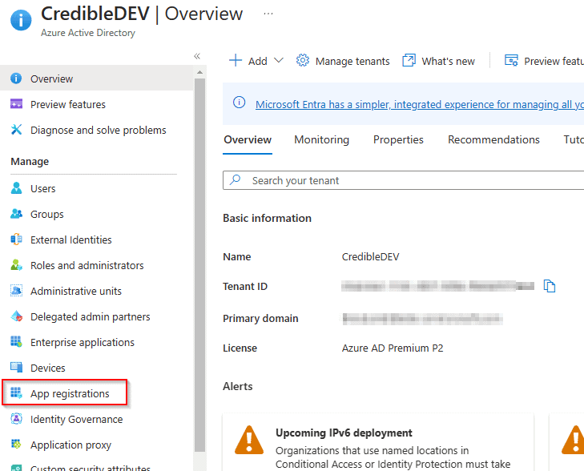
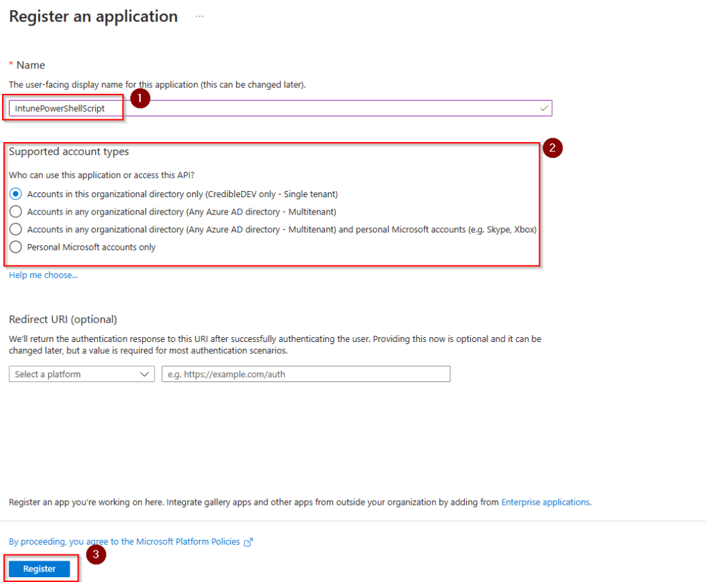
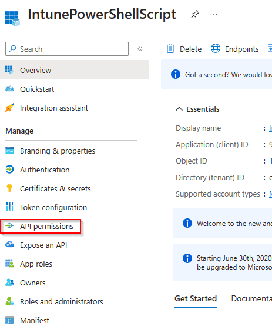
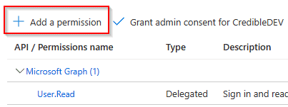
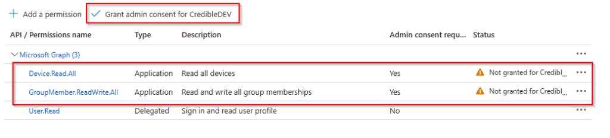
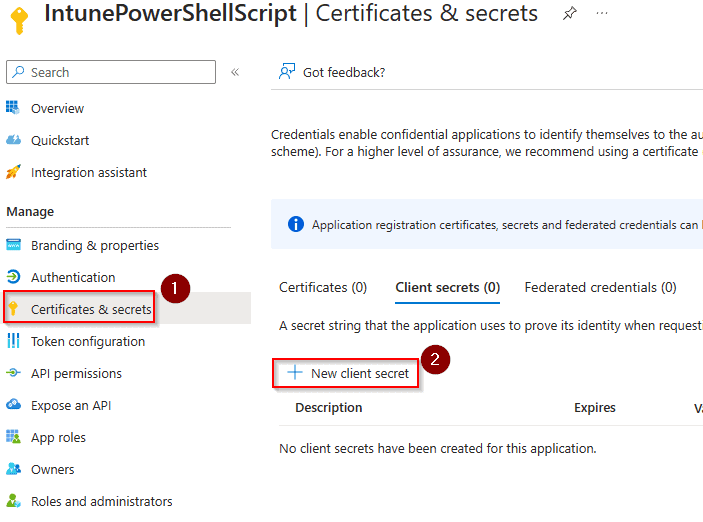
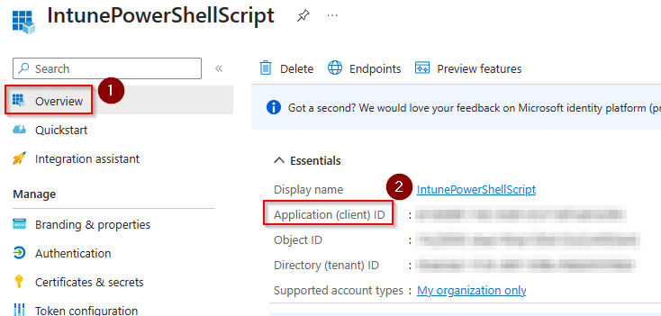

One of the noticeable drawbacks when moving from Config Manager (SCCM) to Intune is the lack of device collections based on software installed on endpoints. Like many other things in Intune, this can be overcome with a bit of creativity and PowerShell scripts.

There are multiple ways you could go about this but the way I am going to show you involves running a PowerShell script on your devices that will check if the software you are looking for is installed and if it is, the script will add the machine to the Azure device group of your choice.

For this to work, you will need an Azure app registration that has permissions for "Device.Read.All" and "GroupMember.ReadWrite.All" in the Microsoft Graph API. Don't worry if you are unfamiliar with that part, I will show you step-by-step how to set that up.

## Step 1 - Create an Azure App Registration

Before creating the PowerShell script, we will make the Azure app registration that will give our script permissions to access the tenant and the Graph API.

Head over to the [Azure Portal](https://portal.azure.com) and then Azure Active Directory. Once there, find "App registrations" in the menu.



On the app registration page, click "New Registration" found at the top. Fill in a name, this can be anything you want. The account access selection can be left as the default option unless you need something specific. When finished, click "Register" at the bottom.



On the next page, choose "API permissions" from the left-side menu.



Next, choose "Add Permission".



In the API popup, choose "Microsoft Graph", then choose "Application Permissions". You should then see a list of permissions. To make it easier, just search for "Device.Read.All" and "GroupMember.ReadWrite.All". Click the boxes next to them to add those permissions. When finished, click the "Add permissions" button. You should now see that new permissions have been added to your Azure app registration.



You'll notice there is an alert next to the permissions we just added. This is because they need admin consent. Click the button highlighted in the screenshot above to grant admin consent.

The last thing we need to do with the app registration is to create a client secret. We will use this secret from within our PowerShell script and it will allow us to access the API. From the left-side menu, choose "Certificates & Secrets". Then click on "New Client Secret".



Give your client secret a description and a time to expire of your choosing. You should now see the client secret and value listed. Make note of these values in a safe place.

Also, head to the "Overview" page for your app registration and note the client ID as well.



That's it for the app registration, we can now move on to creating the PowerShell script that will detect installed applications and add devices to an Azure AD group.

## Step 2 - Creating the PowerShell Script

The PowerShell script needs to do a few things. First, we need to find out if the piece of software we are looking for is installed on the machine or not. There are many ways to do this but we will just check the registry. In this example, we are detecting if 7-Zip is installed.

```
$key = Get-ChildItem 'HKLM:\SOFTWARE\Microsoft\Windows\CurrentVersion\Uninstall' | Get-ItemProperty | Where-Object { $_.DisplayName -match "7-Zip" }
```

The code above will look in the Windows Registry for an uninstall key that has a display name of "7-Zip". If it finds a match it will be stored in the variable "$key".

We can now make an if statement that is true if a match is found, inside this if statement we will have the code that adds the device to the group.

There are some variables that need to be set for this code to work.

- Tenant - This is your tenant ID, found on the Azure AD overview page.

- GroupID - This is the Object ID for the group that you want to add devices to. Found on the Group in Azure AD.

- ClientID - This is the App registration client ID that you noted in the last step.

- ClientSecret - This is the client secret value. Be sure to use the value and not the secret.

The first thing the script does is get the device id from the device by using the "dsregcmd /status" command. It then stores this device ID to be used later in the script.

The next few lines are just setting headers and the body of the API request. This is necessary to get an authorization token to use the API. We then store that token to be used when we make additional API calls.

Line 38 is going to use the device ID we collected earlier to get the Azure AD object ID of the device, we need this to actually add the device to a group.

Skipping down to line 41, we get a list of the current members of the Azure AD group. This is so we can make sure that this device isn't already a member of the group.

The last few lines set up the body of the API call and then make the API call that will add the device to the group specified.

```
If ($key) {
    
    # Define the tenant, group id from azure, graph api address and version
    $Tenant = ""
    $GroupID = ""
    $MSGraphHost = "graph.microsoft.com"
    $MsGraphVersion = "beta"

    # App registration values
    $ClientId = ""
    $ClientSecret = ""

    # Get the device Id of the current machine and set to the global DeviceId variable
    $RegStatus = dsregcmd /status
    if ($RegStatus -match "DeviceId") {
        $global:DeviceId = (($RegStatus -match "DeviceId").Split(":").trim())[1]
    } else {
    Write-Host "No device Id Found"
    exit 1
    }

    # Set request headers
    $headers = New-Object "System.Collections.Generic.Dictionary[[String],[String]]"
    $headers.Add("Content-Type", "application/x-www-form-urlencoded")

    # Set up request body to include app registration details
    $body = "client_id=$($ClientId)&client_secret=$($ClientSecret)&grant_type=client_credentials&scope=https%3A%2F%2Fgraph.microsoft.com%2F.default"

    # Authenticate and get the auth token to be stored in the AccessToken variable
    $response = Invoke-RestMethod "https://login.microsoftonline.com/$($Tenant)/oauth2/v2.0/token" -Method POST -Headers $headers -Body $body
    $response | ConvertTo-Json | Out-Null
    $AccessToken = $response.access_token
    # Add token to request header
    $headers.Add("Authorization", "Bearer $($AccessToken)")

    # Get the current members of the group
    $GroupMembers = Invoke-RestMethod -Method Get -uri "https://$MSGraphHost/$MsGraphVersion/groups/$GroupID/members" -Headers $headers | Select-Object -ExpandProperty Value
    # Get the Object ID of the device using the Device ID
    $DeviceObjId = Invoke-RestMethod -Method Get "https://graph.microsoft.com/v1.0/devices?`$filter=(deviceId eq '$($DeviceId)')&`$select=id"  -Headers @{Authorization = "Bearer $AccessToken"; 'Content-Type' = 'application/json'}

    # Check if the device is already a member of the group
    if ($GroupMembers.ID -contains $DeviceObjId.value.id) {
        Write-Host -ForegroundColor Yellow "($($DeviceObjId.value.id)) is in the Group"   
    } else {
        # Add device to group
        Write-Host -ForegroundColor Green "Adding ($($DeviceId)) To The Group"
        $BodyContent = @{"@odata.id"="https://graph.microsoft.com/v1.0/devices/$($DeviceObjId.value.id)"} | ConvertTo-Json

        # Make POST request to add device to the group using the Object ID
        Invoke-RestMethod -Method POST -uri "https://$MSGraphHost/v1.0/groups/$GroupID/members/`$ref" -Headers @{Authorization = "Bearer $AccessToken"; 'Content-Type' = 'application/json'} -Body $BodyContent
    }

}
```

## Step 3 - Add the PowerShell Script to Intune

Now that you have the script created, you need to add it to Intune. This can be done as a Win32 App, Proactive Remediation, or just a normal one-time device script. If you need help with this part, check out our [guide on PowerShell scripts in Intune](https://credibledev.com/powershell-scripts-in-intune/).

## Conclusion

You should now be able to create Azure groups that have devices dynamically added to them based on installed software. You could extend this script to also remove devices from groups as well. In that case, proactive remediation would probably be your best choice for deploying it. You could also use a [scheduled task.](https://credibledev.com/how-to-deploy-a-scheduled-task-in-intune/)

I hope this guide has helped you overcome some of the limitations of Intune and managing your devices. If you have any questions, please let me know.
