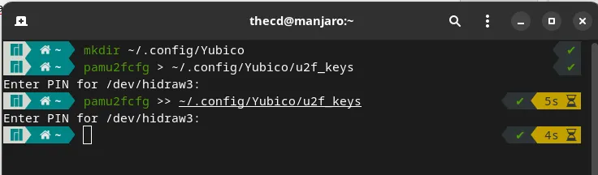
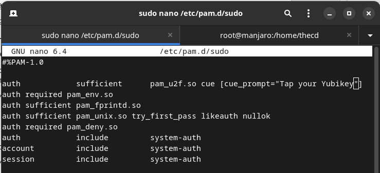
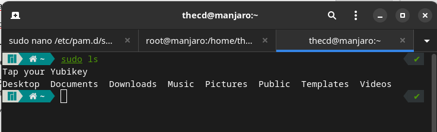
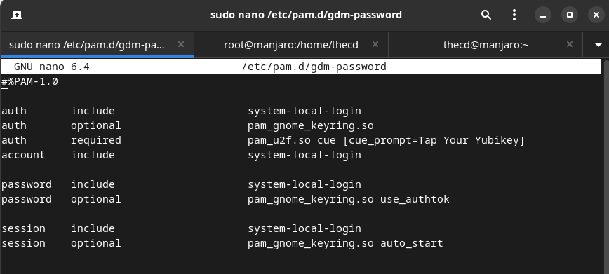
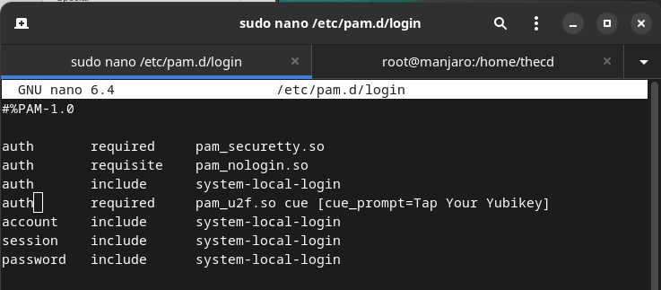
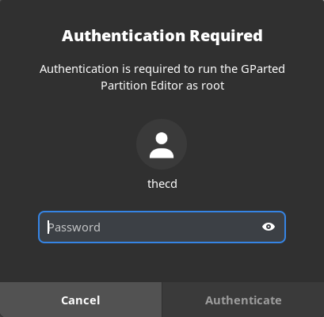
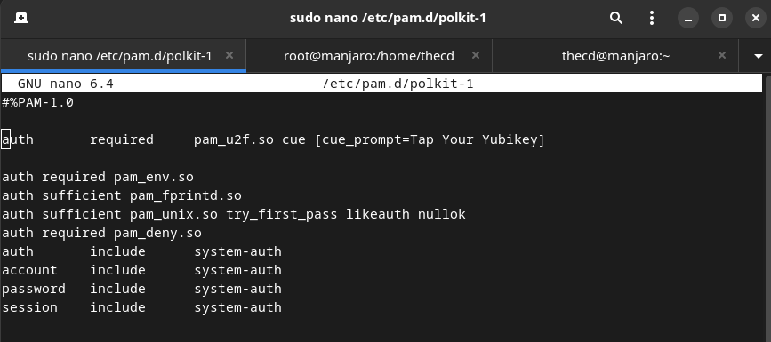
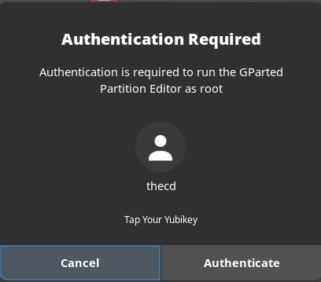

If you're like me, you want to protect your systems from all sorts of attacks. We all know that multi-factor authentication is a great tool to better protect your computers, services, and accounts. This guide will walk you through how to setup a Yubikey on Manjaro Linux. What is Yubikey? Yubikey is a hardware device, typically USB, which serves as a multi-factor authentication method. You plug the device into your USB port and when authenticating to a system, you will tap it. These devices come in various forms, such as USB-A, USB-C, NFC etc. For this guide, I assume you already have a Yubikey device, if not you can grab one from their [official site](https://www.yubico.com/store/). I'm using the [Yubikey 5 NFC](https://www.yubico.com/product/yubikey-5-nfc/) for my example. Let's get started setting up our Yubikey on Manjaro.

https://www.youtube.com/watch?v=dbysj18RMII

## Install Required Packages for Yubikey

We need to install a few packages that are going to make using the Yubikey for authentication possible. Fire up your terminal and run the following command.

```
sudo pacman -S autoconf automake libtool pkg-config libfido2 pam-u2f
```

## Collect and Store the Yubikey Keys

It is recommended that you have more than one Yubikey, in case something happens to your primary. I have 3 total so I will be repeating this process 3 times, once for each key. We need to create a directory in our profile and then a u2f\_keys file to store all of our keys. In your terminal, run the following command to create the folder.

```
mkdir -p ~/.config/Yubico
```

Next, make sure that your first Yubikey is plugged into your computer, then run the following command. Once you run this command, you may be prompted for a pin, if you've set one up. After this, your Yubikey will blink, and once you touch the device, the key will be stored in the key file.

```
pamu2fcfg > ~/.config/Yubico/u2f_keys
```

If you have multiple Yubikey's, insert the next one now and repeat the above command. This time, be sure to change the > to >>, otherwise, you will overwrite the previous key you set up.

```
pamu2fcfg >> ~/.config/Yubico/u2f_keys
```



## Setup Yubikey for Sudo

Now that we have our keys stored, we are ready to setup the Yubikey to be used for running sudo commands. Before you proceed, it's a good idea to open a second terminal window and run "sudo -s" in that terminal to get a root shell in case anything goes wrong. Leave this second terminal open just in case. In your other terminal, open up the file /etc/pam.d/sudo with your favorite editor.

```
sudo nano /etc/pam.d/sudo
```

You will want to add the following line to this file. Once this line is added, running a sudo command with your Yubikey plugged in will cause it to blink, once you tap it, the command will run. It will not ask for a password unless you don't have the Yubikey plugged in.

```
auth sufficient pam_u2f.so cue [cue_prompt=Tap your Yubikey]
```



Go ahead and open a new terminal, then type a sudo command such as "sudo ls" to test it out. You should notice the prompt to tap the Yubikey, then the command completes without asking for a password.



## Setup Yubikey for Login to Manjaro Linux

The next thing we want to use our Yubikey for is logging into the desktop. This is very easy to setup and similar to what we did with sudo. The file we want to edit is /etc/pam.d/gdm-password. This file applies to GDM, if you are using the **KDE version of Manjaro** you will want to edit **/etc/pam.d/kde** and **/etc/pam.d/sddm** instead. You will find multip "auth" lines in this file, we want to enter our line after all of the other "auth" lines like shown below. The Arch documentation on this references using "nouserok", this will only be required if multiple users log in to this station and some do not have a Yubikey. If you are the only user, you don't need to worry about this. Another note here is about home directory encryption, if you have this enabled, it's likely you won't be able to log in after making this change. You can refer to the [official documentation](https://developers.yubico.com/pam-u2f/) for notes on encryption.

```
auth required pam_u2f.so cue [cue_prompt=Tap Your Yubikey]
```



You can now lock your computer and then log in. You should be prompted for the password and then to tap your Yubikey. If you run into issues, you can switch to another terminal by pressing Ctrl+Alt+F3 for example. From here you can log in and edit the file to remove the line you just added and gain access to your system again.

## Setup Yubikey for Terminal Login

Next, we will enable Yubikey for terminal-based logins. Many of you may never even use the terminal without the GUI interface, but it's a good idea to protect these logins with the Yubikey as well. We can do this by editing the file /etc/pam.d/login, and adding the following line after the other "auth" lines.

```
auth required pam_u2f.so cue [cue_prompt=Tap Your Yubikey]
```



You can switch to a terminal by pressing Ctrl+Alt+F3 to test this out. Once finished you can press Ctrl+Alt+F1 to get back to your desktop environment.

## Setup Yubikey for Other Auth Prompts in Manjaro Linux

There are other prompts that you can setup Yubikey for on Manjaro Linux. Sometimes you receive prompts for your password when using the package manager or partition manager for example. Good news! We can protect those with the Yubikey as well.



To set this up for Yubikey, we will want to edit the file /etc/pam.d/polkit-1, and add the following line.

```
auth required pam_u2f.so cue [cue_prompt=Tap Your Yubikey]
```



After saving the changes, try launching the partition manager or something similar that generates an auth prompt. You should now be asked for your password and the Yubikey. You can change the word "required" to "sufficient" in the file if you want to only use the Yubikey and not be asked for the password. If you don't have the Yubikey plugged in, you will be asked for the password.



Sweet! Now you have setup your Yubikey to use with Manjaro Linux! If you have any questions, please drop a comment down below!
