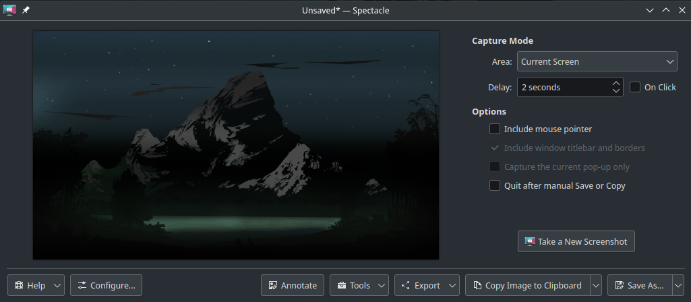
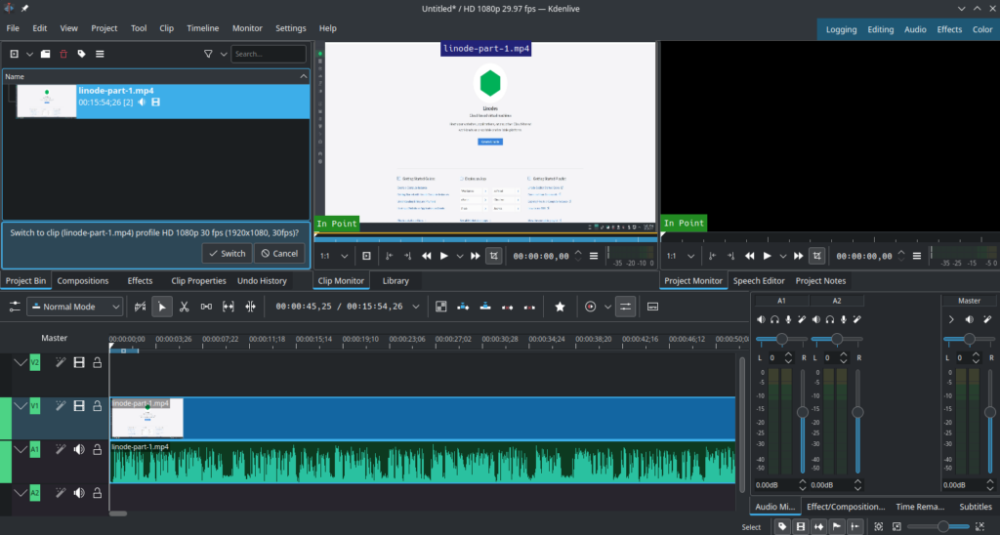
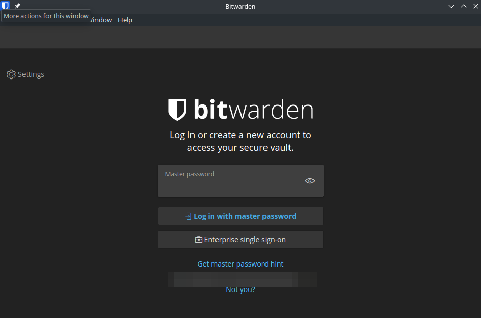
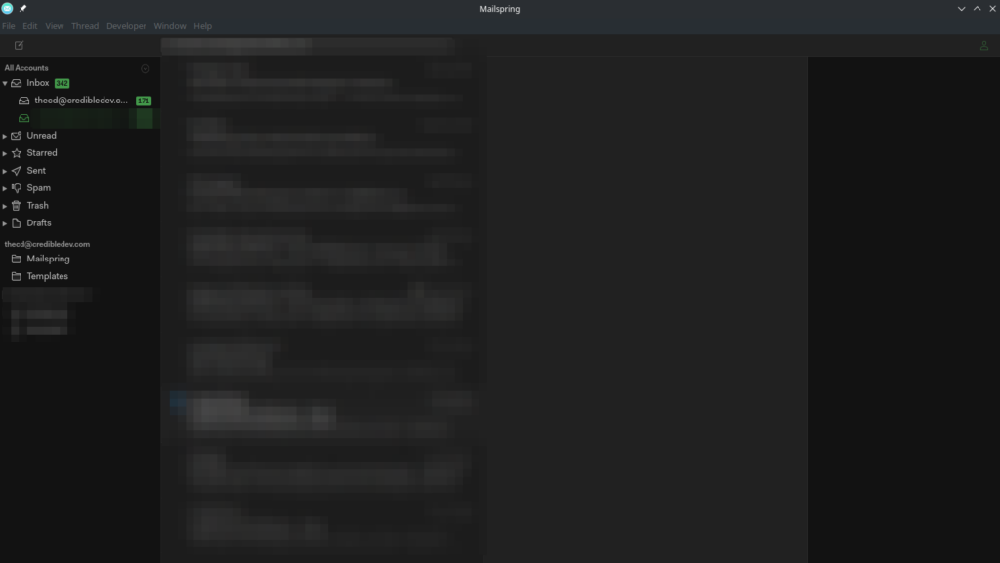
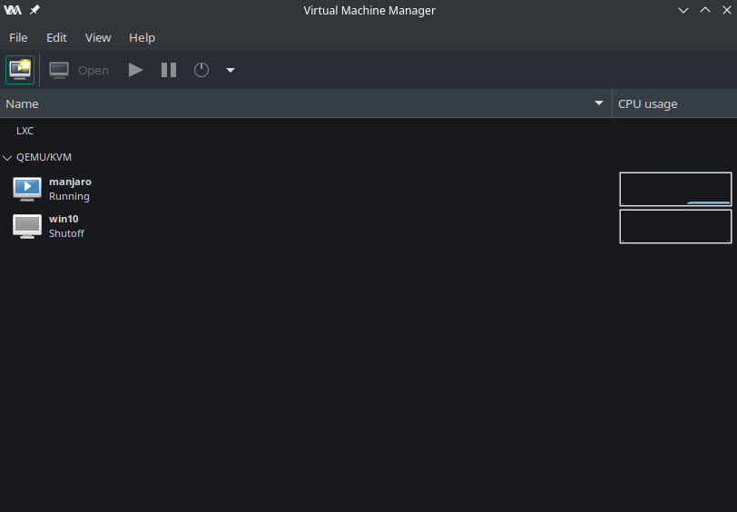

I've been using Linux off and on for years, and more recently Manjaro Linux has become my main Operating System of choice. I figured this would be a good time to cover some of my favorite Manjaro apps that I use often. Many of these Manjaro apps are available for other operating systems and distros as well, so be sure to check them out.

These apps are not in any particular order. Let's go ahead and jump into my list of favorite Manjaro apps!

## [Spectacle](https://apps.kde.org/spectacle/)

Spectacle is a screenshot utility that is packaged with KDE, which will be included by default if you installed the KDE version of Manjaro.

Spectacle is not just a basic screenshot utility, it offers many other features such as cropping, obfuscating, annotating, and more. This is why I enjoy it so much, it makes creating images and screenshots for my website very easy.

## [Kdenlive](https://kdenlive.org/en/)

Kdenlive is a must-have for me since I also create YouTube videos. While it may not be quite as feature-rich as something like Adobe Premiere, it has everything you need for basic video editing. There are some additional features such as transitions, effects, annotations, titles, animations, etc.

Kdenlive is also available on Windows and Mac in addition to Linux. Try it out, it's free and [open source](https://invent.kde.org/multimedia/kdenlive)!

## [Bitwarden](https://bitwarden.com/)

Bitwarden is one of the Manjaro apps that I couldn't live without. Security should be important to everyone, and using unique and strong passwords is imperative. Bitwarden makes this task easy and enjoyable. Bitwarden not only generates and stores complex passwords for you but also handles MFA codes, stores notes, and provides the ability to share account information with the family.

The browser plug-in can also make it more convenient to log in to websites by entering credentials automatically. With Bitwarden's zero knowledge system, I trust this service to manage and secure passwords.

Bitwarden is available for pretty much every OS, either through the browser extension or the desktop app. There is no reason not to be using a password manager and Bitwarden is the one I would recommend.

## [Mailspring](https://getmailspring.com/)

Maybe you enjoy heading to a website to receive, send and manage your email, but I do not. After using Thunderbird for many years, I finally switched over to Mailspring once they removed the requirement to create an account with them.

I can manage multiple email accounts using Mailspring and their easy-to-use interface makes it a simple and enjoyable task. Thunderbird feels archaic in comparison, to be honest. If you're looking for a new email client with a modern feel and lots of features, check out Mailspring. It's open source and it's available for Linux, Windows, and Mac.

## [Virt Manager](https://virt-manager.org/) (Virtual Machine Manager)

After using Virtual Box for virtual machines, I kept hearing recommendations for virt manager on Linux. Once I finally decided to try it, I haven't looked back. So, if you're still using Virtual Box, be sure to check our virt manager. It may not be as easy to get started, I wouldn't say it's difficult though. I've found that the performance of my VMs is far better in virt manager over other tools I've used as well.

Virt manager is only available for Linux but it is available for basically any distro, including Arch-based distributions like Manjaro, which is why it is one of my favorite Manjaro apps.

## OneDrive for Linux

Check out our [Guide on Installing OneDrive for Linux](https://credibledev.com/onedrive-for-linux/), including a GUI client.

I know, I know! Why would you want to install a Microsoft product on Linux? The truth is, many of us are forced into the Microsoft ecosystem through work or school, and our files are managed through OneDrive. Sure, you could use the web client, but sometimes that isn't feasible for your scenario or it's just cumbersome.

There are 2 open-source projects to assist with OneDrive. One of which is a base for handling the setup and syncing, and the other offers a GUI interface, which is very nice. The GUI app is not required, but it does make managing OneDrive and viewing the status nicer.

You can find the app here: [https://abraunegg.github.io/](https://abraunegg.github.io/) and the GUI Client here: [https://github.com/bpozdena/OneDriveGUI](https://github.com/bpozdena/OneDriveGUI)

## Other Manjaro Apps

The apps listed here are quite common but I figured I would mention them for those curious about apps available on Manjaro Linux. These are all apps I use today, many of these are cross-platform as well, so be sure to check them out.

- FTP Client - FileZilla

- VPN - ExpressVPN ([Manjaro ExpressVPN Install Guide](https://credibledev.com/install-expressvpn-on-manjaro-linux/))

- Code Editor - Visual Studio Code ([Visual Studio Code Install Guide](https://credibledev.com/install-vs-code-on-manjaro-linux/))

- C# .NET IDE - Rider

- Screen Recording - OBS

- Image Editing - Gimp

- Browser - Firefox or Edge ([Edge Install Guide for Manjaro](https://credibledev.com/how-to-install-edge-on-manjaro/))

- Network Traffic Analyzer - Wireshark

- System Backup - Timeshift

- Office - OnlyOffice

## What Manjaro Apps Do You Use?

This is a list of my favorite Manjaro Apps, but what are your favorites? What apps could you not live without? Which apps make Linux more enjoyable for you? Let me know in the comments!
