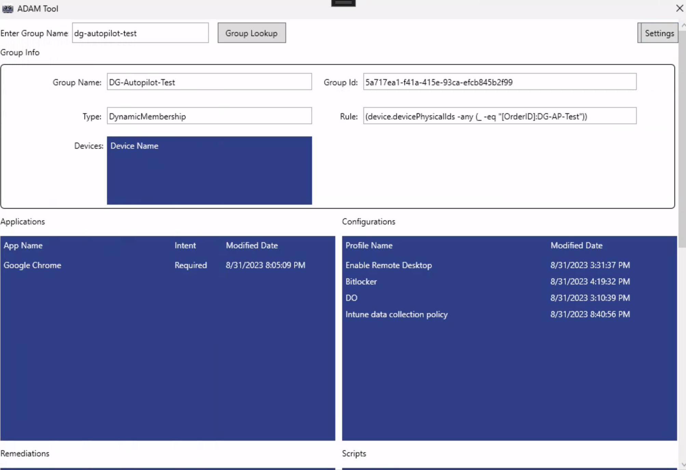

> Download the ADAM Tool Here: https://github.com/adamwhiles/Azure-Device-Group-Assignment-Management-Tool/releases

If you have been using Intune for any amount of time, you have probably found a need at some point to find out what Intune applications, configuration profiles, etc. are assigned to a specific Azure AD group. I have found myself in this position many times and unfortunately Microsoft does not offer any built in ability to do this. Really, your only option is to go through ever app, profile etc. and see what groups they are assigned to. This is not user friendly at all.

I present to you today, a tool that will do just that. The tool is the Azure Device-Group Assignment Management Tool, or ADAM Tool for short. The ADAM Tool allows you to input an Azure AD group and it will return the applications, configuration profiles, remediations, scripts and policies that are assigned to that group. It does this in under 30 seconds as well, saving you a lot of time.

## How Does the ADAM Tool Work?

Using the Graph API and the SDK for .NET, it collects all of the necessary date from Microsoft Intune.

## How Do I Use the ADAM Tool?

Once you have downloaded the ADAM Tool, you will need to install it using the provided MSI. Next, run the application as admin, this is only necessary for the first run configuration of the tenant ID and application ID.

You are going to need to create an Azure App Registration in order to get a client app ID. You don't need to assign any permissions to the app, just create the registration and get the application ID.

You will also need your Azure tenant ID.

Once you have these and have launch the app as admin, click the settings button and insert your ID's. After this the app will save those and close. You can now relaunch the app without being admin.

Put the name of the group you want to search in the box and hit lookup. You will now need to authenticate with your Azure tenant. MFA and FIDO2 keys are supported, or you can use your username/password.

The information will being populating as it's collected. That's it, simple right?

## Any Plans for Future Improvements?

Yes, there are plans for a few improvements.

1. Collect information on app dependencies.
2. Implement export function to export all of the data to csv or Excel.

If you have ideas for other improvements, reach out and let me know!