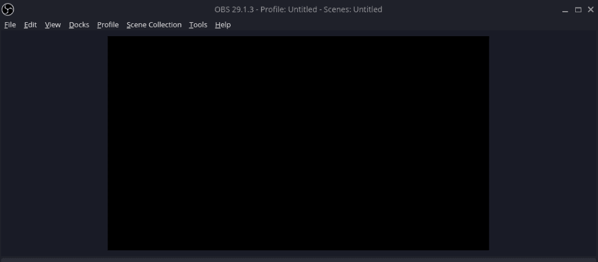
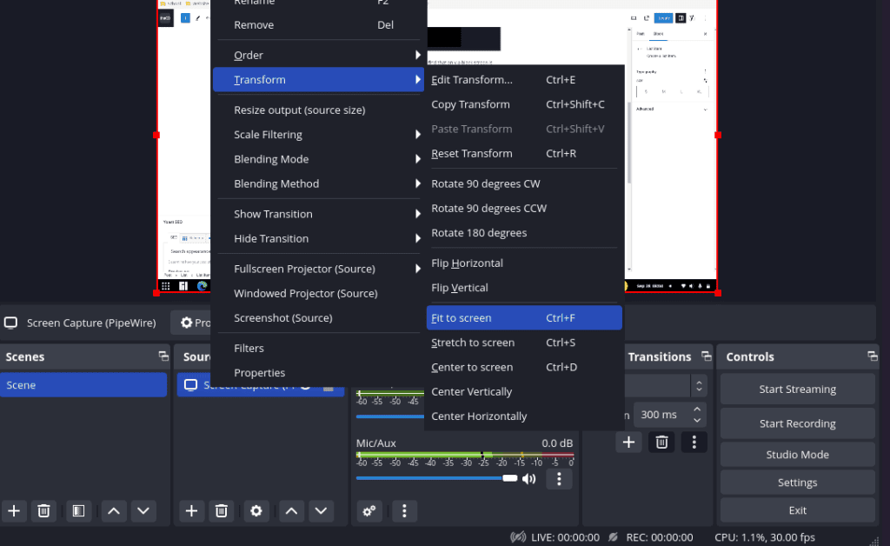

I recently install the latest release of Manjaro GNOME edition and when doing my typical device setup I found that OBS Studio wasn't fully working out of the box. Luckily it wasn't a difficult fix to get everything going and I wanted to quickly share the solution with everyone.

## OBS Install

I typically install OBS as a flatpak from flathub since it tends to provide the best experience for me, so that it what I used in this new setup as well. If you don't already have flatpak setup on Manjaro, you can checkout our guide [here](https://credibledev.com/install-flatpak-endeavouros-manjaro-arch-linux/).

## OBS Black Screen Issue



If you launch OBS and add a screen capture to your scene, you may find that only a black screen is shown instead of the desktop/window that you are expecting. If this happens to you, the fix is simple.

In your terminal, run the following command to install full pipewire support in Manjaro, which is what OBS needs.

```
pamac install --as-deps pipewire-v4l2 pipewire-zeroconf wireplumber qpwgraph manjaro-pipewire
```

Once you have done this, restart your system and OBS should now be working and no more black screen.

## Alternative Solutions

If you still see a black screen there are 2 other things you can try in order to resolve the black screen.

- Solution 1: Remove the screen capture source and re-add it again.

- Solution 2: Right-Click on the screen capture source and from the transform menu option, choose the fit to screen option.


