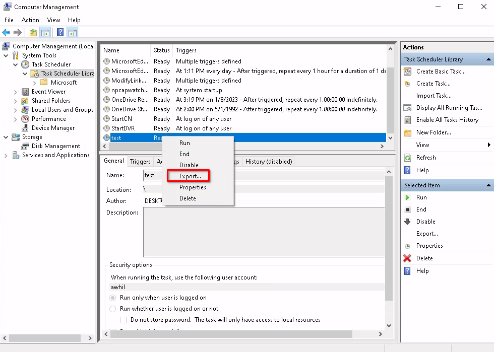
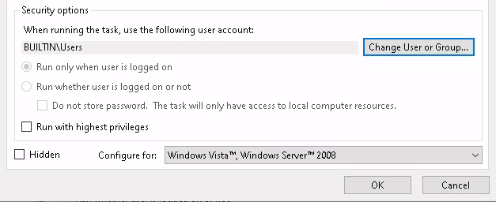
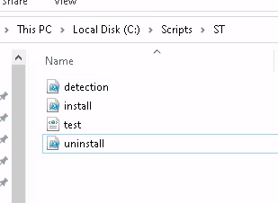
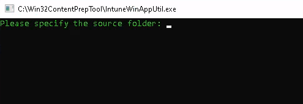
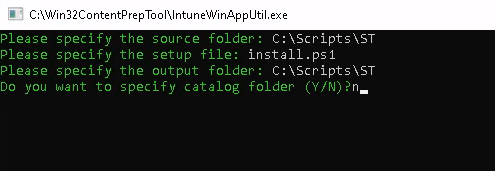
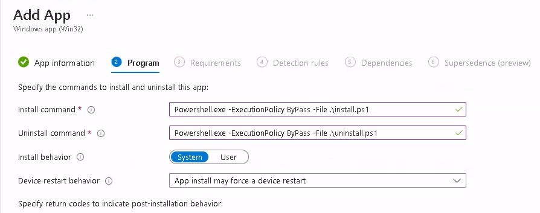
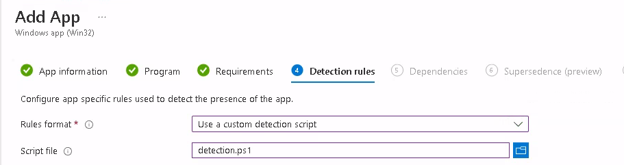

There comes a time in every Window's engineers life when they need to deploy a scheduled task to hundreds or even thousands of endpoints. Unfortunately, if your company has moved to Intune for endpoint management, this deployment isn't as obvious and straightforward as it could be.

Luckily, it isn't terribly hard to do and it certainly isn't impossible. So today, we will break down the steps to deploy a scheduled task with Microsoft Intune. I have used this same method on multiple occasions and it has worked every time.

## Step 1 - Creating a Schedule Task in Windows

The first step in the process is to mock up the scheduled task that you want to create from within the Windows task scheduler. You want to create all aspects of the task the way you want them, be sure to include the event and action. Consider if you want this running in the user or system context as well.

Once you have the scheduled task created, you will want to export it. You can do this by right-clicking on your scheduled task and choosing export.



This will export an XML file that has the details of your scheduled task. This is what we will use to deploy via a Win32 Intune app, along with a little bit of PowerShell.

## Step 2 - Create an Install Script in PowerShell

Now that we have our scheduled task exported as an XML file. We will create a PowerShell script that will install the task via Intune on the target endpoint device.

This PowerShell script will copy the XML file to the machine, then generate the scheduled task using the Register-ScheduledTask command.

The part at the end "-User system" will be the user account the task will run in. In our example, the scheduled task that we deploy will run in the system context.

install.ps1

```
# Copy the XML file
Copy-Item ".\test.xml" "C:\"

# Register a new Scheduled Task using the XML
Register-ScheduledTask -xml (Get-Content C:\test.xml | Out-String) -TaskName "test" -TaskPath "\" -User system
```

If you need your task to run in the user context for all users. Be sure your task is set up to run as BUILTIN\\Users in the task you created. Also, in the PowerShell script above, remove the "-User system".



## Step 3 - Create a Detection Script

Now that we have the install script created, we need to also create a detection script. This script will be run on endpoints to detect if the scheduled task exists on the machine or not. If it doesn't, then the install script we just created will be executed on the endpoint.

detection.ps1

```
$taskExists = Get-ScheduledTask | Where-Object {$_.TaskName -like "test"}

if($taskExists) {
  Write-Host "Success"
  Exit 0
} else {
  Exit 1
}
```

## Step 4 - Create an Uninstall Script

Our Win32 app package for Intune wouldn't be complete with a proper way to uninstall the scheduled task in case the need arises. This script will simply remove the scheduled task and ignore the confirmation prompt. Since this will run silently, we don't need a confirmation prompt preventing it from running properly.

uninstall.ps1

```
Unregister-ScheduledTask -TaskName "test" -Confirm:$false
```

## Step 5 - Create a Win32 App Package for Intune

Now we have our XML, install, detection, and uninstall scripts for our scheduled task, we are now ready to package them as a Win32 app that we can upload it into Intune.

Put all four files in their own directory, for our example, we'll use C:\\scripts\\ST as the directory.



Now we need to run [Microsoft Win32 Content Prep Tool](https://github.com/Microsoft/Microsoft-Win32-Content-Prep-Tool), to package these files into a Win32 app. This tool will generate an "intunewin" file, which we will upload to Intune. Visit the GitHub page linked above and download the repo as a zip. Extract the zip file to your system so you can use the tool. Either double-click the "IntuneWinAppUtil.exe" file or run it from the terminal.



The source folder is where you have the 4 files we created. The next prompt will be for the setup file, this will be "install.ps1". The next prompt will be the output directory, this can be the same as the source folder. You will then be asked about creating a catalog folder, you can put "n" for no. Then your package will be generated.



When it is finished, you should now have an "intunewin" file in your directory.

## Step 6 - Upload the Win32 App Package to Intune

Login to Intune and start creating a new Win32 app. I assume that you know how to start this process so I will only cover the relevant parts here that make it unique. Proceed with choosing Win32 as the app type and when prompted, navigate to the location of the "intunewin" file to upload it.



For the install and uninstall command of the Win32 app use the following as shown in the screenshot above.

```
Powershell.exe -ExecutionPolicy ByPass -File .\install.ps1
Powershell.exe -ExecutionPolicy ByPass -File .\uninstall.ps1
```



For the detection rule, you will choose to use a custom detection script. Then browse to the script that we created earlier.

## Conclusion

You have now successfully created a Win32 app in Intune that will deploy a custom scheduled task to your Windows endpoints.

Want to know how to do other things in Intune? Leave a comment below. Also, be sure to check out my other post on the different ways you can [Deploy PowerShell Scripts in Intune](https://credibledev.com/powershell-scripts-in-intune/).
