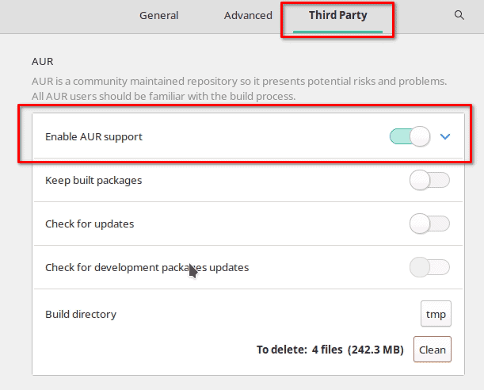

One of the most popular benefits of running an arch-based Linux distribution like Manjaro or EndeavourOS is access to the Arch User Repository, also known as the AUR. Linux distributions typically come with an included software repository which users can easily install software from, and Manjaro is no different. It includes an official software repository that allows access to thousands of software packages. The AUR repository on Manjaro extends this software inventory even further.

## What is the AUR Exactly?

The [AUR is like a big library](https://aur.archlinux.org/) for Manjaro Linux users. It's made by the community and has tons of software packages that you can install to add new features to your computer. Think of it as a place to find and download new tools and programs for your Manjaro Linux system that aren't available in the regular software store.

The AUR differs from the official Manjaro repository in several ways:

1. **Package Quality:** The AUR packages are not reviewed or tested by Manjaro developers, so the quality of the packages may vary.

3. **Support:** Official Manjaro repository packages are supported by the Manjaro team, but AUR packages are not.

5. **Package Versions:** The AUR often has newer versions of software packages than the official Manjaro repository.

7. **Package Quantity:** The official Manjaro repository has a limited number of packages compared to the AUR, which has many more packages available.

9. **Package Availability:** Some packages may only be available in the AUR and not in the official Manjaro repository.

## What are Some Benefits of Using the AUR?

1. **More Packages:** The AUR has many more software packages available than the official Manjaro repository.

3. **Newer Versions:** The AUR often has newer versions of software packages than the official Manjaro repository.

5. **Unique Packages:** Some packages may only be available in the AUR, making it a great resource for finding unique and specialized software.

7. **Community-Driven:** The AUR is a community-driven repository, so users can contribute and share their own packages with the community.

9. **Easy to Use:** The AUR can be easily accessed and packages can be installed using the Pacman package manager.

## Is the AUR Safe to Use?

Using the AUR comes with some risks, as the packages in the AUR are not reviewed or tested by Manjaro developers, and may contain bugs or security vulnerabilities. Here are some steps you can take to reduce the risks of using the AUR:

1. **Read package descriptions and user comments:** This can help you understand what a package does and if there have been any issues with it.

3. **Use trusted sources:** Look for packages that have been frequently downloaded or have positive user comments.

5. **Check the code:** If you are familiar with programming, you can check the package's source code to see if it contains anything malicious.

7. **Use a package manager:** AUR helpers like yay or pamac can help you manage the installation of AUR packages and also help you keep track of updates.

## How Do I Enable the AUR on Manajro?

The AUR is not enabled by default in Manjaro Linux, but it can be easily enabled by using a package manager such as Pamac or Yay. Here's how you can enable the AUR using Pamac:

1. Open Pamac (Add/Remove Software) from the application launcher.

3. Go to the "Preferences" menu and select the "Third Party" tab.

5. Enable the "Enable AUR support" option.

7. Save the changes.



That's it! You can now install packages from the AUR using Pamac. Just search for the package you want to install, select it, and click "Install". Pamac will download the package from the AUR and install it for you. If you are on EndeavourOS, the AUR is already enabled and you can install apps by using "yay" from the command line.

## How Do I Uninstall an AUR App?

To uninstall an AUR app in Manjaro Linux, you will need to use a package manager that supports the AUR, such as Pamac or Yay. Here's how you can uninstall an AUR app using Pamac:

1. Open Pamac from the application launcher.

3. Go to the "Installed" tab.

5. Find the AUR app you want to uninstall and click on it.

7. Click the "Uninstall" button which looks like a garbage can.

9. Confirm the uninstall by clicking apply.

The app and its dependencies will be uninstalled from your system.


If you prefer to use the command line, you can use a package manager such as Yay to uninstall an AUR app. For example:

```
yay -R app-name
```

## Can I Use the AUR From the Command Line?

Yes, you can use the AUR from the command line in Manjaro Linux. For this, you will need to install a package manager that supports the AUR, such as Yay, Trizen, or Aurutils. You can use [pacman](https://credibledev.com/how-to-use-pacman-on-manjaro-linux/) or pamac to install one of these AUR helper tools.

Once you have installed a package manager, you can use it to search for packages, install packages, and manage updates from the command line. For example, if you have installed Yay, you can use the following commands to search for and install a package:

```
yay -Ss package-name  # search for a package
yay -S package-name   # install a package
yay -Syu              # update all installed packages, including AUR packages
```

## How Do I Add an App to the AUR?

To add an app to the AUR, you will need to follow these steps:

1. **Create an AUR account:** You will need to create an account on the Arch User Repository website to be able to upload packages.

3. **Package the app:** You will need to create a package for the app, which includes the source code, configuration files, and a PKGBUILD script that defines how the package will be built and installed.

5. **Upload the package:** Once you have created the package, you can upload it to the AUR using the web interface or the AUR command-line tools.

7. **Wait for review:** After you upload the package, it will be reviewed by the AUR community to ensure that it complies with the AUR policies and guidelines.

9. **Make updates:** If there are any issues with the package, you will need to make the necessary updates and re-upload the package for review.

11. **Maintain the package:** Once the package is accepted and published on the AUR, you will need to maintain it and make updates as necessary to ensure that it continues to work as expected.

Adding an app to the AUR can be a complex process, but it is a great way to share your app with the Manjaro community and make it easily accessible to other users. Before you start, make sure you are familiar with the AUR policies and guidelines, and be prepared to invest the time and effort required to package and maintain the app.

## What are Some Alternatives to the AUR?

Personally, I prefer to install Flatpaks where I can. Apps installed through Flatpaks tend to have fewer dependency related issues and run as the application developer intended. Here are some alternative methods to the AUR for installing software packages.

1. **Official repositories:** Manjaro Linux provides a large collection of packages in its official repositories, which are maintained by the Manjaro development team. These packages are tested and supported and are a good place to start if you're looking for a stable and reliable package.

3. **Snap:** Snap is a package manager for Linux that allows you to install and manage applications. It is similar to the AUR in that it provides access to a large repository of packages, but differs in that the packages are pre-packaged and run in a secure sandbox environment.

5. **Flatpak:** [Flatpak](https://credibledev.com/install-flatpak-endeavouros-manjaro-arch-linux/) is another alternative to the AUR, which provides a centralized repository for Linux applications. It allows you to install and manage applications in a similar way to the AUR, but with the added benefit of having more control over the runtime environment.

7. **AppImages:** AppImages are self-contained, portable application packages that can run on most Linux distributions. They are similar to Snap and Flatpak in that they provide a way to install and manage applications, but differ in that they don't require a centralized repository or runtime environment.

9. **Compiling from source:** Another alternative to the AUR is to compile software from source code. This allows you to build the software specifically for your system and gives you complete control over the installation process. However, compiling from source can be more time-consuming and requires a greater understanding of the software and how it is built.

Each of these alternatives has its own pros and cons, and the best choice for you will depend on your needs and requirements.

## Conclusion

You are now informed on the AUR, how to use it, and the risks, benefits, and alternatives as well. If you have questions about the AUR or other Manjaro Linux topics, let me know in the comments.
