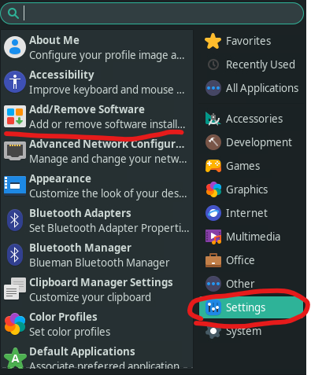
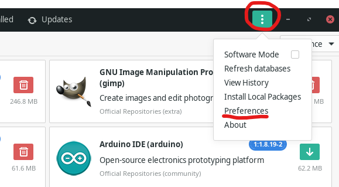
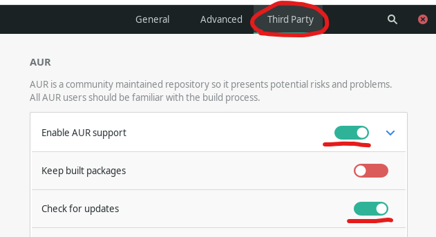
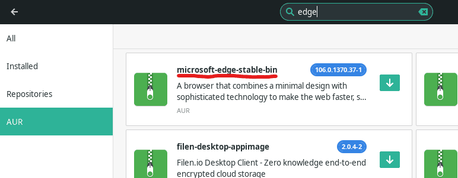
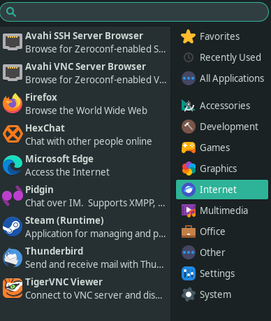

The browser wars are still real, Chrome and Firefox fanboys stand aside. I actually prefer Edge, as it's built on Chromium and performs fairly well, and it includes many features like sleeping tabs and fast startup. It also easily syncs my favorites and extensions which is a nice touch. There is something that seems wrong about installing a Microsoft product on Linux, but I already use VS Code, and to be honest, who cares what other people think? I'm installing Edge and if you want to as well, then follow along with me, it's not too difficult.

## Enable AUR

The first thing we need to do to make the installation simple is to enable the AUR repository if it's not already enabled. AUR is the community-maintained repository that we can enable to gain access to more software, like Edge for example. It's easy to enable, don't worry. First, we need to launch Add/Remove Software.

Once we have Add/Remove Software open, we want to click the three dots at the top right, then choose preferences.

In the preferences screen, we want to select the Third Party tab at the top, then enable AUR Support and also enable Check for Updates.

That's all that is needed for enabled AUR, so now we can proceed with installing Edge.

## Installing Edge

Back in the Add/Remove Software, you can close out of the preferences screen, then click the search icon at the top left of the window. Type edge into the search box and press enter. Then on the left select AUR so you get results from the AUR repository.

Choose the option for microsoft-edge-stabe-bin and on the next page click on build. After clicking build, an apply button will appear at the bottom right of the window. Click apply to process the installation of Edge on our Manjaro machine. You may see an additional popup after clicking apply, this is telling you any dependencies that will be installed, click apply at the top right of this window to continue.

## Running Microsoft Edge on Manjaro

Once this completes, you should now have Microsoft Edge installed on your Manjaro Linux machine. You can find it in the applications menu under Internet. You can also launch it from a terminal by running the command microsoft-edge-stable.

