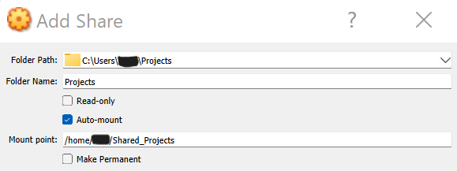

I like many others, use a Linux virtual machine in VirtualBox from my Windows PC to do development work. There are many Linux distributions out there and many choose Ubuntu or some variant of it, I've chosen Manjaro which is an Arch based Linux. Completing tasks in Manjaro can be a bit different than in Ubuntu and other Debian Linux variants. One of those tasks is sharing a folder from my Windows PC through VirtualBox to my Manjaro Linux virtual machine. It's not difficult, just a slight bit different and I will show you here how to share a windows folder with your Manjaro or Arch based Linux VM in VirtualBox.

Before proceeding with the following steps, make sure that you have the VirtualBox Guest Additions installed on your Manjaro or Arch Linux virtual machine. You can install these required tools with the following command.

```
sudo pacman -Sy virtualbox-guest-utils
```

## Create the Folder in Windows

The first step here is to either locate or create the folder you want to share from your Windows OS.

In my example here, it will be a folder in my Windows user directory called "Projects". C:\\Users\\username\\Projects

## Create a Folder on Your Manjaro/Arch Linux VM

Next, we need to create a folder within the Manjaro VM, where the folder from Windows will appear.

For my example, I have created a folder within my Manjaro user account folder called "Shared\_Projects". cd /home/username/Shared\_Projects

To create this folder you could use the following command from the Manjaro terminal prompt.

```
mkdir ~/Shared_Projects
```

The ~ symbol is used here to represent the currently logged-in user's home folder. You can choose any folder you want however, this is just an example.

## Add the User Account to the VBOXSF User Group

When VirtualBox links the Windows folder to our Manjaro folder, it does so using the vboxsf group, which means that our user account must be a member of this group, otherwise, you will get permission errors. Adding a user to the vboxsf group just takes one command.

```
sudo usermod --append --groups vboxsf username
```

Run this command by replacing the username with your Manjaro Linux accounts username and this will make that account a member of the proper group to obtain access to the share folder files.

## Setup the Share Folder in VirtualBox

In VirtualBox, we need to configure the folder we are sharing from Windows, along with the folder we are attaching it to in Manjaro. So open up VirtualBox and head to the settings of your virtual machine. In settings, you will find an option for "Shared Folders". Click that option then on the right side you will see a folder icon with a plus symbol on it, this allows you to add new share folders. Click that icon to create your new shared folder.



In the folder path field, you put the path to the Windows folder you are sharing, it's easier to just browse to the path by using the dropdown.

Folder Name is filled out automatically, no changes are needed here.

Check the Auto-mount box so that your folder is automatically available in Manjaro each time you boot up.

In the mount point field, this is where you put the path to the folder you created on Manjaro. We used the users home directory and a folder called Shared\_Projects within it. So the path is /home/username/Shared\_Projects.

Click ok to close the box, make sure the folder shows up under "Machine Folders" and not "Transient Folders".

You can now power on or restart your Manjaro Linux VM and you will be able to access your newly created shared folder.
