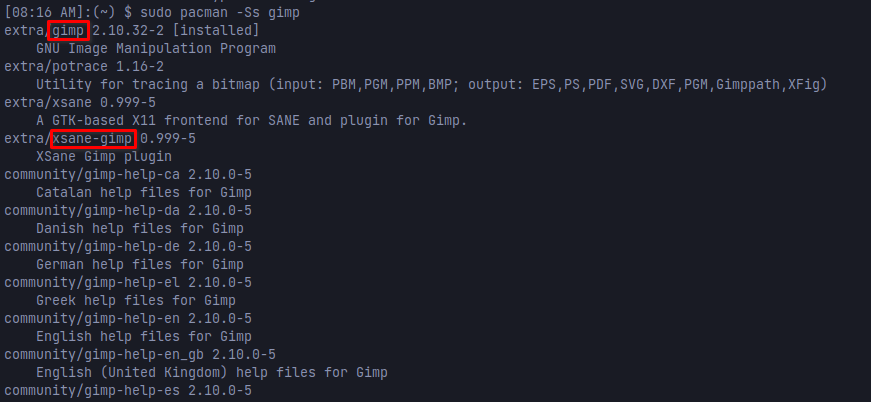
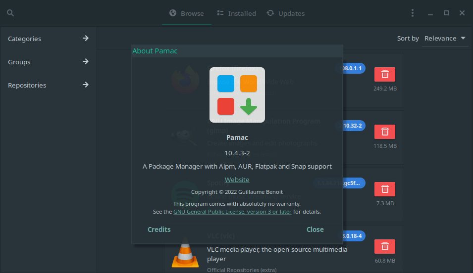

Installing software is a core function of any operating system, [pacman](https://archlinux.org/pacman/#_man_pages), the package manager built into most arch based Linux distributions such as Manjaro Linux serves this purpose well. It is a powerful command-line utility that everyone who uses an Arch based Linux distro should be familiar with.

If you prefer a GUI over using the command line, you can also use pamac, which comes pre-installed typically. Pamac also allows you to handle Flatpaks and packages from the AUR repository, which is a nice bonus.

Pacman is the main utility you will find yourself using on Manjaro to install, update and maintain most of the software on your machine. So, it is essential to understand how to use pacman effectively to install, search, update and inventory the software installed.

Today, we are going to break down 11 of the most common command line functions that will help you make better use of the pacman package manager on Manjaro. Let's get into it.

## Use Pacman to Install a Software Package

The most common and vital function of them all is simply to install a new software package using pacman. If we want to install Firefox, for example, this is the command we would use.

```
sudo pacman -S firefox
```

## Sync Package Database in Pacman

Packages are updated constantly, so the database needs to be refreshed to ensure you are getting the most up-to-date software from pacman and its repositories. Running this command will sync the databases.

```
sudo pacman -Syy
```

## Sync the Pacman Database and Update Installed Packages

Most likely, you are not wanting to just sync the database like with the previous command, you also want to update any out-of-date packages that you have installed. The following pacman command will do just that, it will sync the databases and check for any out-of-date packages on your system.

```
sudo pacman -Syu
```

## Use Pacman to Search for Available Software

Sometimes you may not know the exact package name of the software you want to install. Pacman offers the ability to search for available packages and you can also use regular expressions if that's your thing. If we want to search for Gimp, we can use the following command.

This will search package names and descriptions for the keyword or expression that you enter.

Note: You can also use the [Arch website](https://archlinux.org/packages) to search for packages as well.

```
sudo pacman -Ss gimp
```



You'll notice in the output from searching for the package called Gimp, the version number is listed but to install Gimp or the XSane plugin for Gimp, we would not use the version number to install it necessarily. We would simply run "sudo pacman -S gimp" or "sudo pacman -S xsane-gimp".

## Use Pacman to Search for Installed Packages

You can also use pacman to search your Manjaro or Arch based Linux system for packages that are already installed. If we wanted to search our system to see if Gimp is installed, we can use the following command.

```
sudo pacman -Qs gimp
```

## Use Pacman to Uninstall Software and Packages

If you have unneeded software on your system, pacman makes it easy to uninstall and also clean up dependencies that are no longer needed as well. If we wanted to uninstall Gimp and all of the dependencies that are no longer needed we can use the following command.

Note: Any dependencies still needed by other applications will not be removed. If you want to remove a package without cleaning up dependencies, remove the "ns" option from the command and just use "-R" instead.

```
sudo pacman -Rns gimp
```

## Listing All Installed Apps with Pacman

If you want to spit out a list of all of the packages installed on your system, pacman can help with that. We can also break it down further by apps you installed as opposed to packages that were installed by Manjaro for example. We can also break out just a list of packages installed from the AUR repository.

```
sudo pacman -Q
```

### List User Installed Apps

This command will list all of the apps you installed yourself.

```
sudo pacman -Qe
```

### List Apps Installed from the AUR Repository

This command will list only the software packages that were installed from the AUR repository.

```
sudo pacman -Qm
```

## Use Pacman to List Orphan Packages

If you want to list out all packages that are considered orphaned or no longer needed. Run the following pacman command. You could then uninstall these packages since they are no longer needed and waste hard disk space.

```
sudo pacman -Qdf
```

## Clear Pacman Cache

Pacman can use quite a bit of disk space from cached packages and database cache. You can easily clean this up to free up additional disk space by running the following command.

```
sudo pacman -Sc
```

## Pacman Config File Options

Did you know that you can customize some features of pacman? Check out the pacman config file, typically found here: /etc/pacman.conf

In this config file, you can configure the behavior of pacman, such as checking for available space before installing a package, color terminal output from pacman and more.

You can read about the full pacman config file options here in their [documentation](https://archlinux.org/pacman/pacman.conf.5.html).

## GUI Frontend Package Manager

Manjaro Linux and other Arch distros also come with pamac, which is the GUI frontend for package management. For those who are not comfortable with the command line yet, or simply prefer a user interface, pamac is perfect for managing packages on Linux.



## Conclusion

The provided examples on how to manage, update and install packages should get you started and cover most of the common uses and needs. Did I miss anything? Let me know in the comments. Meanwhile, check out a recent post about [how to install Onedrive on Manjaro Linux](https://credibledev.com/onedrive-for-linux/).
