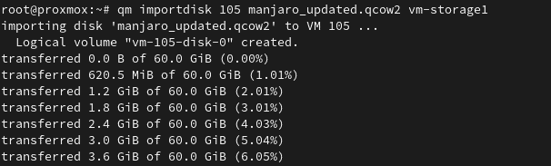

If you're like me, prior to using Proxmox you had virtual machines running in something like VirtualBox or Virt Manager. You may have spent a lot of time configuring these VMs and now that you're migrating to Proxmox you really don't want to start from scratch on those existing VMs. Luckily, you can import those into Proxmox and I'll show you how to do that here, so let's get started.

## Import VirtualBox VM to Proxmox

### Step 1: Launch VirtualBox

Once you have VirtualBox open, find the VM that you want to migrate to Proxmox and right-click on it. In the menu, choose "Export to OCI"


On the following screen, you can keep the defaults. Just make sure the "Format" is set to "Open Virtualization Format". Take note of the file location, as we will be copying this file over to our Proxmox server. Go ahead and click "Next" and then "Finish".


The export of the VM should now begin and will take a few minutes to complete.


### Step 2: Upload VirtualBox OVA to Proxmox

Once the export is finished, you should find the OVA file in the location that you noted above. Now you need to upload this OVA file to your Proxmox server. You can do this using whatever method you want, I typically use SFTP to upload the file.

### Step 3: Prep the OVA File in Proxmox

You will need to either SSH to your Proxmox server or use the built-in console/shell for this part.

Navigate in the shell session to where you uploaded the OVA file and run the following command to extract the OVA. This will give us a vmdk file that represents the hard disk of the VirtualBox VM we are trying to import.

```
tar -xvf yourfile.ova
```

After extracting the OVA file, you will have multiple files. The one that we want is the vmdk file which we will use to create the VM in Proxmox.


### Step 4: Create a Base Virtual Machine

Now that we have the vmdk file, we need to create a basic VM in Proxmox. Configure the Network, CPU, and RAM however you wish. Once you have created the new VM, we will detach and remove the hard disk that was created with the VM. We will be replacing that hard disk with the one from VirtualBox.

To remove the current hard disk of the new VM, go into the hardware for the VM and highlight the Hard Disk. Then in the top menu select detach. After it is detached, it will appear as "Unused", highlight it again and choose remove.


### Step 5: Import the VMDK to the New Proxmox VM

Before we import the disk, take note of the ID for your new VM in Proxmox and the storage you want the hard disk to live on, you will need this for the import. In my case, the VM ID is 104 and the storage I want is vm-storage1. Your storage and ID will be different.


Back in your shell prompt, make sure you are still in the folder where you extracted the vmdk file. Then run the following command. Replace the vmid, filename.vmdk, and storage\_name with your values.

```
qm importdisk vmid filename.vmdk storage_name -format qcow2
```

You should see the import process begin.


### Step 6: Enable the Disk in Proxmox

If you head back to the VM in Proxmox, you should now see your disk listed as "Unused". To enable the disk, highlight it and click edit. Customize any options you may need such as "Discard" and "SSD Emulation" (Only if the underlying disk is an SSD), then click on Add to make the disk active.


One last thing we need to do is change the boot order so that our VM boots to this new disk. From the "Options" menu of the VM, go into boot order and check the box next to your new hard disk and move it up in the order. In my example, I moved it just below the CD-ROM drive since I don't have an ISO attached to it.


### Step 7: Boot Your VM

Now you are ready to boot up your VM for the first time on Proxmox. Once you have confirmed it is working, you can delete the OVA you uploaded and extracted files as they are no longer needed.

## Import Virt Manager VM to Proxmox

### Step 1: Launch Virt Manager

To get started with importing a Virt Manager VM to Proxmox, you need to find out where the VMs disk is currently stored. Go ahead and open up Virt Manager, make sure the VM is powered off, then right-click on the VM you want to use and choose open.

Next, click the info icon to open the hardware details. Find the disk on the left side and view the file location on the right.


### Step 2: (Optional) Disable Preallocation of the Disk

This step is optional but by default, Virt Manager creates full disk-size images. To save some time on uploading the VM disk to Proxmox, we can change the current image to have preallocation turned off, which will reduce the size of the disk image file.

To start we will copy the VM disk in case something goes wrong. I'm just going to copy it to my home folder. Be sure to replace the image file location below to match the location of your image file.

Note: You may or may not need to use "sudo" for this command, depending on where you image file is located.

```
sudo cp /path/to/image/file.qcow2 ~/
```

Now we will disable the pre-allocation feature to shrink the disk image. In the code below, you will need to update current\_file and new\_file with your values.

Note: Depending on who owns the image file on the Linux filesystem, you can either change the ownership of the file with "chmod" or run the command with "sudo".

```
sudo qemu-img convert -f qcow2 -O qcow2 -o preallocation=off current_file.qcow2 new_file.qcow2
```

You should now have 2 qcow2 files, the new one should be much smaller than the original depending on how much disk space was actually used in the original image.

### Step 3: Upload QCOW2 file to Proxmox

Now we need to upload our qcow2 file to Proxmox. You can do this however you want but I will be uploading it via SFTP.

### Step 4: Create a Base VM

Once you have uploaded the qcow2 file, we need to create a basic VM in Proxmox. The options you use for VM creation can be whatever you want, so configure the CPU, RAM, and Network to your requirements or needs. The hard disk created during this process doesn't matter since we will be deleting it.

After your VM is created, the hard disk should be removed. To remove the current hard disk of the new VM, go into the hardware for the VM and highlight the Hard Disk. Then in the top menu select detach. After it is detached, it will show up as "Unused", highlight it again and choose remove.


### Step 5: Import QCOW2 Disk to the New VM

Before we import the disk, take note of the ID for your new VM in Proxmox and the storage you want the hard disk to live on, you will need this for the import. In my case, the VM ID is 104 and the storage I want is vm-storage1. Your storage and ID will be different.


Back in your shell prompt, make sure you are still in the folder where you uploaded the qcow2 file. Then run the following command. Replace the vmid, filename.qcow2, and storage\_name with your values.

```
qm importdisk vmid filename.qcow2 storage_name
```

You should see the import process begin.



### Step 6: Enable the Disk in Proxmox

If you head back to the VM in Proxmox, you should now see your disk listed as "Unused". To enable the disk, highlight it and click edit. Customize any options you may need such as "Discard" and "SSD Emulation" (Only if the underlying disk is an SSD), then click on Add to make the disk active.


One last thing we need to do is change the boot order so that our VM boots to this new disk. From the "Options" menu of the VM, go into boot order and check the box next to your new hard disk and move it up in the order. In my example, I moved it just below the CD-ROM drive since I don't have an ISO attached to it.


### Step 7: Boot Your VM

Now you are ready to boot up your VM for the first time on Proxmox. Once you have confirmed it is working, you can delete the qcow2 file you uploaded since it is no longer needed.

## Conclusion

I hope this guide helps you out on your journey of using Proxmox and virtual machines. If you have any questions let me know below!
