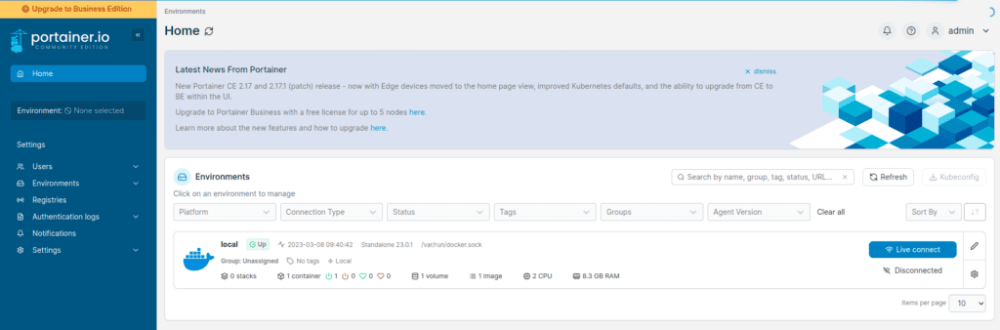
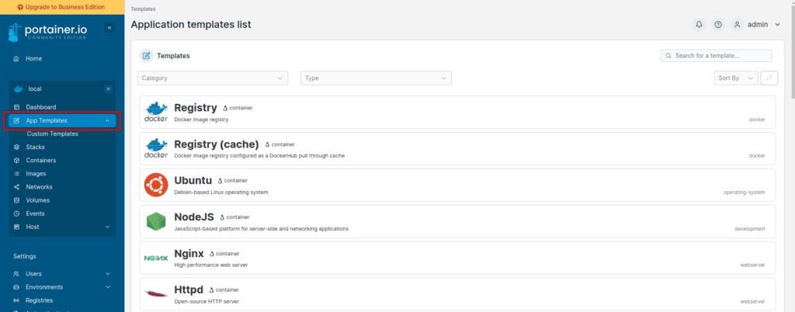
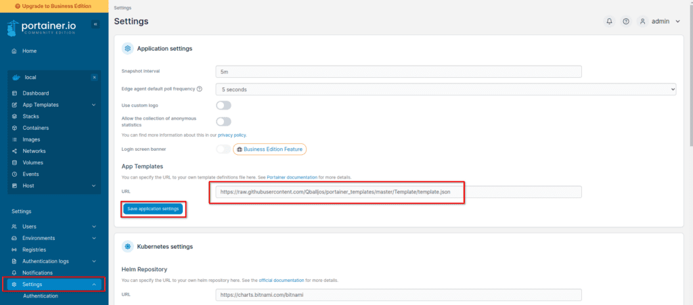

Everyone has heard of Docker by now, it's one of the most popular ways to create and run containerized apps and services. Docker isn't difficult to use and understand but there are tools that exist that make managing, creating, and modifying docker containers even easier and user-friendly. This is exactly what Portainer does, it provides you with a simple-to-use and nice-looking web interface to manage your Docker instances and clusters.

Today, we will walk through how to install and set up both Docker and Portainer inside a Proxmox VM. I assume for this tutorial you are already familiar with Proxmox and have it installed. If you need help with that, check out my video on [installing Proxmox](https://youtu.be/x2OQivKaVpY) and an overview of its features.

### LXC or VM?

There is a lot of debate about whether you should install Docker inside of a VM or an LXC Proxmox container. The official recommendation from Proxmox is to use a VM for better security. This is because an LXC container shares the kernel with the Proxmox host, so there is some concern that if the Docker instance is compromised, this could allow an attacker to breach the Proxmox host as well.

While this may not be very worrisome for a home lab setup, especially if your Docker instance or containers are not exposed to the open internet. It's still a consideration when setting this up.

For a production environment, it is highly advisable to run Docker in a full VM rather than an LXC container.

For this guide, we will be setting up Docker and Portainer on a full Ubuntu Server 22.04 VM in Proxmox.

## Step 1: Create a Ubuntu Server 22.04 VM

We are using the 22.04 version of Ubuntu Server for this guide. You could use a different Linux distribution if you want, you may need to alter parts of this guide to do so.

First, we need to obtain the Ubuntu Server ISO, which you can download from [here](https://ubuntu.com/download/server). You will then want to upload this ISO to your Proxmox server.

For my VM I will give it the following resources.

- 2 CPU Cores

- 8GB of RAM

- 32GB HDD Space

This is a pretty basic VM setup, nothing special going on here. The same is true for the Ubuntu Server OS installation. Boot up your VM to the ISO that you downloaded and run through the installation. Defaults are fine for most of the options. I did choose the "minimal" install option though this is up to you.

## Step 2: Update the System

Once you have Ubuntu Server installed, you can use the Proxmox console to access the VM or set up SSH if you want. From there, you will want to update the system by running the following commands.

```
sudo apt update && sudo apt upgrade
```

## Step 3: Install Docker

Now that we have the system update, it's time to install Docker. This is very easy to do on Ubuntu, just run the following commands to grab and install the latest version.

```
curl -fsSL https://get.docker.com -o get-docker.sh
sudo sh get-docker.sh
```

## Step 4: Install Portainer

Once you have Docker installed, you're ready to install Portainer. First, we will create a volume for the Portainer database, then we install Portainer.

```
docker volume create portainer_data
sudo docker run -d -p 8000:8000 -p 9443:9443 --name portainer --restart=always -v /var/run/docker.sock:/var/run/docker.sock -v portainer_data:/data portainer/portainer-ce:latest
```

## Step 5: Access the Portainer Web Interface

To use Portainer, we can access its web interface in a web browser of your choice. Head to **https://yourserverip:9443**

The first time you come to this page, you may need to accept the security risk, since it's a self-signed certificate. You will also need to create a password for your admin user.

Once you complete that, you should be at the Portainer interface where you can now manage your Docker instance and containers.



## Step 6: Create Docker Containers in Portainer

You installed Portainer to help you set up Docker containers, let us do that then. Portainer comes with some container templates built-in that you can use. You can also add additional templates as well. To view the built-in templates, click on your local environment from the home page. Then in the menu, click on "App Templates".

Here you will find many options like Apache, MySQL, Drupal, WordPress, and more.



## Step 7: Add Additional App Templates to Portainer

You can change the "template.json" file that provides Portainer with the App Templates via the settings. If you search around the web for Portainer App Templates, you will find there are many to choose from.

Here is a popular choice (not updated often): [https://qballjos.github.io/portainer\_templates/](https://qballjos.github.io/portainer_templates/)

This Portainer app template list is updated more regularly and is the current one that I'm using: [https://github.com/Lissy93/portainer-templates/tree/main](https://github.com/Lissy93/portainer-templates/tree/main)

You can add their templates by going to Settings and updating the JSON file listed under "App Templates" shown below.



Now if you go back to your App Templates, you should see many more options available.

## Conclusion

Docker is powerful and fun to play around with, and Portainer makes it even more enjoyable. Have questions about Portainer? Let me know in the comments. Have a great day!
