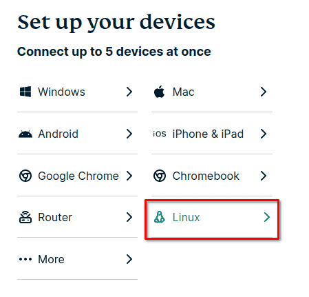
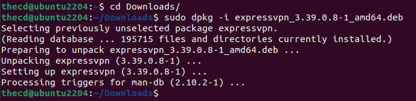
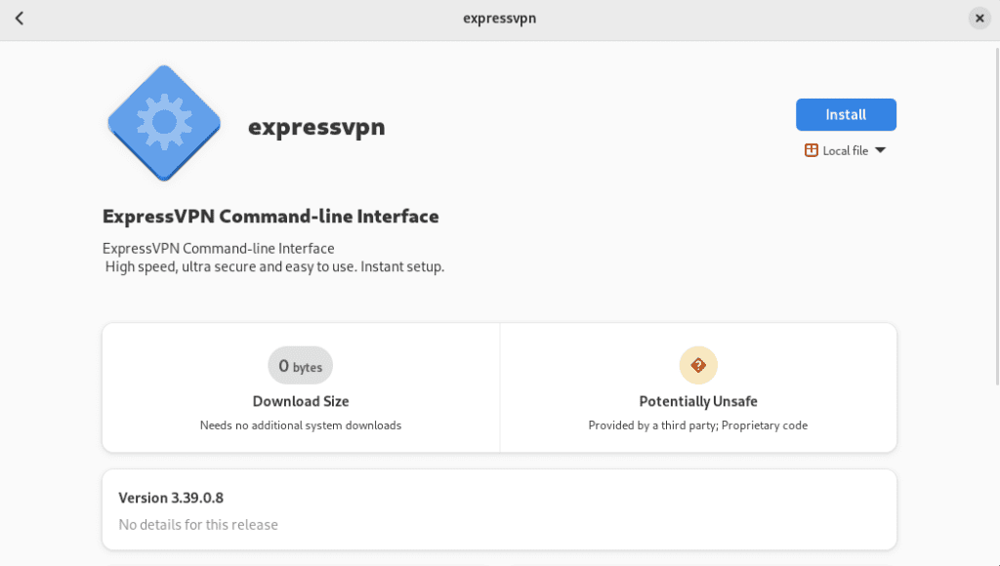
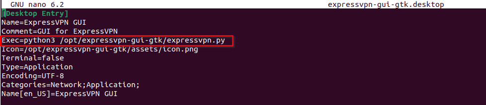
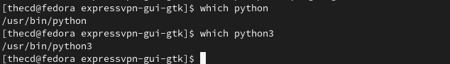
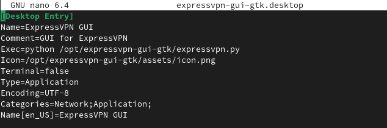
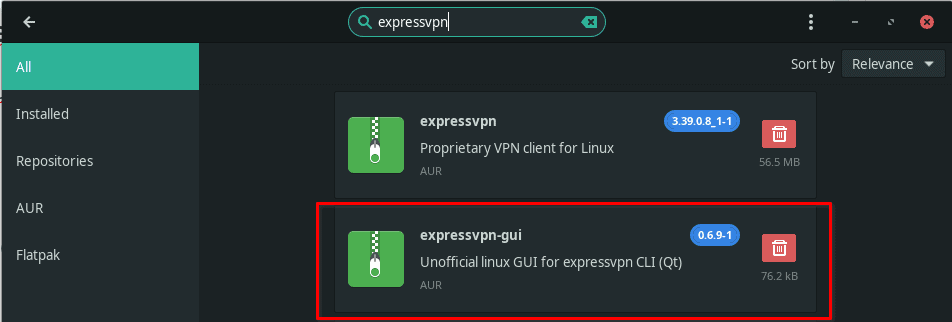

It's important to have a VPN connection to protect your machine, privacy, and your information these days. Yes, even on Linux. I am an ExpressVPN customer and was happy to find that **installing ExpressVPN on Linux** is simple.

## Why use ExpressVPN?

The most important thing when choosing a VPN provider is privacy and security. For me, a "no logging" policy is a must and so are third-party audits of the claims. In late 2022, ExpressVPN had third-party auditors test their no-logging claims and their security, you can review the reports yourself here. Ultimately, it's up to you who you choose to trust, so do your research on available VPN providers.

## Does ExpressVPN Work on Linux?

Yes, ExpressVPN works on all distributions of Linux, including Ubuntu, Fedora, Linux Mint, Manjaro, etc. ExpressVPN is easy to install and set up on Linux, both in a command line and GUI format.

## Is There a GUI ExpressVPN App for Linux?

While there isn't an official GUI app for Linux, there are multiple opensource apps that have been created. We will discuss how to install these in this article in case you prefer to use a GUI.

## Downloading the Linux ExpressVPN Installer

Head over to the [ExpressVPN download page](https://www.expressvpn.com/setup#linux) and log in to your account to find the installer for your distribution of Linux. Under the "set up your devices" section, choose "Linux".



On the Linux download page, you will find a list of available downloads. Select the one for your distribution of Linux and download it.

## Installing ExpressVPN on Linux

Now that you have the installer downloaded, we can proceed to install the package. Below is a breakdown of how to complete the ExpressVPN install for Ubuntu, Fedora, **and Arch distros such as Manjaro and EndeavourOS**. Remember, for other Debian/Ubuntu variants, just choose the Ubuntu install and use the Ubuntu instructions throughout the rest of this article.

### Ubuntu Install

If you are on Ubuntu or other variants like Linux Mint or PopOS, then you have a ".deb" file, and the easiest way to install this file is with dpkg. In your terminal run the following command from the directory where you downloaded the ExpressVPN ".deb" file to.

```
 sudo dpkg -i expressvpn_3.39.0.8-1_amd64.deb
```



It is now installed, you can skip down to the section on activating ExpressVPN or installing the optional GUI app if you prefer.

### Fedora Install

On Fedora, you will download the ".rpm" file from the ExpressVPN website in the previous section. To start the installation, right-click on the file and choose the option to "Open with Software Install". From there, choose install.



After the installation completes, you can proceed to the next section to install the optional GUI app or the section for the command line activation of ExpressVPN.

### Arch, Manjaro, and EveavourOS Install

Open up a terminal and navigate to where you downloaded the installer, then run the following command, make sure you replace the filename with your file name for the package.

```
sudo pacman -U expressvpn-3.32.0.5-1-x86_64.pkg.tar.xz
```

You can now proceed to the section of this article on installing the optional GUI app or the section on activating ExpressVPN.

## ExpressVPN Linux GUI App


If you prefer to use a GUI form of the **ExpressVPN app on Linux**, you can. You will still need to install the base ExpressVPN install that we set up in the previous section. The install process for the **GUI app** will be different based on the Linux distro, so we have broken down the steps for each below.

### GUI Install for Ubuntu

To install the GUI ExpressVPN app on Ubuntu, we need to clone a [Git repo](https://gitlab.com/vojko.pribudic/expressvpn-gui-gtk) so you will need to have the "git" package installed. You can do this with the command below.

```
sudo apt install git
```

Next, we need to clone the Git repo to our "/opt" directory.

```
cd /opt
sudo git clone https://gitlab.com/vojko.pribudic/expressvpn-gui-gtk.git
```

Once you have cloned the Git repo, we need to copy the "expressvpn-gui-gtk" file to the "/usr/bin" directory.

```
cd expressvpn-gui-gtk
sudo cp expressvpn-gui-gtk /usr/bin
```

Before we proceed, you need to find out if you where your python executable is, you can do this by using the "which" command. Try running which for both "python" and "python3". We will use this information to edit the launcher that will be in the app menu.


As you can see, I have Python3, found under "/usr/bin/python3". You may have something different, the important part is whether it is Python3 of just Python.

Now we need to edit the ".desktop" file to ensure the line that executes the script is correct for your machine. Using nano and sudo, open the ".desktop" file for editing. Find the line that starts with "Exec", edit the python command if needed. In my case, I updated it to Python3.

```
sudo nano expressvpn-gui-gtk.desktop
```



After making the necessary changes, we need to copy this file to "/usr/share/applications" so that it will show up in your app launcher.

```
sudo cp expressvpn-gui-gtk.desktop /usr/share/applications
```

Once you have done this, open the app launcher in Ubuntu and check for ExpressVPN. If you don't see it listed, make sure you copied the file properly and also check that you updated the Python execution line in the ".desktop" file to match your system.


Because of the way this app is written, it needs to write a "settings.dat" file to the /opt/expressvpn-gui-gtk foler. For this reason, and for the app to work, you need to grant extra permissions to this folder, at least for the first time you run it.

```
sudo chmod 777 /opt/expressvpn-gui-gtk/
```

After you have successfully run this program and confirmed it is working, you can run this command again with "755" to reset the permissions.

Before you launch the ExpressVPN GUI app for the first time, we need to install one last dependency using APT.

```
sudo apt-get install gir1.2-appindicator3-0.1
```

You can now run the app from the app launcher menu. You will be asked to activate ExpressVPN if you haven't already done that through the console app. Then you will see a tray icon by your clock to interact with the app. Don't forget to change the folder permissions back to 755 if you had changed that earlier.

### GUI Install for Fedora

Installing the GUI app on Fedora is similar to Ubuntu. You should already have Git installed on Fedora but if you don't, you can install it using dnf from that command line.

```
sudo dnf install git
```

Next, we need to clone the Git repo to our "/opt" directory.

```
cd /opt
sudo git clone https://gitlab.com/vojko.pribudic/expressvpn-gui-gtk.git
```

Once you have cloned the Git repo, we need to copy the "expressvpn-gui-gtk" file to the "/usr/bin" directory.

```
cd expressvpn-gui-gtk
sudo cp expressvpn-gui-gtk /usr/bin
```

Before we proceed, you need to find out if you where your python executable is, you can do this by using the "which" command. Try running which for both "python" and "python3". We will use this information to edit the launcher that will be in the app menu.



On my Fedora system, I have both, each points to Python version 3 though. You may have something different, the important part is whether the name is Python3 or just Python.

If you only have "Python3", you need to edit the ".desktop" file to ensure the line that executes the script is correct for your machine. Using nano and sudo, open the ".desktop" file for editing. Find the line that starts with "Exec", edit the python command if needed.

```
sudo nano expressvpn-gui-gtk.desktop
```



After making the necessary changes, we need to copy this file to "/usr/share/applications" so that it will show up in your app launcher.

```
sudo cp expressvpn-gui-gtk.desktop /usr/share/applications
```

Once you have done this, open the Fedora app launcher menu and check for ExpressVPN. If you don't see it listed, make sure you copied the file properly and also check that you updated the Python execution line in the ".desktop" file to match your system.


Because of the way this app is written, it needs to write a "settings.dat" file to the /opt/expressvpn-gui-gtk foler. For this reason, and for the app to work, you need to grant extra permissions to this folder, at least for the first time you run it.

```
sudo chmod 777 /opt/expressvpn-gui-gtk/
```

After you have successfully run this program and confirmed it is working, you can run this command again with "755" to reset the permissions.

Before you launch the ExpressVPN GUI app for the first time, we need to install one last dependency using APT.

```
sudo dnf install libappindicator-gtk3
```

You can now run the app from the app launcher menu. You will be asked to activate ExpressVPN if you haven't already done that through the console app. Then you will see a tray icon by your clock to interact with the app. Don't forget to change the folder permissions back to 755 if you had changed that earlier.

### GUI Install for Arch, Manjaro, and EndeavourOS

To install the GUI helper application, you will need to enable the AUR repository and then install the package [expressvpn-gui](https://aur.archlinux.org/packages/expressvpn-gui). The GUI app will allow you to activate your ExpressVPN subscription along with connecting and disconnecting. It also includes a helpful tray icon, which shows the connection status as well.



## ExpressVPN Browser Extension

If you don't want to install the GUI app on your Linux machine, you can use the browser extension as well. The official ExpressVPN browser extension is available for most major browsers like Firefox, Chrome and Edge. You can get this from the browser extension store or from the ExpressVPN download page as well. The extension will allow you to manage your ExpressVPN client like you would with the desktop GUI application.

## Using ExpressVPN on Linux from the Command Line

If you don't want to use the GUI app, I understand. The official ExpressVPN software offers many command line options. You'll start by activating the client using your activation code.

### Activate ExpressVPN on Linux

Run the following command to activate the app, you will be asked for you code that you get from your "My Account" page on the ExpressVPN website.

```
expressvpn activate
```

Now we can connect. If you want to use the smart location, just run the following command to connect.

### Connect to ExpressVPN on Linux

```
expressvpn connect
```

Keep in mind that by default, if the VPN connection drops it will kill internet connectivity thanks to the Network Lock feature provided by ExpressVPN. You can turn this off by disconnecting from VPN, running the command to disable Network Lock, then connecting to VPN again.

### Disconnect from VPN and other Commands

```
expressvpn disconnect
expressvpn preferences set network_lock off
expressvpn connect
```

If you want to connect to a specific location offered by ExpressVPN, you can run the following command to first get a list of locations and then provide that location to the expressvpn connect command as follows. In the example, we are connecting to Chicago which has an alias of "such".

```
expressvpn list all
expressvpn connect usch
```

Lastly, to check the status of your ExpressVPN connection you can run the following command, which will show which location you are connected to.

```
expressvpn status
```

There are many other options and configurations available from ExpressVPN on Manjaro and Linux, to see a full list, check out the [Linux Express VPN documentation](https://www.expressvpn.com/support/vpn-setup/app-for-linux/#install).
