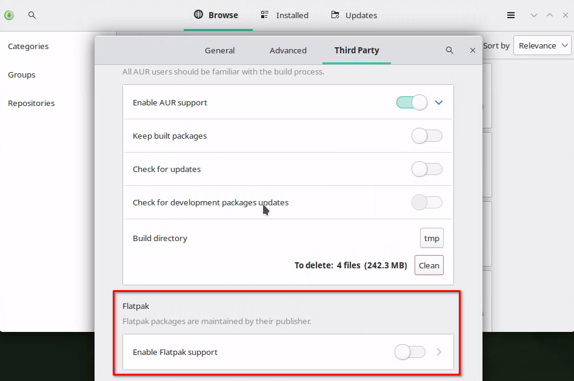
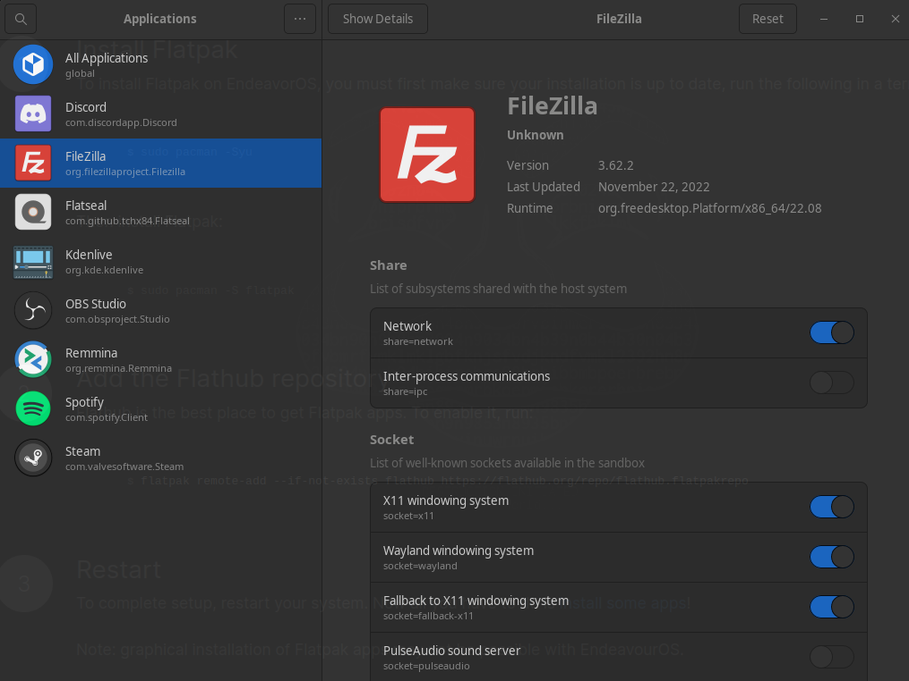

Flatpak's are great, they make installation of applications and their dependencies on Linux easy. Flatpak is already a part of some Linux distributions but EndeavourOS, Manjaro, and Arch do not have them enabled by default, so today we will walk through how to get up and running with Flatpak on these distros.

## Why are Flatpak's Great?

I will keep it simple here and give a better explanation in the next section. Simply put, Flatpak's are great because of compatibility, ease of use and security. They also make a developer's life easier too.

## What is Flatpak?


A [Flatpak](https://flatpak.org/) is a software package that is bundled with the required dependencies such as frameworks, libraries, and other software to make the application work as intended by the developer. All are included in a Linux distro agnostic installer.

### Bundled Dependencies

Packaging applications in this way makes it so that everyone who uses a given app is on the same page in terms of installed dependency versions, which makes it much easier for the developer and the user. The user doesn't have to worry about making sure all dependencies are installed and that they are the right version. This isn't just a Linux problem, this issue exists for some Windows applications as well.

### Distro Agnostic

If you've been using Linux for some time, you are familiar with DEB and RPM packages for example. The days of Linux distro specific packages such as these are no more with Flatpak. The same Flatpak package will install on over 30 different Linux distros!

### Security

Another important feature is sandboxing. Not only do you not need root privileges to install a Flatpak, but they also run in a sandbox that protects the OS. The sandbox that a Flatpak application runs in, is an environment that is isolated from the rest of the OS. This means the application has no access by default to your user files, devices, or the OS itself. This is huge for system security and another big selling point for Flatpak.

### Portals and Flatseal


Obviously, applications will need access to files and other parts of the system. This functionality is provided through what they call portals. These portals are what make it possible for the sandboxed Flatpak software to touch parts of the OS, filesystem and devices.

[Flatseal](https://flathub.org/apps/details/com.github.tchx84.Flatseal) is a separate application install that is almost a must for those running Flatpak's. Flatseal exposes the permissions on a per app basis so you can easily give a Flatpak access to specific parts of your system.

Enough background, let's get started using Flatpak's on EndeavourOS, Manjaro and Arch Linux.

## Install Flatpak on EndeavourOS, Manjaro and Arch Linux

To get started with Flatpak on EndeavourOS, it's quite simple. We will use either [pacman](https://credibledev.com/how-to-use-pacman-on-manjaro-linux/) or yay (insert favorite AUR helper here) to install Flatpak. Pop open your terminal and use one of the following commands to install from the Arch or AUR repository.

### Step 1 - Install

**Install Flatpak from the Arch Repository**

```
sudo pacman -S flatpak
```

**Install Flatpak from the AUR Repository**

```
yay -S flatpak
```

### Step 2 - Add Flathub Repo

You may need to add the Flathub repository as well, you can do this by running the following command in the terminal.

```
flatpak remote-add --if-not-exists flathub https://flathub.org/repo/flathub.flatpakrepo
```

You now have Flatpak installed and you can begin installing Flatpak software packages on EndeavourOS.

## GUI Flatpak Install Using Pamac in Manjaro

The pamac GUI software installer that is provided by default in Manjaro Linux comes with support for Flatpak's, it just needs to be enabled. You will find the option to enable Flatpak under the preferences of Pamac.



Once you have Flatpak support enabled, you will be able to search for Flatpak applications from within pamac, rather than using the terminal. You can use the terminal as well though.

## Installing Flatpak Packages on EndeavourOS, Manjaro and Arch

You may already know the name of the package you want to install, in case you don't, you can check our the Flathub page to find packages and their install commands. For example, if you wanted to install Spotify, you can run the following command in the terminal.

```
flatpak install flathub com.spotify.Client
```

Once the command finishes, you should find Spotify in your application menu. If you prefer to run the application from the terminal, you can run the following command to launch Spotify.

```
flatpak run com.spotify.Client
```

## Install Flatseal for Flatpak Permission Management



I would highly suggest that you install Flatseal, so that you can easily manage the permissions of your Flatpak installs. Flatseal gives you granular control over each apps individual permissions. So you can give file system and device access to whatever apps you wish.

```
flatpak install flathub com.github.tchx84.Flatseal
```

To run Flatseal, find it in your application menu or run the following command in the terminal.

```
flatpak run com.github.tchx84.Flatseal
```

Upon launching Flatseal, you should see all of your Flatpak applications listed on the left. When selecting one of the applications, you will see a list of permissions on the right side. Here you can make changes to the individual app to give it access to various parts of your file system, user files and devices.

## Conclusion

You now have Flatpak installed and set up on EndeavourOS, Manjaro and Arch. You also have learned how to install Flatpak packages and manage them using Flatseal.

If you have any questions about Flatpak, let me know in the comments.
