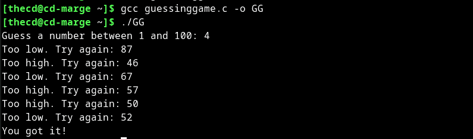

[GCC](https://gcc.gnu.org/) which stands for GNU Compiler Collection, is a collection of compilers for many different languages on Linux. For example, GCC can compile source code from C, C++, Fortran, Go, Objective C, and more. GCC is compatible with a long list of architectures, such as i386, ia64, ARM, and more.

## Is GCC Just for Linux?

No, GCC is not limited to Linux. GCC stands for GNU Compiler Collection and is developed by the Free Software Foundation as part of the GNU project. GCC supports many different operating systems including Linux but also supports other platforms such as Solaris, Microsoft Windows, macOS, and many others. So, GCC is not just for Linux, but it is also available for a wide range of other operating systems.

## What is GCC Used For?

It is used to compile the source code of a program written in one of the languages mentioned above into machine-readable binary code that can be executed on a computer. GCC is widely used as the default compiler on many Linux distributions, and it's also used on other platforms like macOS and Windows. GCC is known for its ability to generate efficient code for various computer architectures, its support for multiple languages, and its debugging features. Additionally, GCC provides many features for optimized code generation, making it an important tool for software development.

## Is GCC Installed on Linux?

In some cases yes, but not all Linux Distributions include GCC by default. Older versions of Ubuntu, such as 18.04 or 20.04 does not come with GCC installed. The newer versions of Ubuntu do have GCC installed by default though.

## How Do I Install GCC on Ubuntu?

First, check to make sure that GCC is not already installed. You can do a quick check for this in the terminal by running the following command.

### Check if GCC is Installed

```
gcc -v
```

If you get an error, then GCC is not installed. If you see a version number output in the terminal, then GCC is already installed on your computer.

### Install GCC Through the Build-Essential Package

One of the most common ways to install GCC on Ubuntu is through the "build-essential" package in APT. This package includes more than just GCC though, below you will find a list of what is included.

- dpkg-dev

- gcc

- gcc++

- libc6-dev

- make

```
sudo apt install build-essential
```

### Install Only GCC on Ubuntu

In some cases, you may only want the GCC package. You are not required to install the build-essential package on Ubuntu, instead, you can install GCC by itself using APT.

```
sudo apt install gcc
```

## How to Compile a C Program with GCC

Compiling a simple C program is easy using GCC. Here, we will create a sample C program that you can compile using GCC. Our example is just a simple guessing game but it's a fun way to test that your GCC compiler is working. Open up your favorite editor and paste in the following code for our game.

### Example C Program

```
#include <stdio.h>
#include <stdlib.h>
#include <time.h>

int main(int argc, char *argv[]) {
  int secret, guess;
  srand(time(NULL));
  secret = rand() % 100 + 1;  // Generate a random number between 1 and 100

  printf("Guess a number between 1 and 100: ");
  while (scanf("%d", &guess) == 1) {
    if (guess < secret) {
      printf("Too low. Try again: ");
    } else if (guess > secret) {
      printf("Too high. Try again: ");
    } else {
      printf("You got it!\n");
      break;
    }
  }

  return 0;
}
```

Assume that we save this code to a file called "guessinggame.c". We can compile this into an executable program by using GCC like so. This will output an executable called "GG".

### Compiling C with GCC

```
gcc guessinggame.c -o GG
```

When we run the game in the terminal, we will be asked to guess numbers until we get it right. Fun, right?

### Running the Example C Program



Now go have fun writing a new program and use GCC to compile it. If you have questions, let me know in the comments.
