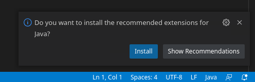
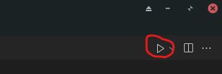
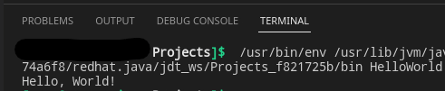

If you are a developer or student, you may be programming in Java and using VS Code to do your coding. Setting up your environment can be a confusing but important task and today we will cover the steps to get you up and running with Java in VS Code.

First, make sure you have [VS Code installed on Manjaro](https://credibledev.com/install-vs-code-on-manjaro-linux/), if you need help with that you can follow my [guide](https://credibledev.com/install-vs-code-on-manjaro-linux/) on doing so.

Next, we need to install Java on Manjaro, which is simple thanks to the pacman package manager. Depending on the version of Java you wish to install there will be a slight variation to the install command. I've provided a few examples below to get you started.

## Installing Java on Manjaro

### Latest OpenJDK

The following command will install the latest version of OpenJDK and JRE available in the package manager, currently version 18.

```
sudo pacman -S jre-openjdk-headless jre-openjdk jdk-openjdk openjdk-doc openjdk-src
```

### OpenJDK 8

This command will install the older, version 8 OpenJDK in case you need this for your development project.

```
sudo pacman -S jre8-openjdk-headless jre8-openjdk jdk8-openjdk openjdk8-doc openjdk8-src
```

Once you have complete the install, you can confirm by running the command "java -version", without the quotes, which should print out the currently installed version of java.

## Setup VS Code for Java Development

The easiest way to get rolling with VS Code and Java in Manjaro is to launch VS Code and create a HelloWorld.java file. VS Code will detect that you are developing in the Java language and will offer to install necessary extensions for you. This box will display at the bottom right of your VS Code window, like in the following screenshot. You can proceed by clicking Install.



VS Code Java Extensions Setup

At the time of writing 6 extensions are installed by VS Code that will help you with your Java development.

- [Language Support for Java](https://marketplace.visualstudio.com/items?itemName=redhat.java&ssr=false#review-details) (Developer: Redhat)

- [Debugger for Java](https://marketplace.visualstudio.com/items?itemName=vscjava.vscode-java-debug&ssr=false#review-details) (Developer: Microsoft)

- [Test Runner for Java](https://marketplace.visualstudio.com/items?itemName=vscjava.vscode-java-test&ssr=false#review-details) (Developer: Microsoft)

- [Maven for Java](https://marketplace.visualstudio.com/items?itemName=vscjava.vscode-maven&ssr=false#review-details) (Developer: Microsoft)

- [Project Manager for Java](https://marketplace.visualstudio.com/items?itemName=vscjava.vscode-java-dependency&ssr=false#review-details) (Developer: Microsoft)

- [ItelliCode](https://marketplace.visualstudio.com/items?itemName=VisualStudioExptTeam.vscodeintellicode&ssr=false#review-details) (Developer: Microsoft)

Once the extensions have finished installing, you can go back to your HelloWorld.java file to write the code and test that everything is functioning. Go ahead and paste the following code into the editor if needed.

```
class HelloWorld {
    public static void main(String[] args) {
        System.out.println("Hello, World!");
    }
}
```

Once you have your code inserted, you will find a Run button along the top bar at the right of the screen. You can press this button to launch your code which should result in Hello World being printed in the terminal window at the bottom of VS Code.





Awesome, you now have your environment setup to develop in Java using VS Code in Manjaro Linux. Feel free to explore other extensions that can help with coding as well. If you have any recommended extensions, let us know in the comments!
