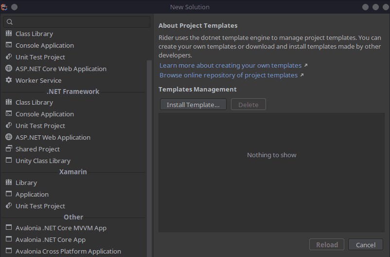

If you are a .NET developer and coming to Linux, you have a few different options for a development IDE. You may choose any standard text editor if that's your thing, or you may like Vim or [VS Code](https://credibledev.com/install-vs-code-on-manjaro-linux/). If you are looking for a Linux alternative that is close to Visual Studio, like you have on Windows, JetBrains Rider is an excellent choice.

Rider is a fully featured .NET IDE for Linux that also supports the cross-platform GUI framework [Avalonia UI](https://avaloniaui.net/). This means that you can develop GUI applications that run natively on many different operating systems such as Linux, Windows, MacOS, iOS, etc. by using the Avalonia UI framework. Coupled with JetBrains Rider, your .NET C# development becomes much smoother. While Rider is not a free product, you do get a free 30-day trial to try it out.

Great news, Rider is also available in a Flatpak. So installation is a breeze and the application will run great on all Linux distributions. Today, I will be installing Rider on Manjaro Linux and walking you through the process.

## Install .NET SDK on Linux

Before proceeding, make sure you have [installed the .NET SDK for Linux](https://credibledev.com/dotnet-in-linux/) on your machine.

## Step 1: Install JetBrains Toolbox for Linux

There are many ways to install Rider and other JetBrains products for Linux but using their Toolbox will save you a lot of headaches. Normally I would recommend using the Flatpak but in the case of Rider, it will give you some issues. So use their Toolbox app instead, regardless of Linux distribution such as Ubuntu, Fedora, or Manjaro/Arch.

Head over to their website to download the latest version. It will be a "tar.gz" archive which we will install it from.


Once you have downloaded the archive file, we need to extract it. Inside will be an AppImage that runs the Toolbox app. Before you can run it, we need to install some dependencies.

Use your package manager like apt, dnf or [pacman](https://credibledev.com/how-to-use-pacman-on-manjaro-linux/) to install these.

```
libfuse2 libxi6 libxrender1 libxtst6 mesa-utils libfontconfig libgtk-3-bin
```

If you are on an Arch-based Linux distro like Manjaro or EndeavourOS, the package names will be a bit different.

```
sudo pacman -S fuse2 libxi libxrender libxtst mesa-utils fontconfig gtk3
```

You can extract the JetBrains Toolbox archive with this command.

```
tar -zxvf jetbrains-toolbox-1.27.2.13801.tar.gz
```

This will extract the AppImage file to a directory that matches the name of the archive. We will want to cd to that directory and launch the AppImage or you can find it in your File Manager of choice to run it that way.

```
cd jetbrains-toolbox-1.27.2.13801
./jetbrains-toolbox
```

Once it loads, answer a few questions, then you will see a list of JetBrains apps that you can install.

## Step 2: Install JetBrains Rider

Using the Toolbox app, find Rider and click install.


Rider will begin to download, you can monitor the progress by scrolling back to the top of the list. Once the download is finished, the installation will start automatically. When finished, you can launch Rider from the Toolbox app by clicking on it, or you can find it in your application menu, typically under the "Development" category.

## Step 3: Launch Rider

After launching Rider on Linux for the first time, you will get a series of prompts to accept the license agreement, configure your color scheme, etc. You will also be given an opportunity to install some additional plugins like the Azure Toolkit or AWS Toolkit. These are optional, install any of these and then you can proceed with using Rider.

Before getting to the welcome screen, you must activate Rider using your paid or trial license.

## Step 4: Create a .NET C# Console Project

Once you have the Rider IDE loaded, let's test out a simple console app. From the welcome screen, choose "New Solution".


On the new solution screen, choose "console application" from the left side menu. You can keep the defaults or customize them as you wish. I will be keeping the defaults for this test.


Depending on your system, it may take a few moments for the project to prepare and load. Once it does, you will see a simple console print statement for "Hello, World!". At the top right, you can click on "Run" to test everything.


After running the application, you will see the output panel show up at the bottom where the application will build and execute. You should see "Hello, World!" printed after a moment.

## Conclusion

Now you have successfully installed JetBrains Rider on Linux for .NET and C# development. You can easily build console applications using .NET on Linux.

If you want to build cross-platform GUI applications, I suggest the Avalonia UI framework, which is very similar to WPF apps on Windows. It will make the transition from Visual Studio to Rider on Linux very easy for you.

You can get started by installing the Avalonia UI templates with the following command.

```
dotnet new install "Avalonia.Templates"
```

The next time you load Rider and choose to create a new solution, you will find the Avalonia Templates at the bottom under "Other".


