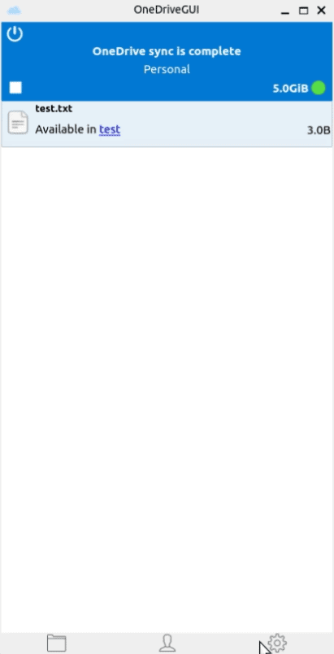
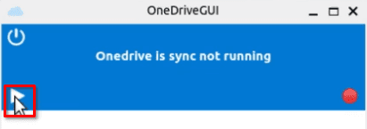
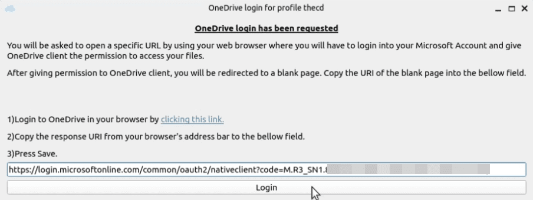

Maybe your school, work, or a client requires you to use OneDrive. What are you to do on Linux, except use the web version of OneDrive? I never realized so many people used OneDrive on Linux but apparently, it's quite common. So today, we will be installing OneDrive on Ubuntu 22.04. We will install both a console version and a GUI version of OneDrive. If you're tired of using the web version or just curious about setting it up, this guide is for you.

This guide is made possible by open-source work from two repos, one for the console application and another for the GUI companion app.

[Linux OneDrive Github Repo](https://github.com/abraunegg/onedrive)

[Linux OneDrive GUI Github Repo](https://github.com/bpozdena/OneDriveGUI)

## Can I Use OneDrive on Linux?

Yes, OneDrive works on Linux through various methods. The method we discuss here will allow you to install the base OneDrive client for Linux but also enables you access to a GUI desktop application as well. There are alternatives, such as using it in the browser but that doesn't let you easily sync files like you can on windows.

## Is OneDrive Supported on Ubuntu?

Yes, Microsoft OneDrive is supported on Ubuntu through the use of opensource software.

## Is There a OneDrive Linux GUI?

Yes, there is an opensource project called OneDrive-GUI that provides a desktop application. This guide will show you how to install it on Ubuntu.

## Installing OneDrive on Ubuntu

### Step 1 - Configure Additional Repo Required for OneDrive

The first thing that we need to do is set up the OpenSuSE repo that we will be installing from. According to the documentation for installing OneDrive on Ubuntu, we should NOT use the official Ubuntu repo. Pop open a terminal window and run the following commands to get started.

The first command gets the key needed for the repo and the second command adds the repo.

```
wget -qO - https://download.opensuse.org/repositories/home:/npreining:/debian-ubuntu-onedrive/Debian_11/Release.key | gpg --dearmor | sudo tee /usr/share/keyrings/obs-onedrive.gpg > /dev/null
```

```
echo "deb [arch=$(dpkg --print-architecture) signed-by=/usr/share/keyrings/obs-onedrive.gpg] https://download.opensuse.org/repositories/home:/npreining:/debian-ubuntu-onedrive/Debian_11/ ./" | sudo tee /etc/apt/sources.list.d/onedrive.list
```

Next, you need to do an apt update to sync the new repo that you just added.

```
sudo apt update
```

### Step 2 - Install OneDrive on Ubuntu

To install OneDrive on Ubuntu, we will use APT by running the following command.

```
sudo apt install --no-install-recommends --no-install-suggests onedrive
```

### Step 3 - Connect OneDrive to our Account

Now that we have OneDrive installed, we need to connect the application to our OneDrive account. If you plan to install the GUI application, skip ahead to installing it because it will walk you through this process.

To link your OneDrive account, run the following command in the terminal.

```
onedrive
```

After you run this command, a link will show up in the terminal. You can hold CTRL and click the link or copy and paste it into your browser. In the browser, you will log in to your OneDrive account and then be sent to a blank page. Once you reach the blank page, you will copy the URL from the address bar and paste it into the terminal.

You should then see confirmation that your OneDrive account has been authorized with the OneDrive Linux client.

### Step 4 - Sync OneDrive on Ubuntu

We have OneDrive installed and linked to our account, we are ready to sync it now. We can do a test sync first by running the following command.

```
onedrive --synchronize --verbose --dry-run
```

When you are ready to do a live sync, you can run the following command.

```
onedrive --synchronize
```

When the sync is finished, you will see in the output that the files have been synced to a OneDrive folder inside your Linux home directory.

### Step 5 - Setup Automatic OneDrive Sync

Now that you have everything set up and synced, you can continue manually syncing files by running the synchronize command. You can also set up OneDrive as a service on Ubuntu so you don't need to worry about manually syncing. To do this, run the following commands to use systemctl and register OneDrive as a service.

```
systemctl --user enable onedrive
systemctl --user start onedrive
```

## OneDrive Linux GUI Client Install



A separate open-source project offers a GUI front-end for OneDrive on Linux and Ubuntu. It's very easy to get started with because it is a AppImage, which means the install is basically just downloading the AppImage file and making it executable. If you are running Ubuntu 22.04 or higher, there is one package we need to install first.

```
sudo apt install libfuse2
```

Once libfuse2 is installed, we can proceed with downloading the AppImage file. Head over to the [projects Github page](https://github.com/bpozdena/OneDriveGUI/releases) and download the latest release, currently, that is October 2022.

After the download is complete, navigate to where you downloaded the file in the terminal, then run the following command. You may need to modify the file name if the version has changed since this post was published. This [chmod](https://credibledev.com/chmod-syntax-in-linux/) command makes the AppImage file executable so that it will launch properly.

```
chmod +x ./OneDriveGUI-1.0.1_fix59-x86_64.AppImage
```

You can now either double-click the file from your file manager to launch it or run it from the command line, "./OneDriveGUI-1.0.1\_fix59-x86\_64.AppImage".

Once you launch the application, you will be greeted with a setup wizard. Follow through the wizard and check the option for "Create a new OneDrive profile". Fill out the required fields and continue through the process. Once it's complete, click the play button on the main interface which should give you a box explaining how you should click the link, log in to OneDrive and paste the resulting URL back into the program to set up your account.





Once the OneDrive client is linked to your OneDrive account, you can once again click the play button on the main interface to start the sync process.

## Conclusion

That's it, you now have OneDrive installed and set up on an Ubuntu Linux machine. Be sure to check out their official documentation for more options for customized syncing. The GUI app has a lot of advanced sync settings built into its interface as well. If you have any requests or questions, be sure to leave a comment below.
