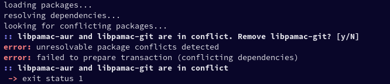
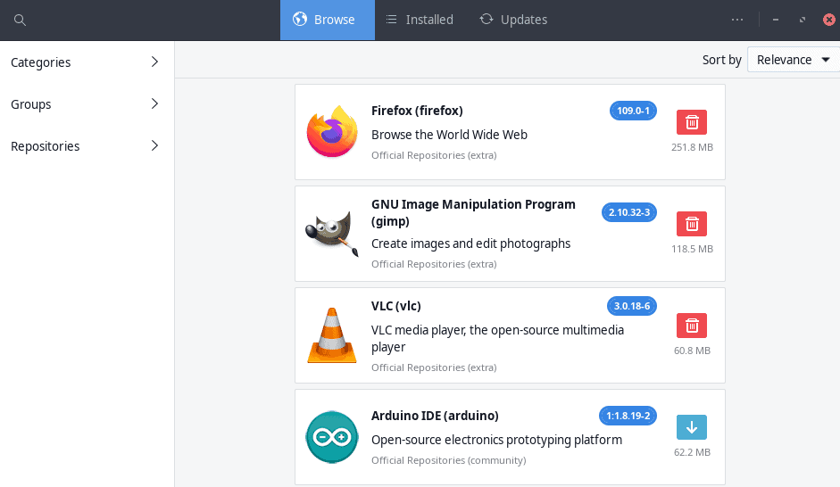
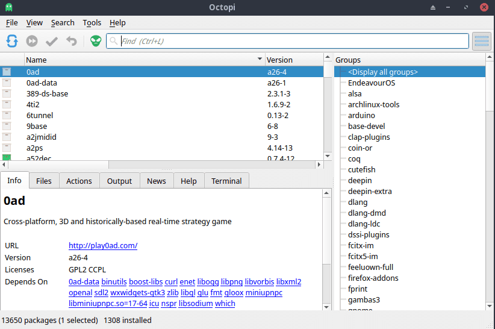

Maybe you came to EndeavourOS from another Linux distro like Ubuntu or Manjaro and you are used to having a graphical software package manager. On Manjaro you have pamac which is a really nice counterpart to [pacman](https://credibledev.com/how-to-use-pacman-on-manjaro-linux/) and AUR command line package managers like yay. When you install EndeavourOS, you may quickly realize that you don't have a graphical package manager by default. In this post, we will explain step by step, how to install pamac on EndeavourOS.

For those interested, you can read some [background info](https://forum.endeavouros.com/t/does-endeavouros-allow-gui-package-installers/23110) on why EndeavourOS doesn't already include a GUI package manager.

## What is Pamac?

Pamac is a graphical package manager for Arch Linux and its derivatives, like Manjaro and EndeavourOS. It provides a user-friendly interface for installing, updating, and managing packages.

Pamac was created as a graphical package manager for Arch Linux and its derivatives, such as Manjaro. The development of Pamac began in early 2013, with the goal of providing a user-friendly graphical interface for managing packages on Arch Linux. Since then, Pamac has been regularly updated and improved, with new features added and bugs fixed.

Today, Pamac is one of the most popular graphical package managers for Arch Linux and its derivatives, and is widely used by users who prefer a graphical interface for managing their packages. Pamac has become a key component of the Manjaro Linux distribution and continues to be actively developed and maintained by the Manjaro team.

## Pamac Install Steps for EndeavourOS

Since EndeavourOS comes with yay pre-installed, the installation of pamac is pretty simple. Run the following command in the terminal to install pamac.

```
yay -S pamac-aur
```

### Resolving the libpamac-git Conflict Error



If you see an error in the terminal output when trying to install pamac that mentions libpamac-git, try removing that package manually. When testing this, it seemed that auto-removing libpamac-git during the installation of pamac-aur was causing problems. Removing the package manually resolved the issue.

```
yay -R libpamac-git
```

## Running Pamac on EndeavourOS



To run pamac on EndeavourOS, you can find it in the app menu, typically found under "System" or "Settings" as "Add/Remove Software". You can also run pamac from the command line.

```
pamac-manager
```

## Are There Alternatives to Pamac?

Sure, one popular alternative to pamac on EndeavourOS and other Arch Linux distros is Octopi. Octopi is similar to pamac but Octopi also features a system upgrade function and the ability to view detailed information about packages, including dependencies and files. You can install Octopi on EndeavourOS with the following command.

```
yay -S octopi
```

After installing Octopi, you will find it in the application menu under "System" or "Settings" as Octopi.



## Conclusion

You now have a graphical frontend to your package management on EndeavourOS whenever you need it. You can still use the powerful pacman and yay as well, this is simply just another option for those who love the GUI. If you have any questions or run into issues, let me know in the comments.
