Ad and tracking blocker plugins are popular in most web browsers, but what if you could apply ad blocking to your entire network without a need for these plugins? This is where Pi-hole comes in, providing you with whole network ad blocking. In this guide, I will walk you through installing Pi-hole on Proxmox using a Ubuntu container so you don't need many resources to do this.

### What is Pi-hole?

To put it simply, Pi-hole is a DNS server that uses a blocklist to block ads, trackers, and more. It is customizable, meaning you can add additional blocks manually or via openly available blocklists. You can further customize your DNS by whitelisting domains that you find should not be blocked by Pi-hole.

### What is DNS?

DNS stands for domain name resolution, but what does this mean? When you open up your web browser, you put in google.com and google comes up. Behind the scenes, a DNS server is being asked, "What is the IP for google.com?". The DNS server sends the IP of the website back through your network so that the communication can be successful. Simply put, DNS translates domain names, like google.com, to an IP address.

## Installing Pi-hole on Proxmox

To get started, we are going to create a Ubuntu 20.04 container in Proxmox. Inside the container, we are going to install Pi-hole. Afterward, we will configure pfSense to use Pi-hole as well as show you how to configure individual Linux and Windows machines to use Pi-hole.

### Step 1: Download a Ubuntu 20.04 Container Template

In order to set up a container in Proxmox, you will need a template. If you haven't already done so, you can download the Ubuntu 20.04 template that we are going to use from within Proxmox.

To do this, navigate to your "local" storage, then choose "CT Templates" and click "Templates" from the top bar as shown below. This will give you a list of templates that can be downloaded. Find the Ubuntu 20.04 one and download it.

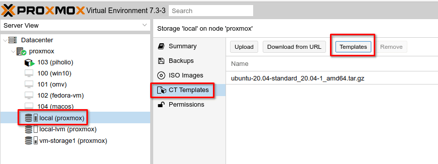

### Step 2: Create a Linux Container in Proxmox

Now that you have the template downloaded, we can create the container. Right-click on your proxmox node, then choose "Create CT".

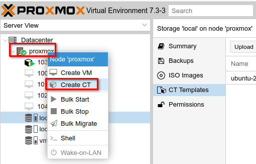

In the "create container" popup, give your container a name and set up a password. This password will be the root user account password of the Linux container.

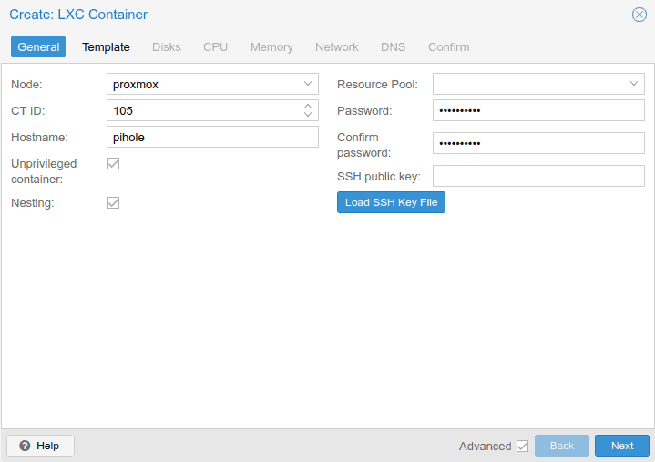

On the template tab, choose the Ubuntu template you downloaded earlier.


On the Disks tab, select the storage volume you want or keep the default and update the disk size to 2-4GB of space. This is all that Pi-hole requires.

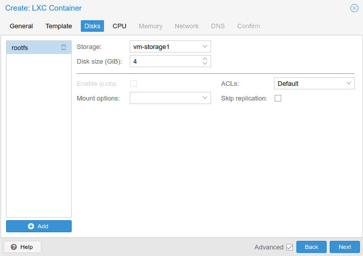

On the CPU tab, the default is 1 core, I've changed this to 2. Configure what you want here, 1 or 2 is probably fine and you can change it later if needed.

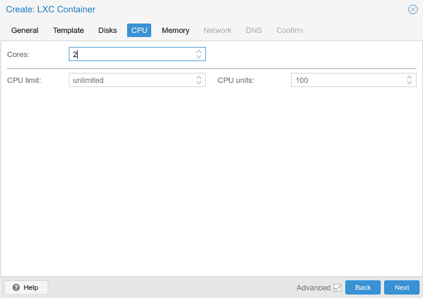

On the Memory tab, the default is 512 MB of RAM, this is the minimum required amount for Pi-hole. You can up this to 1 or 2GB if needed.

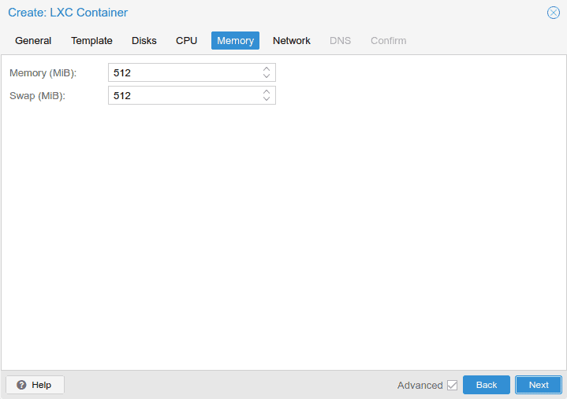

On the Network tab, it is highly suggested that you configure a static IP. If you set this to DHCP, the IP could change and devices configured to use Pi-hole DNS will fail to resolve domain names. Here I've configured a static IP of "192.168.1.10" and the gateway is "192.168.1.1". The gateway is my pfSense firewall, yours is likely different.

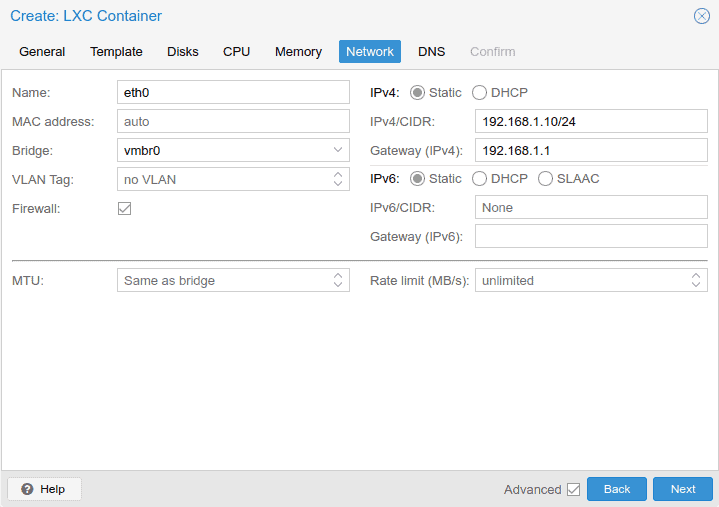

On the DNS screen, keep the defaults and on the confirmation screen review the details and click "Finish".

Once the container is finished, which should only take a few minutes, power it on and open up the console for it in Proxmox so we can install Pi-hole.

### Step 3: Install Pi-hole

Before we start the installation, let's update the container using APT. In the shell console of the container, log in as root and run the following commands.

```
apt update && apt upgrade
```

You will need to install "curl" to install Pi-hole using this method.

```
apt install curl
```

Once the system has been updated, we can now install Pi-hole. To start the installation, run this command in the terminal.

```
curl -sSL https://install.pi-hole.net | bash
```

A few seconds after running this command you should see a series of questions in the Pi-hole installer. I'll cover the important ones here.

- Static IP Needed
    - This is a warning that you should have a static IP configured, which we did earlier.

- Upstream DNS Provider
    - The upstream DNS provider is the service that Pi-hole uses to resolve DNS names that it hasn't cached already. Any choice is fine here, I went with Google DNS.

- Blocklists
    - You are offered a default blocklist called "StevenBlack's Unified Host List", it isn't too aggressive and typically safe to accept this default list.

- Admin Web Interface
    - If you want to be able to administer Pi-hole from the web interface, you will want this option.

- Web Server
    - If you chose to install the web interface, you need a web server, Pi-hole will set this up for you.

- Enable Logging
    - The queries made to Pi-hole can be logged, you will want this in most cases.

- Privacy Mode
    - If you selected to enable logging, this determines how detailed the logging is. I chose Show Everything.

After these menu questions, Pi-hole will complete the installation, then you will be presented with a screen explaining how to access the web interface and the default password. Take note of this information.

### Step 4: Access the Pi-hole Web Interface

Open up your browser and head to http://pihole\_ip/admin to access the web interface. Use the password that was provided at the end of the installation process to log in.

From here you can add blocklists, manual domain blocks, and whitelists. You can view the query log to see what is being allowed and blocked on your network and much more.

Check out this video for a detailed overview of the interface.

https://youtu.be/F2b1SECl-Ek

### Step 5: Update pfSense to Use Pi-hole for DNS

If you are using a pfSense firewall like I am and you want your entire network to use Pi-hole for its DNS then you will want to update your DHCP server. To do this, log in to pfSense, in the top menu, go to "Services" and choose "DHCP Server".

Scroll down the page to the "Servers" section where you will find an option for DNS servers. Put your Pi-hole IP address as the first one and put a backup in the second box.


The next time your devices renew their DHCP lease, they will get the updated DNS servers. You can also disconnect and reconnect a device to speed this up.

If you have a different firewall or router for your network, look for the DNS or DHCP settings in its interface to make the same changes.

### Step 6: Configure a Linux Device to Use Pi-hole

Maybe you just want to configure a few devices and not your whole network to use Pi-hole. You can do that on a Linux device by editing the "/etc/resolv.conf" file.

```
sudo nano /etc/resolv.conf
```

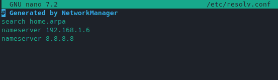

You will want to update the first entry to point to the IP of your Pi-hole server.

### Step 7: Configure a Windows Device to Use Pi-Hole

If you have a Windows device that you want to point to Pi-hole for DNS, right-click on the network icon in the system tray and choose "Open Network & Internet Settings".

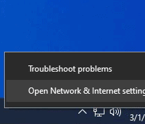

From the network settings, choose "Change Adapter Options".

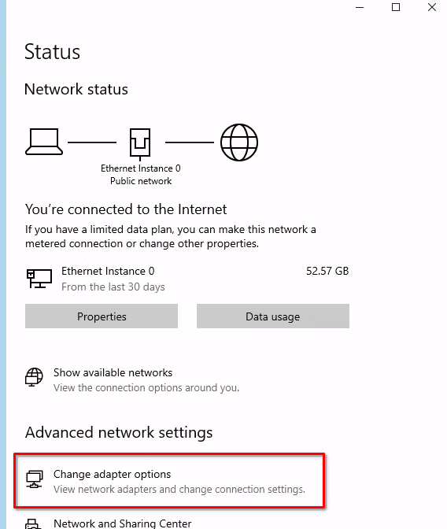

Find your network adapter, then right-click on it and choose properties. In the properties window, choose "Internet Protocol Version 4 (TCP/IPv4)" and click on properties.

Here you will check the box for "Use the following DNS server addresses". Then input your Pi-hole IP and a secondary DNS server.

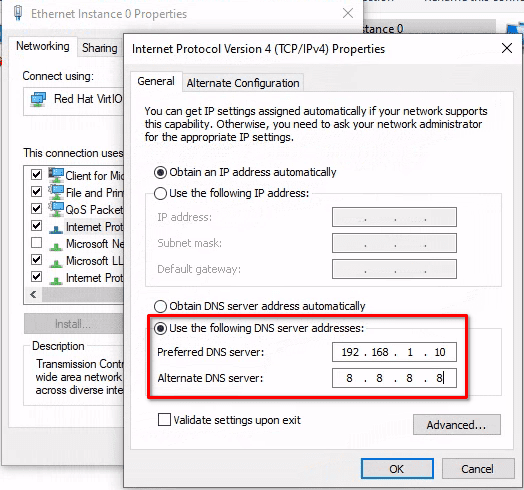

## Conclusion

That's it, you now have Pi-hole setup in Proxmox to handle all of your DNS queries. If you need any help or have questions, leave a comment below.
