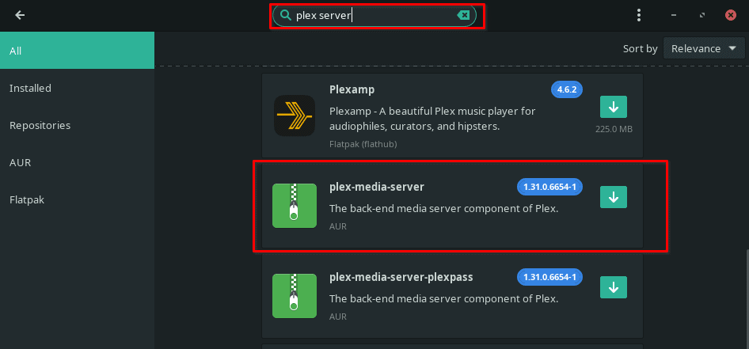
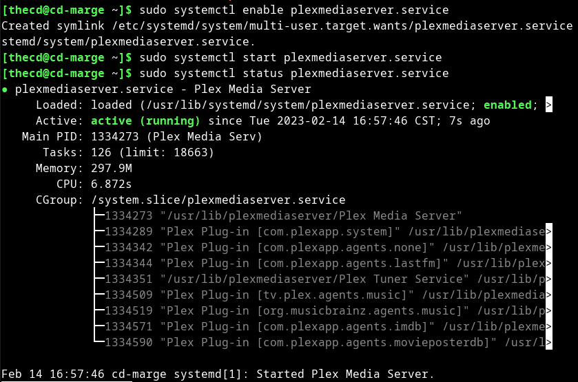
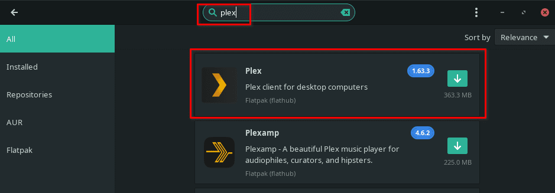
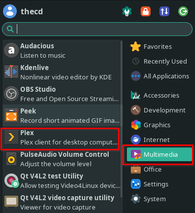

Plex has become extremely popular since its humble beginnings back in 2008. Today Plex is used all over the world, serving up streaming content as well as users' own content. They have built relationships with many big players in the entertainment industry as well, such as MGM, Lionsgate, and Warner Bros.

If you have been looking for a solution to stream your own video content and also access tons of content from the web, Plex has you covered. You can also set up remote access so you can stream from anywhere, not just your home.

Plex has both a client and a server component, both of which will run on Linux. You can install the Plex server on a VM of your choice or on your desktop, laptop, or server. While this guide covers Linux, you can also install Plex on Windows and MacOS.

The following instructions will work for any Arch-based Linux distro such as EndeavourOS.

## Step 1: Install Plex Media Server

To get started with the installation on Manjaro you need to make sure you have the AUR enabled.

If you do not know how to enable the AUR, our [AUR guide](https://credibledev.com/how-to-enable-the-aur-on-manjaro-linux/) will help you with that.

Unfortunately, the plex-media-server package is not available from Flathub or the Official Manjaro Repo. Once you have the AUR enabled, you can start the installation from the command line or from the GUI using pamac. I'm using the yay helper, you can install it with "sudo pacman -S yay" if you don't already have it.

```
yay -S plex-media-server
```



## Step 2: Running Plex Media Server

Before you can start using the Plex media server on Linux, you will need to enable and start the service. On Manjaro, we do this using systemd and the systemctl command.

```
sudo systemctl enable plexmediaserver.service
sudo systemctl start plexmediaserver.service
```

You can then verify that it is running with the status command.

```
sudo systemctl status plexmediaserver.service
```



Once you have confirmed that the Plex server is running, you can open and browser and head to the following URL to access the interface. http://127.0.0.1:32400/web

## Step 3: Plex Server Folder Permissions

In order for the Plex server to access media files on your Linux system, you need to grant the "plex" user access to them.

The best thing to do is to create new directories outside of your home directory to store all of your media files, let's go ahead and do that now.

```
sudo mkdir -p /media/movies
sudo mkdir -p /media/tvshows
```

Now, let's make the plex user and group the owner of these directories.

```
sudo chown -R plex:plex /media
```

We need to be able to access and use these directories as our own user account well, so we will add our user to the plex group.

```
sudo gpasswd -a username plex
```

Finally, we make sure the owner (plex) and the group (plex) have write permissions on these folders. This allows both your user account and plex to write to the directories.

```
sudo chmod -R 775 /media
```

**Note:** Your user account may not be able to add/modify files in this directory until you log out and back in again.

### Using a File Share Instead

If you are storing your files on some type of share drive, you should add plex to your users' group instead, or whatever group has access to the share. Make sure your user group has read/write permissions on the share drive.

## Step 4: Installing the Plex Client

The best and easiest way to install the Plex Client on Linux is through Flatpak using Flathub. Make sure that you have Flathub enabled on Manjaro, if you're not sure, you can use our [guide for enabling Flatpak support](https://credibledev.com/install-flatpak-endeavouros-manjaro-arch-linux/).

Once you have Flatpak enabled, you can use the command line or pamac to install the Plex client. You can also use Flatpak to install it on Ubuntu and other Linux distros as well.

```
flatpak install flathub tv.plex.PlexDesktop
```



## Step 5: Running the Plex Client

To run the Plex client, you can either find it in your Applications menu if you're using KDE, Gnome, XFCE, etc. or you can run it from the command line. You will find it under Multimedia in the Applications menu.

```
flatpak run tv.plex.PlexDesktop
```



## Accessing Plex Remotely

In order to access Plex from outside of your home, you will need to enable port forwarding on your router and open up ports on your firewall. The port you need to open and forward is 32400. On Manjaro you can use ufw or gufw to open this port on the machine itself. You will need to refer to your router's documentation to enable and setup port forwarding.

## FAQ

### Can I Run Plex Server on Linux?

Yes, the Plex server runs great on Linux. It will run on many distros such as Arch-based distros like Manjaro, Ubuntu, and other Debian variants, etc.

### How do I Watch Plex on Linux?

You can use the Plex client or the web interface found at http://serverip:32400/web. I prefer the Plex client, which can be installed on Linux via Flatpak for the best experience.

### How do I Start the Plex Server on Linux?

Assuming that your system uses systemd to manage services you would run "sudo systemctl start plexmediaserver.service" to start the Plex Media Server.

### Is Jellyfin Better than Plex?

Jellyfin and Plex are very similar but Plex supports implementation on more setups, such as some NAS setups. At the core, they are very similar and offer similar performance for media sharing. Jellyfin is free and open source as well, so if that is important to you then you may want to check it out.
