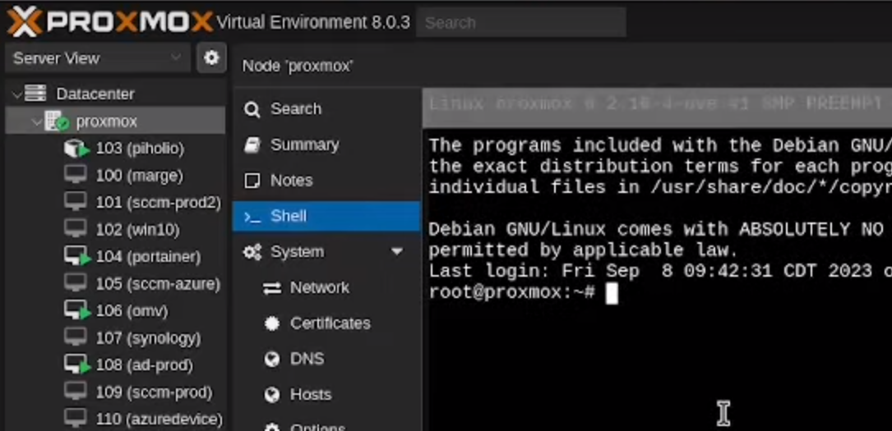
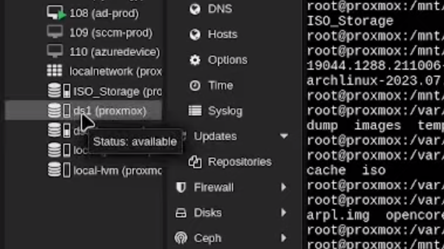
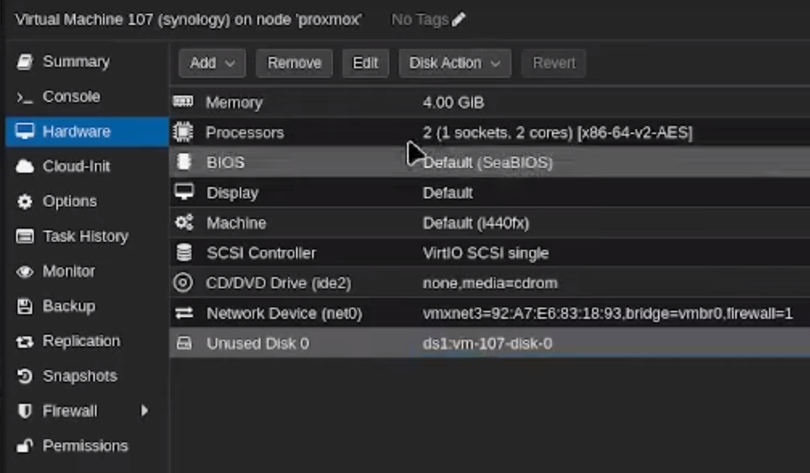
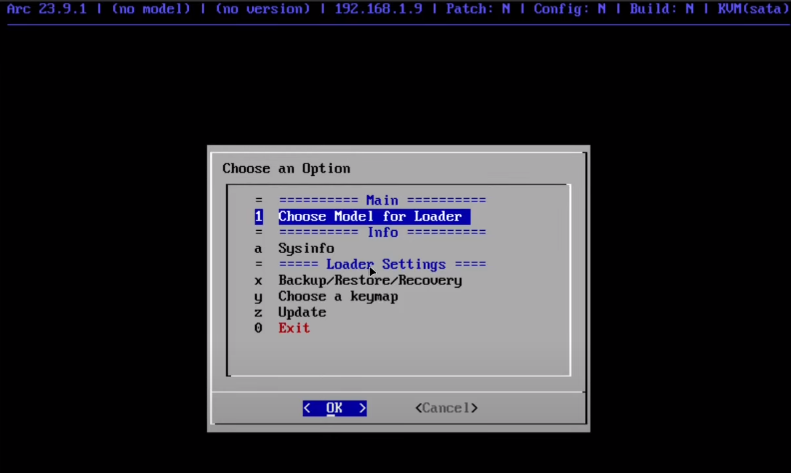
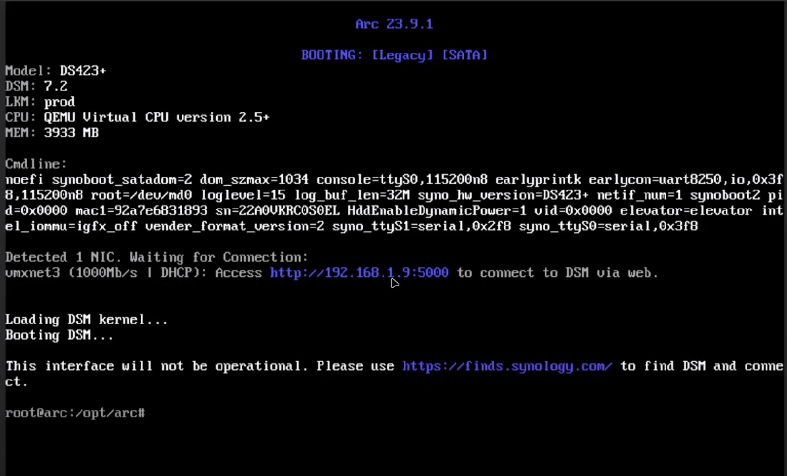

In this article, I will guide you through the process of setting up a Synology NAS (Network Attached Storage) on Proxmox in a virtual machine (VM). This setup is often referred to as a "Poor Man's Synology" because it allows you to create your own NAS using affordable hardware and open-source software.

## Video Guide

If you would prefer a video guide, I have one availble on YouTube.


## Downloading the Bootloader

You have a few options for bootloaders such as the Arc Bootloader and the ARPL Bootloader. I used the Arc Bootloader, you will need to download the `.img.zip` file from the releases page on the Github site.

Once you have this downloaded, you will need to extract the zip file and upload the `.img` file to Promox just like you do an ISO file. If you're not familiar with uploading an ISO, you can see that process in a previous post about setting up a [Ubuntu VM on Proxmox](https://credibledev.com/how-to-create-a-ubuntu-22.10-vm-on-proxmox/).

[Arc Bootloader](https://github.com/AuxXxilium/arc)

[ARPL Bootloader](https://github.com/fbelavenuto/arpl)

## Create the Proxmox VM for Synology

Next, we need to create a VM on Promox that will run our Synology NAS. We will create the base VM and then make modifications to the disks to get this working.

VM Setup Configuration
- OS: Choose "Do not use any media" and leave the guest OS on Linux.
- System: Keep all of the defaults.
- Disks: Remove the default device so the VM has no drives.
- CPU: Up to you but I would suggest 2 cores minimum.
- Memory: 4GB Minimum
- Network: Keep defaults or configure as needed


## Importing the Bootloader Image

The first step is to import the bootloader image into the VM that we just created. To do this, you need to open the Proxmox shell and locate the image file you uploaded earlier. 

To get to the shell, click on your Promox host node on the left, then choose Shell.



In my case, the `.img` file I uploaded is located in `/mnt/pve/ISO_Storage/template/iso/arc.IMG`. However, it may be in a different location for you, such as `CD /var/lib/vz/template/iso`. Once you have located the image file, in the shell and run the following command:

```
qm disk import <VM_ID> <image_file_path> <storage>
```

Replace `<VM_ID>` with the ID of your VM (in this case, 107), `<image_file>` with the path to the arc.IMG file, and `<storage>` with the storage location where you want to create the hard disk. The storage location can be found in the left menu, in my case I chose ds1 which you can see in the screenshot.



If you go back to the VM you created and click on the hardware tab, you should now see an unused disk, which is the one you just created from the `.img` file.



You need to select this disk and choose edit from the menu at the top. Change the BusDevice to be SATA and the Cache to Write Back.

## Configuring the Hard Disks

After importing the bootloader image, we need to configure the hard disks for the Synology NAS. In my case, I have two disks that I want to add to the NAS, each are  2TB and are connected to my Proxmox server as SATA devices. To find the IDs of these disks, run the following command in the shell:

```
ls /dev/disk/by-id
```

This will display a list of all the disks available in your system. Look for the disks you want to add (e.g., sde and sdf) and copy their IDs.

Next, we need to attach the disks to the VM. Run the following command in the shell:

```
qm set -sata1 /dev/disk/by-id/<disk1_ID>
```

Replace `<VM_ID>` with the ID of your VM and `<disk1_ID>` with the ID of the first disk. Repeat this command for each disk you want to add, changing the SATA number (-sata1, -sata2, etc.) and disk ID accordingly. Sata0 is already used by the `.img` file you imported earlier as a disk.

## Setting the Boot Order

To ensure that the Synology NAS boots from the correct disk, we need to set the boot order in the VM settings. Go to the "Options" tab of your VM, then "Boot Order". Uncheck the existing boot options and check the SATA0 option. Move it to the top of the list and click "OK".

## Assigning a Static IP Address

This isn't necessarily required but it is highly suggested so the IP of your Synology doesn't change.

To assign a static IP address to the Synology NAS, we need to copy the MAC address of the VM. Go to the "Hardware" tab, select the network device, and click "Edit". Copy the MAC address.

Next, go to your pfSense server (if you have one) and navigate to Services > DHCP Server. Scroll down to the bottom and click "Add". Paste the MAC address and assign an IP address and hostname for the NAS. This will ensure that the VM is assigned the same IP address every time it boots up.

If you don't have pfSense, you should be able to configure this on your router, refer to it's documentation or search online for specific instructions.

## Starting the Synology NAS

Now that we have configured the VM and attached the hard disks, we can start the Synology NAS. Go to the "Console" tab and click "Start". Wait for the VM to boot up and obtain the static IP address that you assigned.

You should come to the Synology bootloader options screen.



From there, choose option 1 and choose the model of Synology that you want to emulate. I chose DS423+, you can choose whichever you want.

You will then be asked to choose a version, this is referring the the DSM (Disk Station Manager) software version. Choose 7.2 or the highest version number available.

Next it will assess the system and let you know the number of disks that it detected, in my case it was 3. One disks is the bootloader, the other 2 are the 2TB disks I added to the VM.

On the next screen of the bootloader config you will have the option to select DSM extensions. These are optional.

Next, you will be asked if you want to build the bootloader. Choose option 1 for yes and press enter.

Now you will be asked if you want to boot into the DSM bootloader, choose yes and press enter. The VM will reboot, which take a moment. You should eventually get to a screen like the one shown below.



## Accessing the Synology NAS Interface

To access the Synology NAS interface, open a web browser and enter the IP address of the NAS followed by port 5000 (e.g., `http://<NAS_IP>:5000`). This will take you to the Synology DSM setup page.

On the setup page, click "Install" and follow the prompts to set up the NAS. You will see a progress screen and the device will reboot. When it comes back up, click "Setup" and follow the prompts. You will need to provide a name for the device, create an administrator account, and set a secure password. Choose to notify you of updates and do not use automatic updates. You can skip setting up a Synology account, it typically won't work for this setup anyways.

Once the setup is complete, you will be able to access the Synology DSM interface and start exploring its features. You can configure network settings, create shared folders, and more.

## Conclusion

Setting up a Synology NAS on Proxmox is a cost-effective way to create your own NAS using affordable hardware and open-source software. By following the steps outlined in this article, you can import the bootloader image, configure the hard disks, set the boot order, assign a static IP address, start the Synology NAS, and access its interface.

If you have any experiences or information about Synology NAS that you would like to share, please leave a comment below. Thank you for reading, and I hope you found this article helpful.