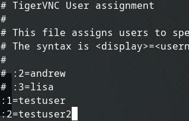
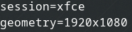
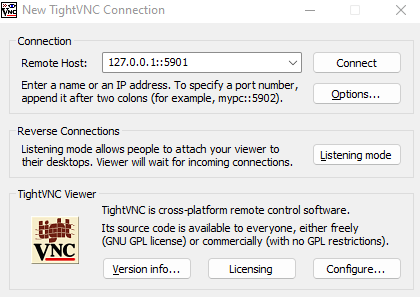

Recently I set up Proxmox on an old PC so that I could create a home lab. One of the VMs is for development that I would need to access remotely through some sort of remote viewing utility. The VM is running Manjaro Linux and while I could use TeamViewer to accomplish remote abilities, I've found that it doesn't always provide the best performance so I wanted to explore other options. One of the more common options for Manjaro is TigerVNC so that is the remote access tool I decided to go with for my setup. This quick guide will help you install TigerVNC on Manjaro Linux so that you can remotely connect to and view your desktop, just as if you are sitting at the machine with a monitor, keyboard, and mouse directly connected to it.

While this guide is targeted at Manjaro, you can likely adapt it to work for other Linux distributions such as Ubuntu by swapping out commands like pacman for apt install for example.

## RDP Instead of VNC

Instead of VNC, you may want to consider trying out RDP. RDP has been known as a Windows remote desktop technology, but open-source Linux-compatible versions exist. One of these is XRDP, in many cases, it performs better than VNC.

Check out our [guide on installing XRDP on Linux](https://credibledev.com/xrdp-and-vnc-which-is-the-better-remote-desktop/) if you're interested in trying it out.

## How to Install TigerVNC

### Install TigerVNC

```
sudo pacman -S tigervnc
```

### Set a Password for Remote Connections

```
vncpasswd
```

### Designate user and virtual desktop assignments

```
sudo nano /etc/tigervnc/vncserver.users
```

Inside this document, you will assign a virtual desktop to specific users. You do this using the format of :1=username

The colon at the beginning of the line is required, the number following the colon represents the virtual desktop which also represents the port that will be used for remote connections. For example, :1 is port 5901, :2 is pot 5902.



### Setup User Config

In the user home directory, we will create the config file to tell TigerVNC what desktop environment to use and the resolution.

```
nano ~/.vnc/config
```

Add or edit the following lines that are in the file. Replace xfce with the desktop window manager that you use.

```
session=xfce
geometry=1920x1080
```



### Create a Service to Run TigerVNC on System Startup

```
sudo nano /etc/systemd/system/tigervnc@:1.service
```

Replace the number 1 in the command above with the desktop you chose previously.

Paste the text below into the file, and replace testuser with the user account name that you are configuring this for.

```
[Unit]
Description=Remote desktop service
After=syslog.target network.target

[Service]
Type=simple
User=testuser
PAMName=login
PIDFile=/home/testuser/.vnc/%H%i.pid
ExecStart=/usr/bin/vncserver :1
ExecStop=/usr/bin/vncserver -kill %i

[Install]
WantedBy=multi-user.target
```

### Enable the Service

```
sudo systemctl enable tigervnc@\:1.service
```

Don't forget to change the number 1 to whatever you used previously.

- Take note of the IP address for your Manjaro install. You can check this in many ways, such as the ifconfig command from a shell prompt.

- Restart Manjaro

## Connecting to VNC on Manjaro

On the machine you will be connecting to the VNC instance on Manjaro from, such as your Windows device, you will need to download and install a VNC client such as [TightVNC](https://www.tightvnc.com/) which is what I will be using in this example.

Once you have the client downloaded and installed, it is time to connect. You will be using the IP address you collected earlier and the port such as 5901, depending on what virtual desktop you chose in the earlier steps.



You should now be remotely connected to your Manjaro Linux installation remotely using TigerVNC. If you were unable to connect, verify the IP address and port. If you are still having trouble connecting, you may want to test disabling the firewall in Manjaro if you had it set to active.
