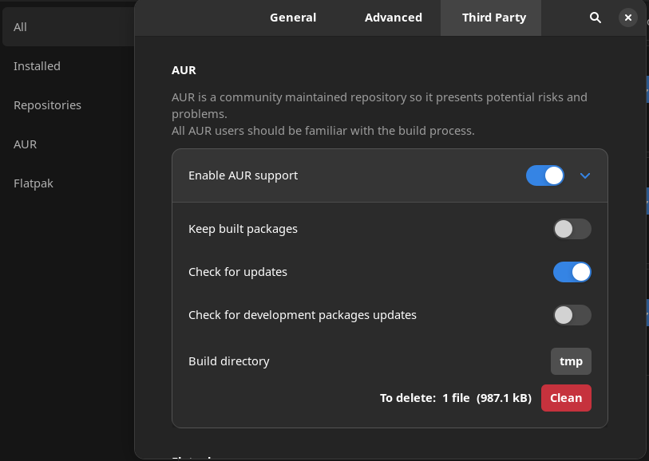
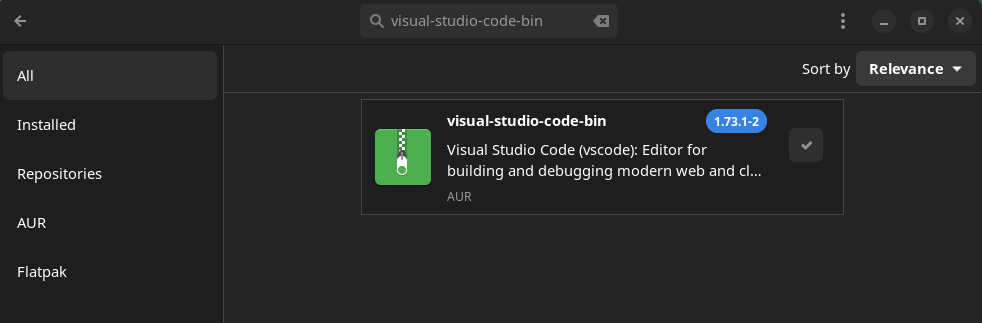

Many developers today choose [Microsoft Visual Studio Code](https://code.visualstudio.com/) as their preferred text editor and IDE. VSCode is a multi-platform tool that is powerful in terms of editing and extended editing capabilities. On top of the already feature rich client, there are many official and community based extensions that expand it's capabilities. This guide will explain how to install **VSCode on [Manjaro Linux](https://manjaro.org/)**.

https://www.youtube.com/watch?v=QppKSrsuPZ8

## Install VSCode Flatpak

Installing VSCode as a Flatpak is an excellent option for Manjaro Linux users. It's just as easy as the Snap method and the performance and manageability is even better. This is the method I've used to install VSCode on my Manjaro PC, so I recommend you try it out. You will need to enable Flatpak support on Manjaro first, if you haven't already. If you need help, we already have a [guide on setting up Flatpak on Manjaro](https://credibledev.com/install-flatpak-endeavouros-manjaro-arch-linux/).

Once you have Flatpak support setup, open up your terminal and run the following command to install VSCode.

```
flatpak install flathub com.visualstudio.code
```

### Running the VSCode Flatpak

In order to run VSCode, you can either find it in your app launcher or run the following command in the terminal.

```
flatpak run com.visualstudio.code
```

## Install VSCode Through Snap

I don't like snap! Ok, you can [install VSCode from the AUR](#vscodeaur) as well.

By far the easiest way to install VS Code on Manjaro Linux is to use the Snap version. Snap versions of apps are bundled with everything they need, including dependencies, that an application needs to run on essentially any distribution of Linux. These apps also run in a sandbox to be more secure. For VS Code, in order to avoid file access issues, we must install with the --classic flag to allow access to files across the filesystem and not just in the sandbox environment.

First we need to check that you have snap installed, at a shell prompt, run the command "snap version" without the quotes. If you get a response with the snap version, you're good to move on. If snap isn't installed, run the following commands to complete that installation before proceeding.

### Install Snap

```
sudo pacman -S snapd
sudo systemctl enable snapd
sudo systemctl start snap</code>
```

Now you should have Snap installed and you can confirm with the "snap version" version command. You may need to log out and back in if it's still not working.

Once everything is good with your Snap install, we need to create a symbolic link from /snap to /var/lib/snapd/snap. This is required since we are using the --classic flag during the install of VS Code. Run the following command to setup the symbolic link.

```
sudo ln -s /var/lib/snapd/snap /snap
```

Now everything is setup and we can finally install VS Code on our Manjaro Linux machine. Run the following command to complete that install.

### Installing VS Code from Snap

```
sudo snap install code --classic
```

## Install VSCode from AUR

Before installing apps from the AUR, you should understand the risks involved as well as why sometimes the alternatives like Flatpak are better. Read through [our article that discusses the concerns with the AUR](https://credibledev.com/how-to-enable-the-aur-on-manjaro-linux/).

Installing VS Code from the AUR is pretty simple, go ahead and launch the package manager. Enable the AUR if you haven't already, this can be done through the preference menu of the package manager. Choose Third-Party at the top and then enable AUR support.



Now that you have the AUR enabled. Go back and use the search function in the package manager to search for "visual-studio-code-bin", which should return a result for you.



Go ahead and select this option to install VS Code using the AUR on Manjaro. Once the installation is completed, you're ready to go.

### How to Run VSCode on Manjaro

Once the installation is finished, depending on your exact environment, you may see Visual Studio Code in your applications menu. Also, you can launch VS Code from a shell prompt by running the command "code", without the quotes. You can also run the command "code .", to launch VS Code using the current directory as the working directory which can be useful.

That's it, now you have VS Code installed in Manjaro Linux and the app will get updates through the snapd service so you always have the latest version available.
