https://youtu.be/-F1IF9kybbU

Many organizations could import the hardware hash of their existing endpoints using SCCM or other automated means because the endpoints were already running Windows. However, in some cases, this wasn't possible because the devices were not running Windows at the time, which was the case for my organization. We wanted to use Autopilot when converting from the old Linux solution to the new Windows Azure AD/Intune solution. To do this, we needed an automated solution for collecting the hardware hash and importing it into Intune. So this was the start of a journey to find a good solution.

We already have SCCM in our environment, which was used heavily pre-pandemic. So we started looking at ways we could use SCCM to our advantage to complete the following steps.

- Convert Linux or Other OS Devices to Windows

- Collect the Hardware Hash and Import it into Intune

- End Goal Being a Fully Intune Managed Windows 10 PC

Researching online, it wasn't easy to find solid information for this scenario. I guess what we were trying to do just wasn't that common. Luckily, we stumbled upon the [Intune Training YouTube channel](https://www.youtube.com/@IntuneTraining), which had a [video](https://www.youtube.com/watch?v=nelpwJLQJDk) on the topic of collecting the hardware hash and uploading it to Intune via an SCCM task sequence.

After some trial and error and a couple of changes to their provided solution using a few PowerShell scripts at the end of the task sequence, we had a working product. Windows 10 would be deployed using SCCM, after this, the task sequence would collect the hardware hash and import it to Intune. The device then reboots and starts the Autopilot process. Sweet! So let's dive into how this is set up.

## Task Sequence PowerShell Scripts to Collect and Upload the Hardware Hash

First, we need to obtain the PowerShell scripts we will use during the task sequence to obtain and import the hardware hash to Intune. The original files are available from the [Windows Admins Github Repo](https://github.com/windows-admins/Intune/tree/main/TaskSequenceFiles). As I've mentioned, we made some slight modifications that you may want to consider as well, so we've forked the repo and made the modified version available on the [credibleDEV Github repo](https://github.com/credibledevcom/AutopilotTS/tree/main/TaskSequenceFiles). If you download the files from our repo you will have these modifications already.

The two modifications made are as follows.

- Change the grouptag variable to be a parameter instead of hardcoded. This allows us to customize the group tag without editing the script. We can now use the same package for all of the task sequences and just change the parameter used for the grouptag.

- Add the -Assign flag to the call of Get-WindowsAutoPilotInfo. This will cause the script to wait for the assignment of the autopilot profile in Intune to complete before continuing to the OOBE. We ran into issue where the assignment took a while on the Intune side which caused issue when the device kicked out to the OOBE.

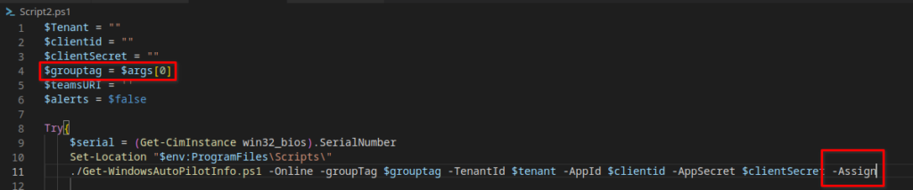

The scripts being used in this package will perform the following functions.

- Script1 - Sets up the directory and copies the needed files to the target machine

- Script2 - Sets variables for your tenant, app registration, grouptag, and optional Teams integration. This script also calls GetWindowsAutoPilotInfo to do the work of uploading the hardware hash and grouptag to Intune.

- Script3 - Cleanup, remove the config manager client from the machine and kick it out to the OOBE.

## Required App Registration

We need to allow these scripts to talk to the tenant and upload the hardware hash from the task sequence. For this to work, you will need to create an app registration from your Azure tenant. Let's do that now.

From Azure AD, choose App Registrations from the left sidebar menu.

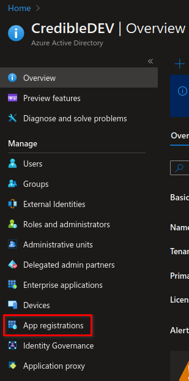

On the next screen, you will click on "New Registration" at the top. You will then be taken to page to name your new app registration. Give it an appropriate name and configure any other options you may need to customize. When finished, click on "Register" at the bottom.

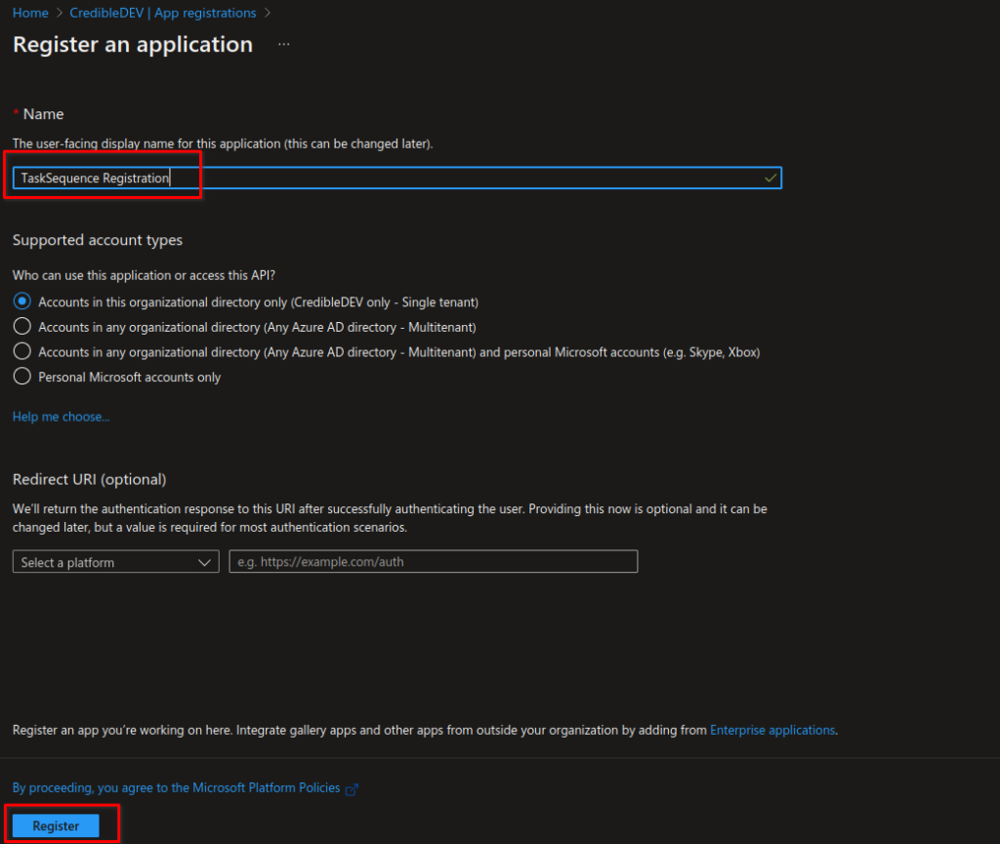

Once your app registration is created, click on "API Permissions" from the left sidebar menu. Then click on "Add a Permission".

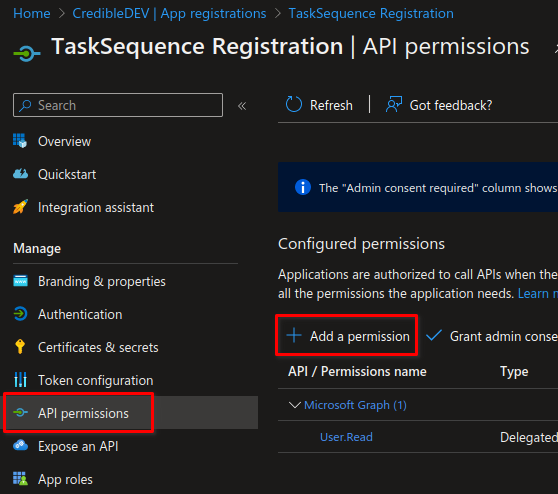

On the Add Permission popout window, do the following.

- Select Microsoft Graph

- Select Application Permissions

- In the search box, type "device" to narrow down the list.

- Find and expand "DeviceManagementServiceConfig"

- Select the checkbox next to "DeviceManagementServiceConfig.ReadWrite.All"

- Click Add Permissions at the bottom

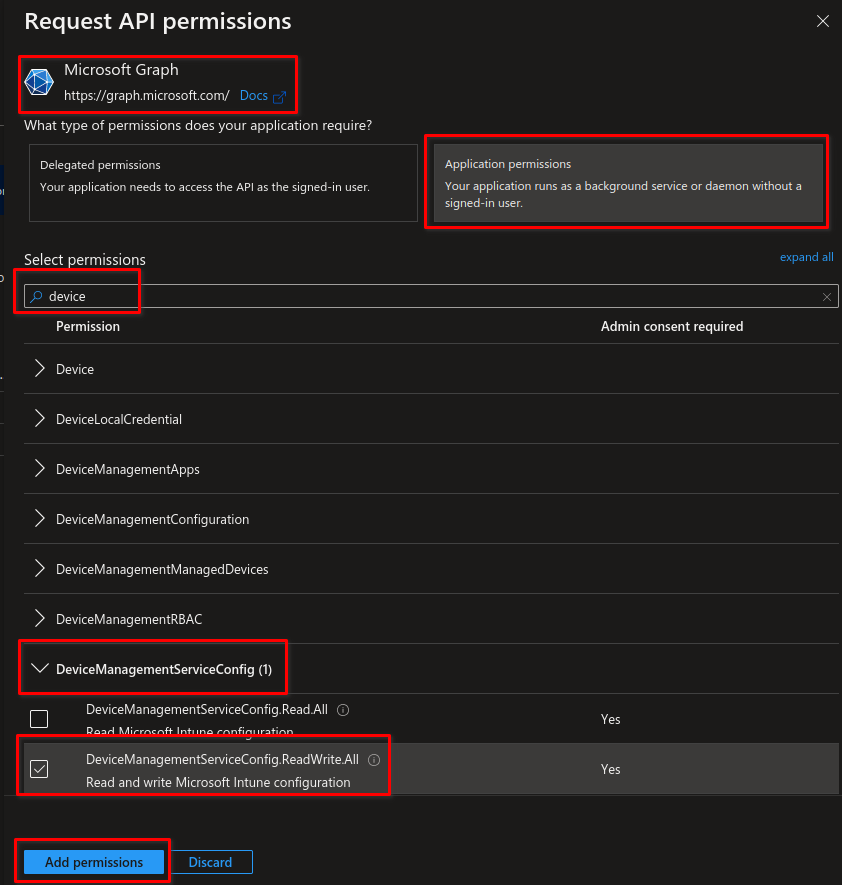

Before leaving the API page, we need to give admin consent as well. You do this by clicking on the link that says "Grant Admin Consent".

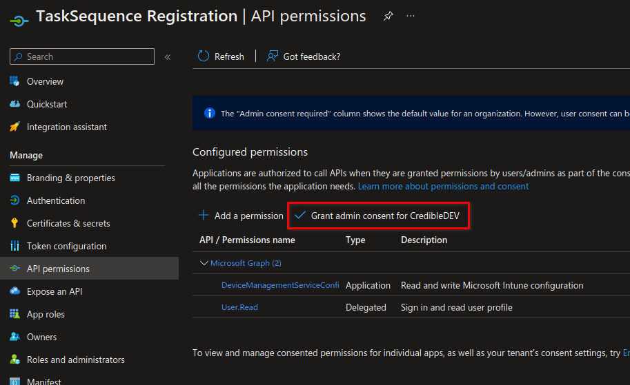

Next, you click on "Certificates & Secrets" from the left sidebar menu, then choose "New Client Secret". Give it a name, then select the expiration time you would like.

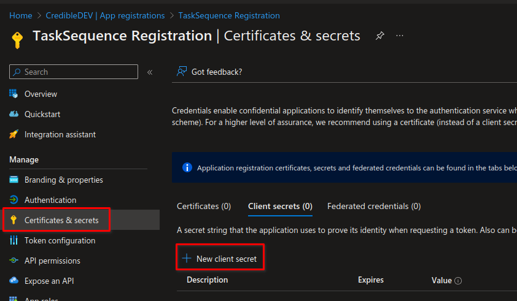

After creating your new client secret, you will want to take note of the value highlighted in the image below. You will be adding this to Script2 in the next step.

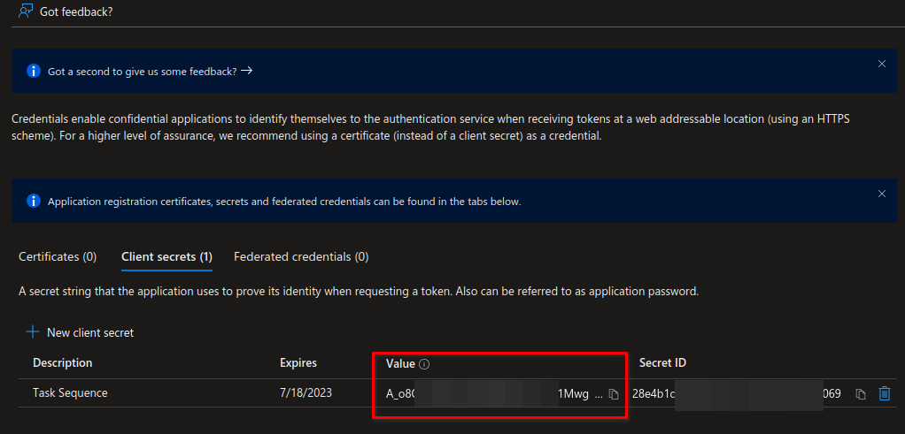

## Link the Task Sequence Script to Azure AD

In this step, we will be linking variables in Script2 from the repo to our Azure AD tenant and the app registration we just created. Open up Script2.ps1 and edit the following variables accordingly.

- $tenant = "whatever.onmicrosoft.com"

- $clientid = "Application ID from your app registration"

- $clientSecret = "The value you copied from the client secret you created in the previous step"

## Create an SCCM Package

Once you have downloaded the files from the Github repo. You want to create an SCCM package for them and push it out to your distribution points. I assume you already know how to do this process and won't go into detail here.

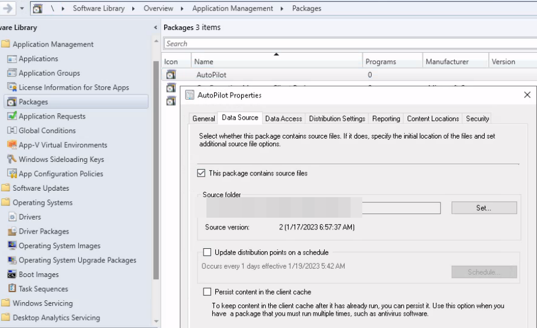

## Create an SCCM Task Sequence to Get the Hardware Hash and Upload to Intune

Now that we have an SCCM package created with the PowerShell scripts, we will create a task sequence. Again, I won't go into the basics of creating a task sequence, as I assume you already know how.

At the end of the task sequence, you will want to add three steps, one for each of the PowerShell scripts that need to run from the package we just created. When creating the task sequence steps, choose the step type of "Run PowerShell Script", then select the package you created.

For the first one, you will put "Script1.ps1" as the script name and set the execution policy to bypass.

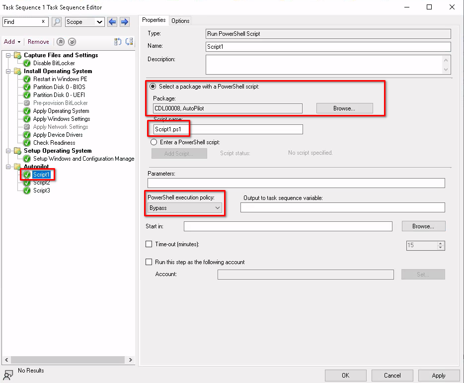

For the second step, you will set the script name as "Script2.ps1". In the parameters field, you will put your chosen grouptag, and then set the execution policy to bypass as well.

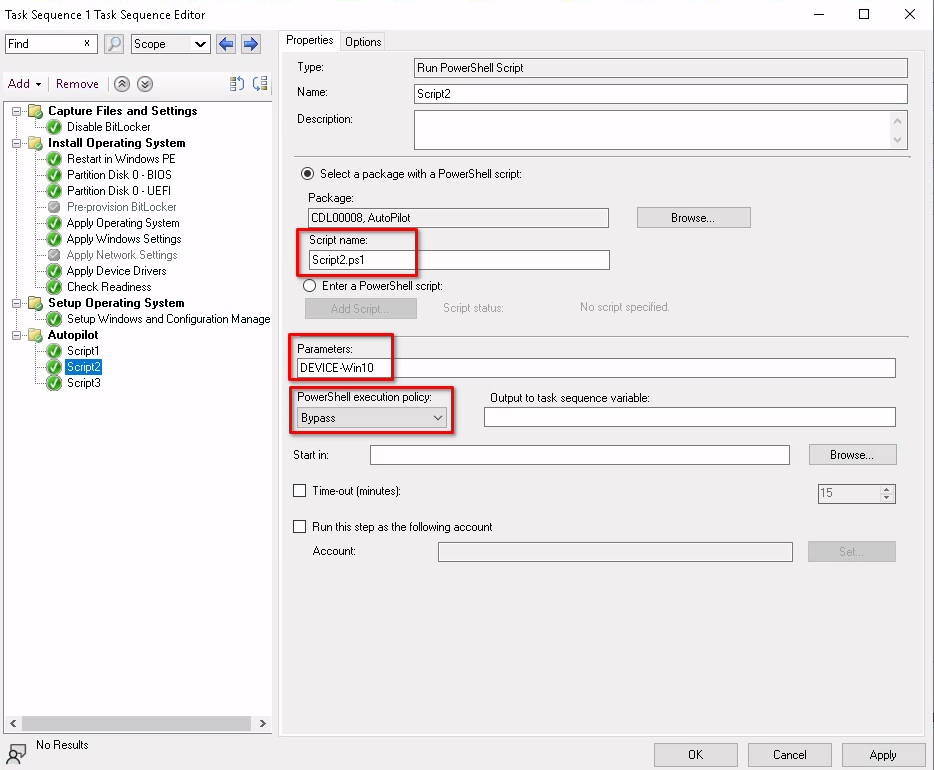

The third script will be set up like the first, except for using "Script3.ps1" as the script name.

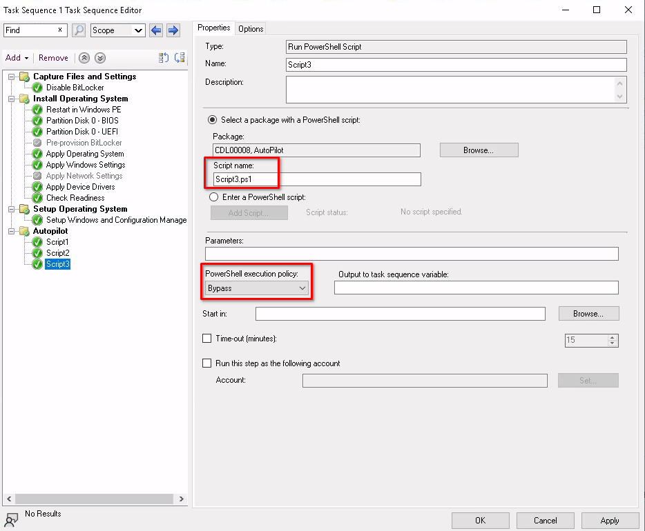

## Conclusion

You're now ready to assign the task sequence to a collection and test. If set up properly, and your devices have a physical TPM 2.0 chip, you should not have any issues getting this to work.
