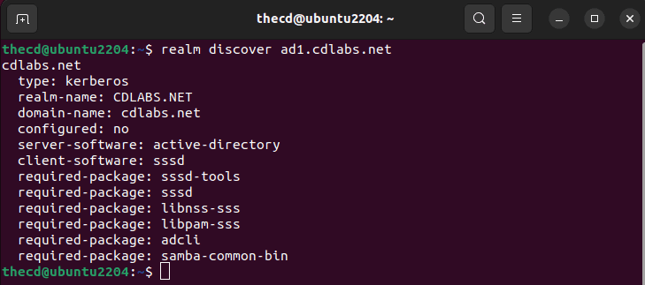
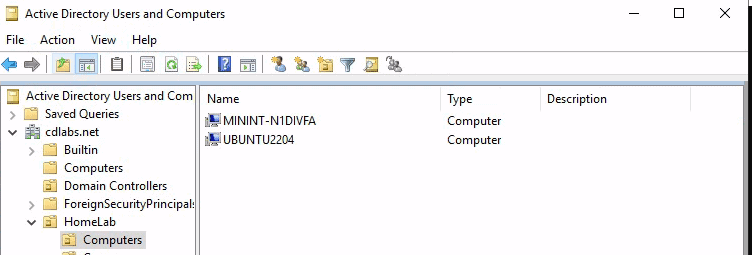
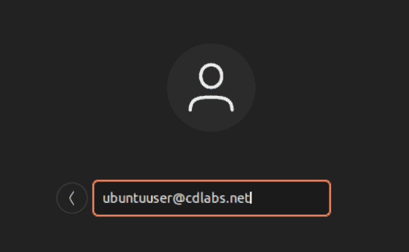

I assume if you are reading this, then you are familiar with what Active Directory and Linux are. Although, you may be asking yourself, what would be the benefit of joining a Linux device to Active Directory? The answer: Central ID and user management. Especially for large organizations that use both Windows and Linux devices or servers.

Imagine not having to set up local accounts across all of the Linux servers and devices, instead, you just log in with your active directory domain credentials and authenticate with your AD server. Plus you can easily manage who has access to sudo. Another benefit is that you don't have to clean up old local accounts when an employee leaves the company.

The following guide will walk you through joining an existing Active Directory domain from your Linux devices such as Fedora, Ubuntu, etc. But first, let's talk briefly about the packages needed to make this possible. We will be using [SSSD](https://sssd.io/) and [Realmd](https://www.freedesktop.org/software/realmd/) to make this possible on Linux, it's surprisingly easy.

**SSSD**

The core software package that we need in order to join Linux devices in Active Directory is System Security Services Daemon. This package is called SSSD for short, way easier to say and remember. SSSD is what allows us to communicate with AD, LDP, Kerberos, and other providers. It also handles caching credentials on the client device as well. This way you can log in when network connectivity is not present, assuming you have signed in before and the credentials are cached.

One important thing to note is that SSSD does not create local Linux accounts on the client device, it only caches the credentials.

**Realmd**

Configuring SSSD yourself can be time-consuming, a pain, and error-prone. Thankfully, realmd does all of the heavy lifting for us by doing all of the configurations. You can use realmd to not only discover your AD server but to identify additional packages that are needed to make the connection.

## Installing SSSD and Realmd

Depending on what Linux distribution your client machine is running, this will be different, so I have included a few different types below. In many cases you can use these instructions for other Linux distributions as well, just use the package manager for that specific distro.

### Ubuntu 22.04 LTS

To install SSSD and Realmd, run the following command in the terminal. This will also work for other Ubuntu/Debian variants such as PopOS and Linux Mint.

```
sudo apt install sssd realmd
```

### Fedora 37, Rocky Linux 9

Use this command to install SSSD and Realmd on Fedora.

```
sudo dnf install sssd realmd
```

## Set Hostname

Before continuing, make sure you have set a proper hostname and it's not something like "localhost". If you don't set a hostname, the domain join using realmd will fail.

```
sudo hostnamectl set-hostname newhostname
```

## Discovering the Domain

Now that you have sssd and realmd installed, let's use realmd to discover our AD domain.

```
realm discover ad1.cdlabs.net
```

The output of this command will give us some information about our AD setup and additional packages that are required for the connection to work properly. It looks like we need to install these additional packages: sssd-tools, libnss-sss, libpam-sss, adcli, samba-common-bin.



### Ubuntu 22.04 LTS

```
sudo apt install sssd-tools libnss-sss libpam-sss adcli samba-common-bin
```

### Fedora 37, Rocky Linux 9

```
sudo dnf install oddjob oddjob-mkhomedir adcli samba-common-tools
```

## Join the Domain

Now we are ready to join the domain. We will use the "realm join" command to do this and you have some additional options that can be used with it as well. Examples are below, starting with a basic AD join.

When inputting the AD domain admin username, you do not need to specify the domain like "domain\\thecd", you can just use the username by itself.

```
realm join -U domain_admin_username domain.fqdn
```

If you want to specify the OU where the computer account is created, you can do that as well with the following variation. By default, new computers will be added to the Computers OU in the root of the domain.

```
realm join --computer-ou="ou=Computers,ou=HomeLab,dc=cdlabs,dc=net" -U domain_admin_username domain.fqdn
```

We can then check AD to find our Linux device has been created under the OU we chose.

### Handling Errors

If your Linux device fails to join AD, you should get a "journalctl" command output that you can use to see the logs. These logs will help you diagnose the issue.

Common issues are the domain account used for joining doesn't have the proper permissions, the encryption type is not supported or an incorrect password was used.

### Verify the Machine Account is Created



## Login to Linux with AD Account

Now that we have our Linux device added to our Windows Active Directory domain, we can log in with an AD account.

Username: username@domain.ext

So to log in with a test user account we would type in the username like so.



## Create Home Directories Automatically

You may notice that your user doesn't have a home directory upon login. We need to enable it so that when a user logs in with an AD account, their home directory is created.

**Note:** If you are on **Fedora 37** or **Rocky Linux**, a home directory will be created by default. You do not need to run this command.

```
sudo pam-auth-update --enable mkhomedir
```

Now if you log in with your AD account again, the home directory will be created.

## Add AD Users to Sudo Group

Another common task when integrating Linux devices into Active Directory domains is putting admins into the sudo group so they can run elevated commands.

To do this you must add the AD group that you want to have sudo privileges to the sudoers file. We can do this using the "visudo" command or you can create a new file in the "/etc/sudoers.d/" directory.

If you have a group called "linuxadmins" in AD, you would add the following line to your sudoers file.

```
"%linuxadmins@domain.ext" ALL=(ALL) ALL
```

You should clear the cache and restart sssd before trying to log in with a user that has been added to this group. This will make sure their group memberships are read again and not pulled from the cache.

```
sudo sss_cache -E; sudo service sssd stop ; sudo rm -rf /var/lib/sss/db/* ; sudo service sssd start
```

Now, any user that is a member of that group in AD will be able to use sudo on the Linux system.

## FAQ

### Does Linux Support Active Directory?

Linux can support and use Active Directory for user management and authentication. This is done through extra packages like SSSD and Realmd.

### Can I Use Linux as a Domain Controller?

Yes, there are specialized Linux distributions made for this, such as [Zentayl](https://zentyal.com/).

### Can I Control Sudo Access with Active Directory?

Yes, once you have connected the Linux system to AD, you can use the sudoers file to grant access to a particular AD group.
