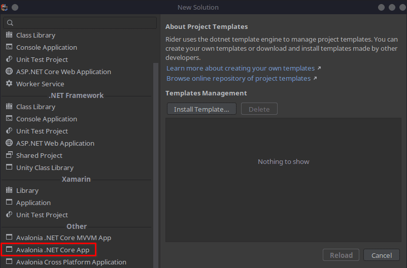
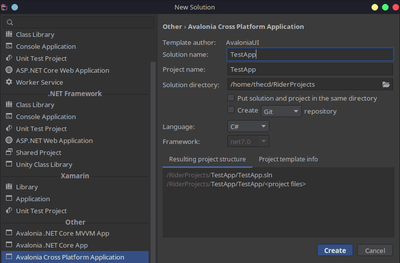
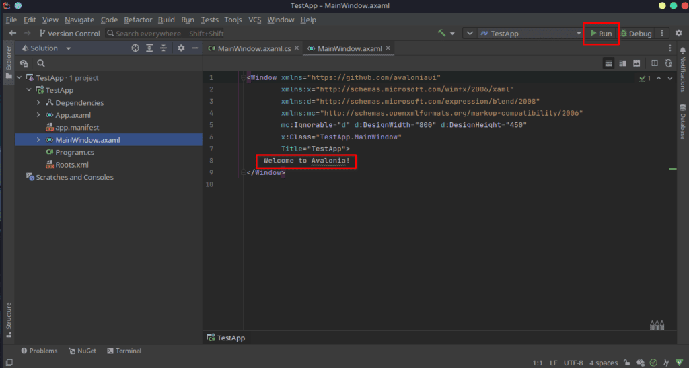
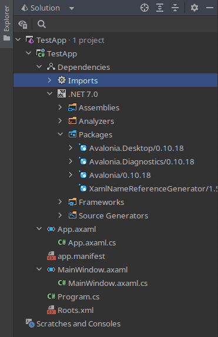
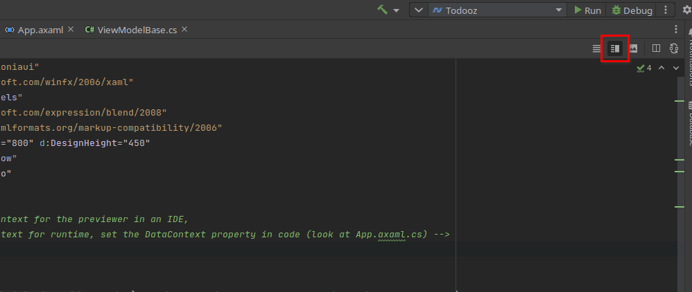

I said in a recent article that Avalonia UI is a great framework for creating Linux GUI applications using C# and .NET. I also said that it paired well with the JetBrains Rider IDE. So today, we are going to build the basic Linux GUI app using Avalonia UI and Rider.

The GUI applications built using this framework will be cross-platform. They will run on Linux, Windows, and MacOS which greatly speeds up development. Also, if you are already familiar with WPF apps in Visual Studio on Windows, Avalonia UI borrows a lot from WPF so you will feel right at home.

### Requirements

- Have the .NET SDK installed on Linux ([guide](https://credibledev.com/dotnet-in-linux/))

- Have JetBrains Rider Installed ([guide](https://credibledev.com/install-jetbrains-rider-for-c-on-linux/))

## Step 1: Install Avalonia UI Templates

In order to use Avalonia, we need to first install the templates. We do this by using the command line, so pop open your terminal and run the following:

```
dotnet new install "Avalonia.Templates"
```

## Step 2: Launch JetBrains Rider on Linux

Go ahead and start up Rider and create a new solution. From the new solution menu, choose the "Avalonia UI Core App" template.



Give the solution a name, choose C# as the language, and choose the .NET framework you want to build with if needed.



Now, click "Create" to build the solution. It will take a moment for the project solution to build

## Step 3: Run the Avalonia UI App

Once the project loads fully, you should see the contents of the "MainWindow.axaml" file displayed in the editor window. This basic app will produce a Linux GUI app that displays "Welcome to Avalonia!" in a desktop window. You can click run in the top right to test the application.



After running the app, you should see this window.


Congratulations, you have built and run your first GUI C# .NET application for Linux using Avalonia UI.

## Step 4: Get Familiar With Avalonia UI

If we take a look at the solution explorer and the file structure, we will find some similarities of Avalonia with WPF applications on Windows.



We see that we are building for .NET 7.0 which is the latest version at this time. We also see that some NuGet packages have been installed for Avalonia.

Further down we see some "axaml" files, these are just normal XAML files, they are prefixed with an "a" for Avalonia.

If you expand the XAML files, you will find the code-behind ".cs" files, just like a regular WPF application.

You can find a [full feature comparison between WPF and Avalonia](https://docs.avaloniaui.net/guides/developer-guides/comparison-of-avalonia-with-wpf-and-uwp) in their documentation.

### Program.cs

This is where the initialization of the program is setup

### App.axaml.cs

Code-behind for "App.axaml" and the OnFrameworkInitializationCompleted method is called when all parts of the Avalonia Framework are loaded and ready, after which the MainWindow is generated.

### MainWindow.axaml

This is the window that will be presented when you run the application, you will want to make additions to the UI here, such as buttons, labels, inputs, etc.

### MainWindow.axaml.cs

Code-behind for the MainWindow, unless you are following a strict MVVM pattern, you can put code here to work with UI elements that are in the MainWindow.

## Step 5: Install the Avalonia Rider Plugin

In order to see a live preview of what your XAML layout looks like, you will need to install the Avalonia plugin for Rider.

To do this, go to the File menu in Rider, then choose Settings. From the settings menu, choose Plugins and search for Avalonia. You should see the plugin listed with the options to install it.


You will need to restart Rider for the plugin to be active. After this, you should be able to see the live preview when editing a XAML layout file. If you don't, even after installing the plugin and restarting Rider, make sure you have the "Editor and Preview" option selected.



## FAQ

### Does Avalonia use WPF?

Avalonia is very similar to WPF but not identical. So you won't be able to just copy your WPF code and run it with Avalonia. Learning Avalonia will be easy if you already know WPF. Avalonia does have a new project, which isn't free, called [XPF](https://avaloniaui.net/XPF) which allows you to run existing WPF Windows apps on Linux and MacOS.

### Is Avalonia Cross-Platform?

Yes, you can build apps that run on Windows, Linux, MacOS, iOS, and Android.

### Is Avalonia UI Free?

Yes, Avalonia is free and it's also open source. Check out their [GitHub](https://github.com/avaloniaui/avalonia).

## Conclusion

This was just a simple primer for Avalonia UI to show that building cross-platform .NET C# GUI apps that run on Linux is not difficult or impossible. We will have future posts that build some sample applications using this framework.

Stay Tuned for More! In the meantime, Avalonia has great [documentation](https://docs.avaloniaui.net/) to get you started.
