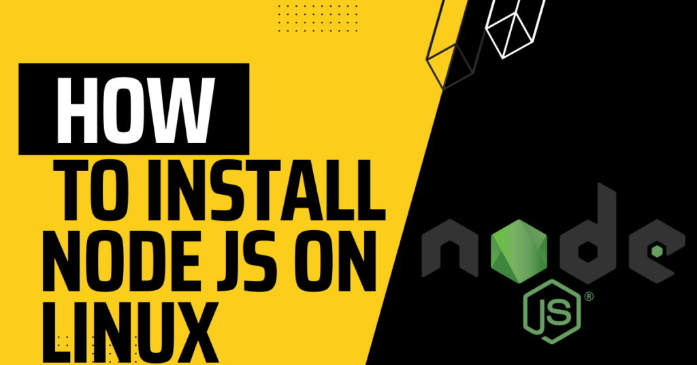
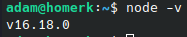

How to install Node JS on Linux

If you are a Javascript developer and you use Linux, how to install [Node.JS](https://nodejs.org/en/) is probably a question that you have. Fortunately for you, it is actually easy to install node js on Linux. We already have a guide that explains [how to install NodeJS on Manjaro Linux](https://credibledev.com/how-to-install-nodejs-on-manjaro-linux/) so today we will be explaining how to install Node.JS on Ubuntu and other Debian-based Linux distributions.

## Install Node Version Manager

The easiest way to install Node.JS on Linux and also to manage it is by using [Node Version Manager](https://github.com/nvm-sh/nvm), NVM. So, we will first install NVM on Ubuntu because this will provide an easy way to install any version of Node.JS on Ubuntu without any additional work from us.

First, you will need to open a terminal window on your Linux desktop. Now, run the following command in the terminal. This single command will download the Node Version Manager install script and execute it as well.

```
curl -o- https://raw.githubusercontent.com/nvm-sh/nvm/v0.39.1/install.sh | bash
```

After the installation of NVM is complete, you can try typing the following into the terminal to verify the install completed. If the command does not work, you may need to close the terminal window and open a new one to refresh the session.

```
nvm
```

## Install Node.JS on Linux

Once you have confirmed that you have NVM installed, we can use it to install Node JS.

Most users will want to install the long-term support version, also known as LTS. To use NVM to install the LTS version we use the following command in the terminal.

```
nvm install --lts
```

If you want to install a specific version of NodeJS, you can use the following command, replace the version number with the version you want to install.

```
nvm install 18.4.0
```

Using NVM, you can install multiple versions of Node.JS. When you have multiple versions installed, you can switch between them using NVM. To tell NVM to use version 16.18.0 we run the following command.

```
nvm use 16.18.0
```

There are other options that can be used with NVM as well, I have listed some of the more common commands here.

```
# Directly run a node app from nvm
nvm run 6.10.3 app.js
nvm exec 4.8.3 node app.js

# Install the latest available version
nvm install node
nvm use node

# Uninstall a specific version
nvm uinstall 16.18.0
```

## Verify NodeJS is Installed

Now that we have used NVM to install Node JS, we should verify it was installed. Using the Linux terminal run the following command which should return the version is installed.

```
node -v
```

The output in the terminal should look similar to the screenshot below. If you get an error, try closing the terminal window and opening a new one.



Congratulations, you now have Node.JS installed using NVM on Ubuntu Linux! You're ready to get coding!
