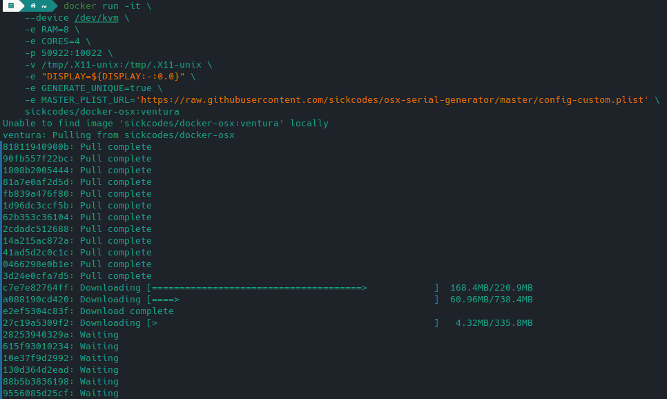
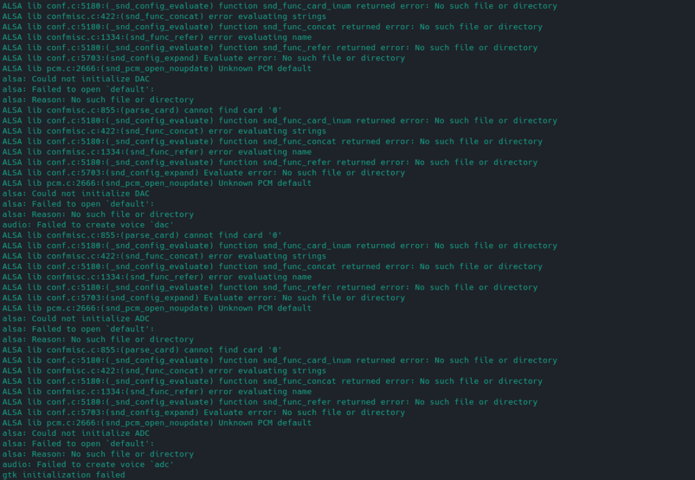
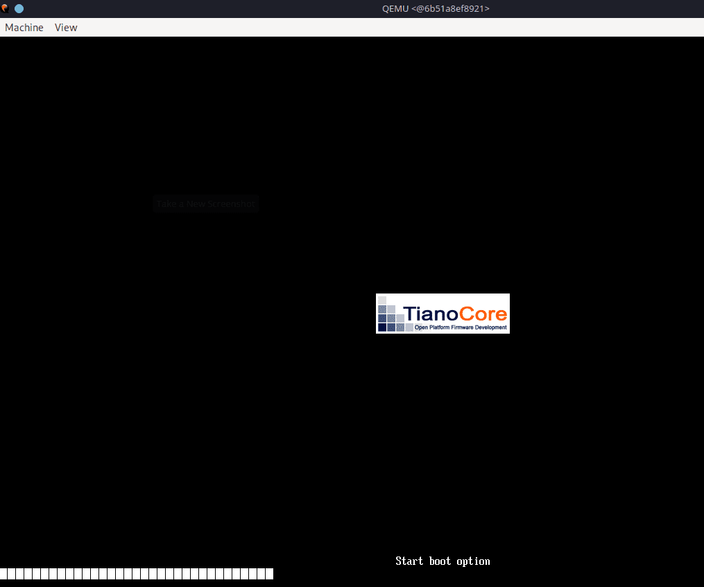
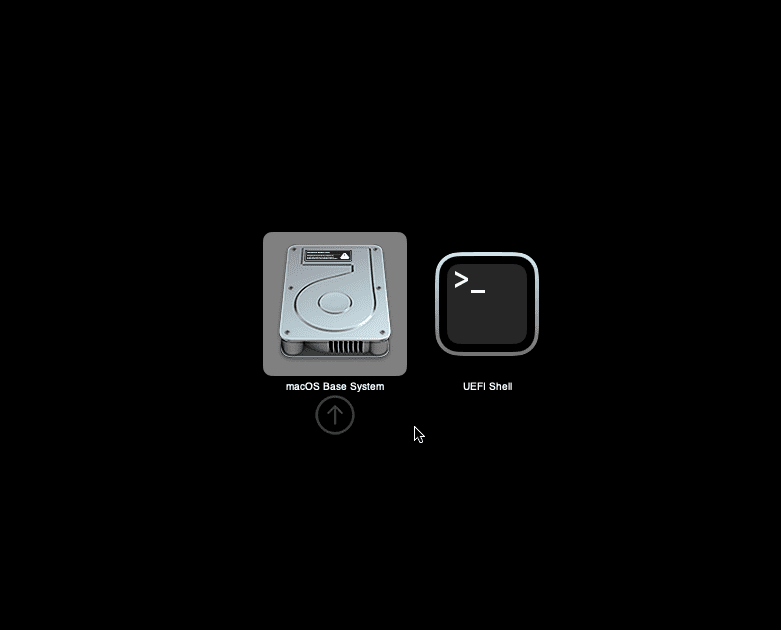
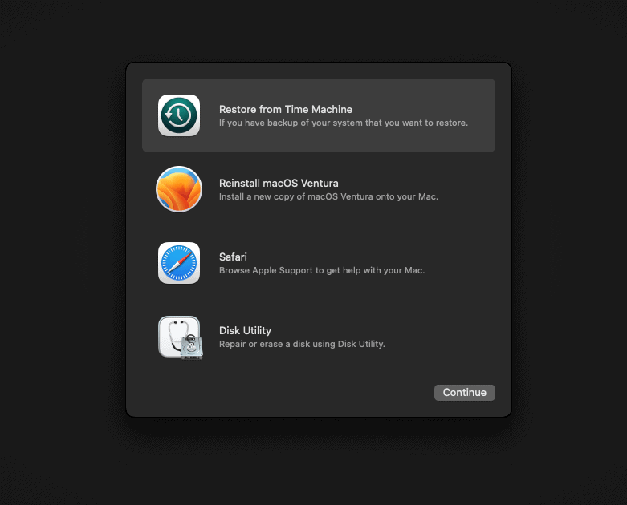
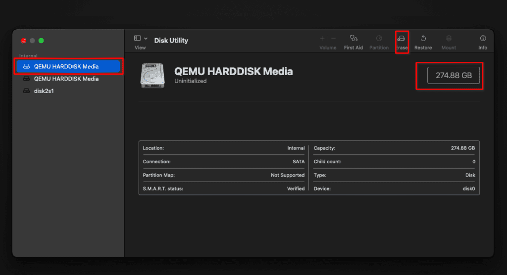
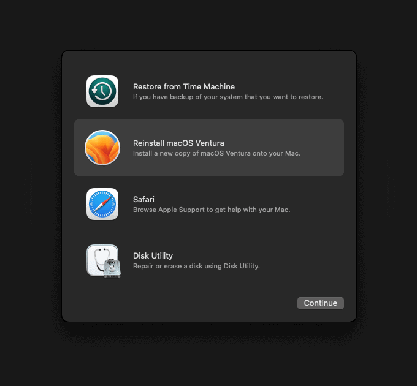
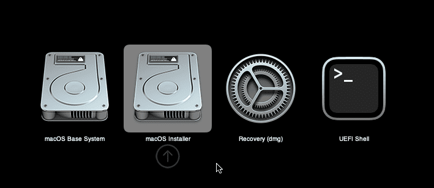
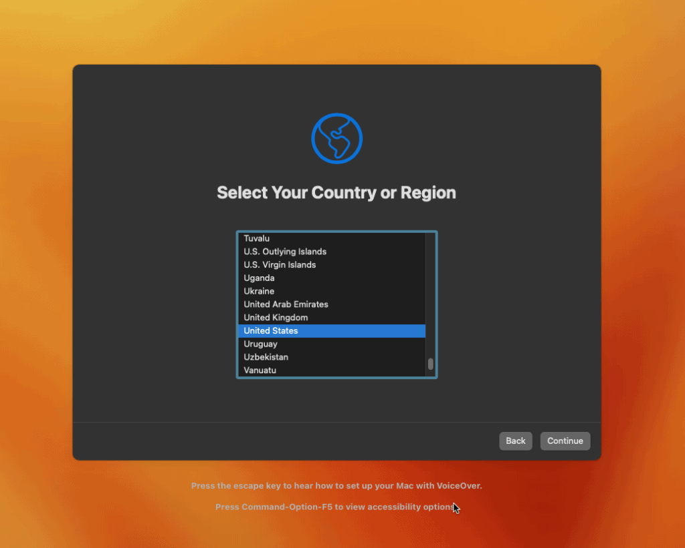
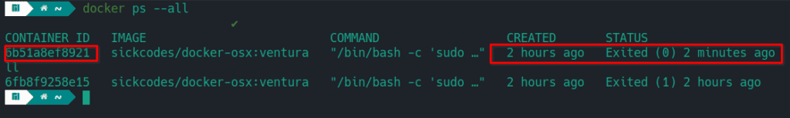

There are times, especially if you are a developer when you really need to create or test something on macOS. Luckily, there is a very easy way to do this on Linux, using Docker. There are many methods out there, such as running macOS in Virtual Box or even dual booting if you have the right hardware combination and a lot of time to fiddle with it.

Running macOS in Docker on Linux is really easy thanks to an open-source project from [sickcodes](https://twitter.com/sickcodes) called [Docker-OSX](https://github.com/sickcodes/Docker-OSX). This will actually run on most distributions of Linux, assuming you can install Docker and the other dependencies. I will be covering the steps for Manjaro specifically since this is what I run. This exact process should also work on Arch and EndeavourOS flavors of Linux as well.

Note: Before proceeding, make sure you have Virtualization turned on in your BIOS.

## Step 1: Install Dependencies

Before we move on, we need to make sure our machine has all of the necessary software to make running macOS on Linux a success.

```
sudo pacman -S qemu libvirt dnsmasq virt-manager bridge-utils flex bison iptables-nft edk2-ovmf
```

Next, we should enable libvirt and load the kvm module.

```
sudo systemctl enable --now libvirt
sudo systemctl enable --now virtlogd
echo 1 | sudo tee /sys/module/kvm/parameters/ignore_msrs
sudo modprobe kvm
```

We also need to install and enable Docker.

```
sudo pacman -S docker
sudo systemctl enable docker
sudo systemcrl start docker
```

We also should add our user account to a few groups for docker, libvirt, and kvm.

```
sudo usermod -aG docker,libvirt,kvm your_username
```

You may need to restart your machine or log out and back in before proceeding if you run into issues trying to start Docker.

## Step 2: Choose Which macOS Version to Run on Linux

Sickcodes offers many different Docker containers, each containing a different OSX version. In the examples below, I have configured 8GB of ram and 4 CPU cores, you can update this for your own needs or remove the two additional "-e" options to take the defaults.

### Catalina

```
docker run -it \
    --device /dev/kvm \
    -e RAM=8 \
    -e CORES=4 \
    -p 50922:10022 \
    -v /tmp/.X11-unix:/tmp/.X11-unix \
    -e "DISPLAY=${DISPLAY:-:0.0}" \
    sickcodes/docker-osx:latest
```

### Big Sur

```
docker run -it \
    --device /dev/kvm \
    -e RAM=8 \
    -e CORES=4 \
    -p 50922:10022 \
    -v /tmp/.X11-unix:/tmp/.X11-unix \
    -e "DISPLAY=${DISPLAY:-:0.0}" \
    sickcodes/docker-osx:big-sur
```

### Monterey

```
docker run -it \
    --device /dev/kvm \
    -e RAM=8 \
    -e CORES=4 \
    -p 50922:10022 \
    -v /tmp/.X11-unix:/tmp/.X11-unix \
    -e "DISPLAY=${DISPLAY:-:0.0}" \
    -e GENERATE_UNIQUE=true \
    -e MASTER_PLIST_URL='https://raw.githubusercontent.com/sickcodes/osx-serial-generator/master/config-custom.plist' \
    sickcodes/docker-osx:monterey
```

### Ventura

```
docker run -it \
    --device /dev/kvm \
    -e RAM=8 \
    -e CORES=4 \
    -p 50922:10022 \
    -v /tmp/.X11-unix:/tmp/.X11-unix \
    -e "DISPLAY=${DISPLAY:-:0.0}" \
    -e GENERATE_UNIQUE=true \
    -e MASTER_PLIST_URL='https://raw.githubusercontent.com/sickcodes/osx-serial-generator/master/config-custom.plist' \
    sickcodes/docker-osx:ventura
```

## Step 3: Run the Docker Command

Once you pick which version of macOS you want to run, copy the code into your terminal and run it. Depending on your system, this may take a while. It will begin by downloading the required image that you chose, then it will build and launch the Docker container.



I ran into an error the first time I tried this.



If you run into the **error gtk initialization failed**, you need to install an additional package and run this one additional command, then try launching your container again.

Note: I would not recommend running "xhost +" on a shared computer, only a single user personal device. [Read more about xhost](https://wiki.archlinux.org/title/Xhost).

```
sudo pacman -S xorg-xhost
xhost +
```

If you get the error **"docker: unknown server OS:"**, try running the following command and run it again. If it still fails with this error, restart your computer and try again. If you still have this error message, even after a restart, refer to this [documentation](https://github.com/sickcodes/Docker-OSX#docker-unknown-server-os-error) page for more info.

```
sudo systemctl enable --now docker
```

## Step 4: Install macOS

If you were able to launch the Docker container without any issues, after a while you should come to a screen similar to the one pictured below. There may be some slight differences depending on which version you chose.

QEMU will pop up once the image is downloaded, and the Docker container is created and started.



Eventually, you should get to this boot menu. You will choose "macOS Base System" or you can just wait and it will boot this one by default after a few seconds.



On the next screen, you will want to open the "Disk Utility" to wipe the partition so we can install macOS on it.



Once you are inside the Disk Utility, choose the first disk, which should be the largest, around 270GB. Then choose to erase from the options at the top. Don't worry, this isn't your hard drive and you are not losing any data on your actual machine. These are just virtual disks inside the container.

Once you click erase, give the partition a name and keep the format and scheme as their defaults.



When you are done erasing the partition, you can close the disk utility and you should be back at the menu. Here you will choose to "Reinstall macOS".



Once you start the installation, it may take a while and there will be a series of reboots. At the disk selection screen, choose the disk that you erased using the disk utility earlier.

After the reboots, make sure to select the **macOS installer** option.



After multiple reboots, the **macOS installer** option will **disappear from the boot menu**. When that happens, you will choose the disk that has the same name you gave it in the Disk Utility earlier in the process.

Eventually, you will end up at the final system and account setup. Once you finish this portion, you will have installed macOS on the Docker container.



## Step 5: Starting Your Docker Container

If you shut down your macOS Docker container or reboot your host machine, you will probably want to get back into it at some point in the future.

If you were to run the Docker command you used at the start of this process, it will create a whole new Docker container and you will be going through the macOS install all over again. That's likely not what you want.

To get back to your container and boot it you need to get the ID of the container. You can do this with the **"docker ps --all"** command.



We will copy the container ID and use it with the **"docker start container\_id"** command to relaunch our existing macOS container. Just replace my container ID with yours.

```
docker start 6b51a8ef8921
```

It may take a few moments but after running this command you should see the QEMU window popup and macOS start to load.

## FAQ

### Can you run macOS on Linux?

Yes, there are many ways to do this, all involving some form of virtualization technology such as Docker or VirtualBox. This guide walks you step-by-step through setting up macOS on Linux using a Docker container.

### Is it possible to run macOS on a PC?

Yes, you can install macOS on a PC depending on the specific hardware. However, running macOS in a virtual machine or container is far easier to get started with.

### Can you put macOS on a Virtual Machine?

Yes, you can install macOS on a Virtual Machine using VirtualBox or other virtualization tools. In this article, we cover using Docker, which is another form of virtualization using containers.

### Is it legal to install macOS on a PC?

It is a violation of the software license agreement from Apple to install macOS on anything other than genuine Apple hardware.
