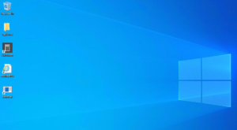

If you have been using redirected desktops or some form of mandatory profile in your on-prem Active Directory environment using GPO, you may ask yourself how you will manage desktop icons and shortcuts in Intune? This was a question I faced myself, how can we easily control what icons and shortcuts a user see's on their desktop of fully Intune managed devices? It's actually not that hard thanks to the work of Florian, who runs the [scloud blog](https://scloud.work/en/). Let's go over the implementation and how you can use this to manage the desktops of your Intune devices.

## Download the Desktop Icon Script Package

To start, we need to download the script package that we will use to deploy desktop shortcuts to our Intune devices. Head over the the [scloud GitHub page](https://github.com/FlorianSLZ/scloud/tree/main/DesktopShortcut) to download this.

The important parts of this package are broken down here.

- **install.ps1** - This script is what does the heavy lifting of copying the icons, cleaning up old icons etc. When you package this as a Win32 app in Intune, you will use this file as your setup and install file.

- **check.ps1** - This is the detection script that will be used by the Win32 app to verify that the device has the latest desktop icon package.

- **Link-list.csv** - In this file you can put website links and also a custom .ico file that will go in the Icons Folder. Web links put in this CSV file will be added to the users desktop. You don't need to add these to the Desktop folder. This file has one already added as an example.

- **uninstall.ps1** - Removes the icon package and icons, obviously.

- **Desktop Folder** - You will drop the shortcuts you want the user to see into this folder.

- I**cons Folder** - Here you can drop custom .ico files to assign to web links, in case you want them to look different than the default browser icon. There is an example icon file in this directory that is used for the example web link in the link-list.csv file.

## Using the Script to Configure the Intune Desktop Icons

Now that you have the script package, let's go ahead and use it to create a set of managed desktop icons for Intune.

1. Extract the downloaded package somewhere on your system

3. Locate the application shortcuts that you want to appear on the users desktop and copy them to the Desktop folder of the package. You can also copy website shortcuts here if you are good with the icon being the default browser icon.

5. Consider an web links you may want to customize the icon for. If you have some, you will want to edit the link-list.csv file to include them and also put the .ico file into the icons folder.

7. Open up the install.ps1 file for editing.
    - Edit the $packagename variable to be something unique.
    
    - Edit the version number if needed.

9. Open up the check.ps1 file for editing.
    - Edit the $packagename variable to match what you put in the install.ps1 file.
    
    - Edit the version number to match what you put in the install.ps1 file as well.

11. Open up the uninstall.ps1 file for editing.
    - Edit the $packagename variable to match what you put in the install.ps1 file.

## Package Desktop Icons In a Win32 Intune App

Now that you have your shortcuts configured and ready, we need to package it all up into a Win32 Intune app for deployment. You are likely already familiar with this process, in case you're not, check out our post on [deploying PowerShell scripts for Intune](https://credibledev.com/powershell-scripts-in-intune/). Specifically the section about packaging them into Win32 apps. You will want to use the "install.ps1" file as the setup file when using the [Win32 Content Prep Tool.](https://github.com/Microsoft/Microsoft-Win32-Content-Prep-Tool) You will use the "check.ps1" file as your detection method when creating the app in the Intune console.

## Important Notes

**How do you update these shortcuts if you need to make changes once you have deployed them in Intune?** You just need to update the shortcuts in the desktop folder, the version number found in the "install.ps1" and "check.ps1" scripts, while making sure the package name stays the same. Then repackage the Win32 app and deploy along with the updated "check.ps1" file as the detection method.

## Conclusion

That's it, you have migrated from the old on-prem Active Directory method of using redirected desktop to the fully Intune managed way of deploying shortcuts to your end users. You also have a path forward for keeping the shortcuts updated when you need to make future changes.

If you have any questions about this method or other Intune topics, let me know in the comments.
