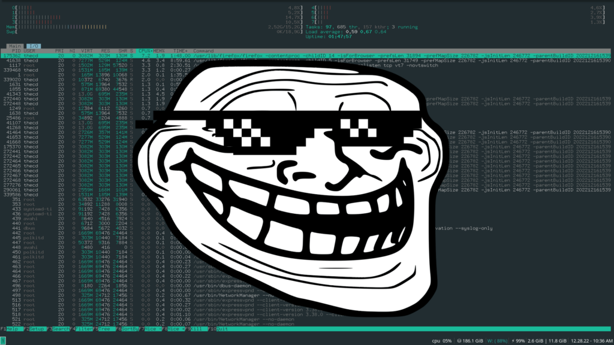

I've heard the Linux elite talk about tiling window managers, like [Manjaro i3 edition](https://manjaro.org/download/), for some time. So I decided to dive into the [i3 tiling window manager](https://i3wm.org/) on my Manjaro desktop, and these are some things I learned.

This isn't really my first dive into a tiling window manager, I've run across some before, likely by accident as I recall. I believe it was an early adventure into Arch that led me to an unpleasant experience with a tiling window manager that I don't remember the name of. Being brought to a desktop where there wasn't really anything to click on and no menu to be found, or so I thought.

I didn't really give this window manager a fair shake, in frustration of not knowing what to do, I installed something more familiar like KDE or Gnome. Ah, finally, a menu and a clickable interface.

Fast forward to last week, I decided to dive straight into the Manjaro i3 version of the window manager by installing the i3 community install of Manjaro. At this point, I had watched a few YouTube videos about i3, which explained how to navigate, use [dmenu](https://tools.suckless.org/dmenu/) and show off their fancy customized bars, backgrounds, and transparency. I love how many of the Linux YouTube folks show htop, even when system performance is not even being discussed, it makes me giggle.



Anyways, let's jump into a few things I've learned so far during my time with the i3 window manager on Manjaro.

## Multiple Display Setup on i3

One of the first things I wanted to tackle before I customized anything was my display setup. I use a laptop, which is connected to an external display. So, sometimes I'm using just the laptop screen, and others I'm using a dual display setup with the external monitor above the laptop.

After searching around online, I found that I could run commands to adjust the display using [xrandr](https://wiki.archlinux.org/title/xrandr). This wasn't too difficult, and plugging the commands in my i3 config file in Manjaro was pretty simple. The issue was switching from one monitor to two monitors, then back to one monitor.

So I continued searching and found some information about the applications [arandr](https://christian.amsuess.com/tools/arandr/) and [autorandr](https://github.com/phillipberndt/autorandr). Wow, after setting this up, it did exactly what I wanted. In i3, when 2 monitors were connected, the displays were extended and my external display was recognized as being above my laptop's built-in display. When I disconnected my external monitor, it recognized this and adjusted it appropriately for one monitor.

### Easy Setup for Multiple Displays on i3

To get started the easy way and save yourself some frustration, install the arandr and autorandr packages.

```
sudo pacman -S arandr autorandr
```

Once you have these packages installed, use dmenu (mod+d) or whatever menu you may have installed, to launch arandr.

In arandr, you can drag your displays around, change their resolution, etc. Go ahead and play around with the settings, once you have things the way you want, click apply and confirm the displays work the way you expect.


Now that you have your displays the way you want them, we will head back to the command line and use autorandr to save this config so it can be automatically restored later.

```
autorandr --save dualdisplay
```

If you're like me, you want another config for when the external display is disconnected, so only the laptop screen is in use. To do this, run arandr again, this time only configure one screen. My external display still showed up in arandr even though it was disconnected. If this happens to you, right-click on the external display in arandr and uncheck the active box to disable it. Then click apply to confirm everything works as expected.

Once you are satisfied with the second config, we will use the autorandr application in the command line again to save the single monitor config.

```
autorandr --save singledisplay
```

### Add autorandr to i3 Config

If you haven't already made your own i3 config in Manjaro, you will want to create a copy of the default config, found here: /etc/skel/.i3/conifg

Copy that default config to this file ~/.config/i3/config

Now that we have our display profiles set up, we can add an autorandr line to our i3 config file. By adding this line, each time we log in, depending on the displays connected, autorandr will adjust accordingly.

```
exec autorandr -c
```

After adding this line and saving the config, you should be all set. Upon reboot, if you have 2 monitors connected, i3 should adjust to extend and position the screens the way that you saved them in arandr. If you have 2 monitors connected, then disconnect one of them, i3 should adjust again.

### Adjust i3 Wallpaper on Screen Change

Something else annoying happened when I set my dual displays. I change the resolution of one of my monitors and when autorandr runs to change it, the wallpaper isn't sized properly.

Manjaro i3 uses nitrogen for wallpaper selection and configuration, which is a nice tool. We just need to make a minor change to our i3 config to fix this issue though. First, you want to configure your wallpaper, which you can do by running nitrogen from the command line or from your chosen menu such as dmenu.

Once you have the wallpaper set up how you like, adjust the autorandr line we added to the i3 config to look like this.

```
exec autorandr -c && exec nitrogen --restore
```

Now, when you reboot the wallpaper will be refreshed after autorandr makes adjustments to your displays.

### Autorandr Display Change Trigger

If you have an issue with the wallpaper whenever a display is connected or disconnected, autorandr has the ability to trigger actions based on this change. This can be done by creating a postswitch script in the ~/.config/autorandr directory.

Create a new file in that directory called postswitch. An example of how I used this to trigger nitrogen to restore the wallpaper is shown below. I added a 3-second sleep because I had issues without it. Feel free to remove this and test it on your own machine.

```
#! /bin/sh

sleep 3
nitrogen --restore
```

After you have created the script, you need to make it executable. This can be done using [chmod](https://credibledev.com/chmod-syntax-in-linux/) in the following way.

```
chmod +x ~/.config/autorandr/postswitch
```

Now, whenever you connect to disconnect a display, nitrogen --restore will be launched.

## Bluetooth in Manjaro i3

I have a bluetooth mouse and I use Apple Airpods on my Manjaro laptop, so making bluetooth available in the i3 status bar was necessary for me and I didn't want to manually launch a bluetooth manager every time I started my system.

Manjaro i3 comes with [blueman](https://github.com/blueman-project/blueman) installed, so I only needed to add a call to the applet in my i3 config file. This provided me with the bluetooth status bar icon where I could easily manage my bluetooth devices.


Add this line to the i3 config file.

```
exec blueman-applet
```

Now, on each reboot, the status bar icon for bluetooth is there and my mouse automatically connects after login.

## Conclusion

For those interested, my current i3 config can be found here (warning: it's nothing fancy): [i3 config Github repo](https://github.com/credibledevcom/dotfiles/tree/master/i3).

My adventure with Manjaro i3 edition has been short so far but I plan to continue using it, so stay tuned for future tips, configs, etc. as I continue this journey. If you have any questions or suggestions, please drop a comment below and let me know! In the meantime, check our recent guide on [Setting up a Yubikey for Manjaro Linux](https://credibledev.com/easy-setup-yubikey-on-manjaro-linux/).
