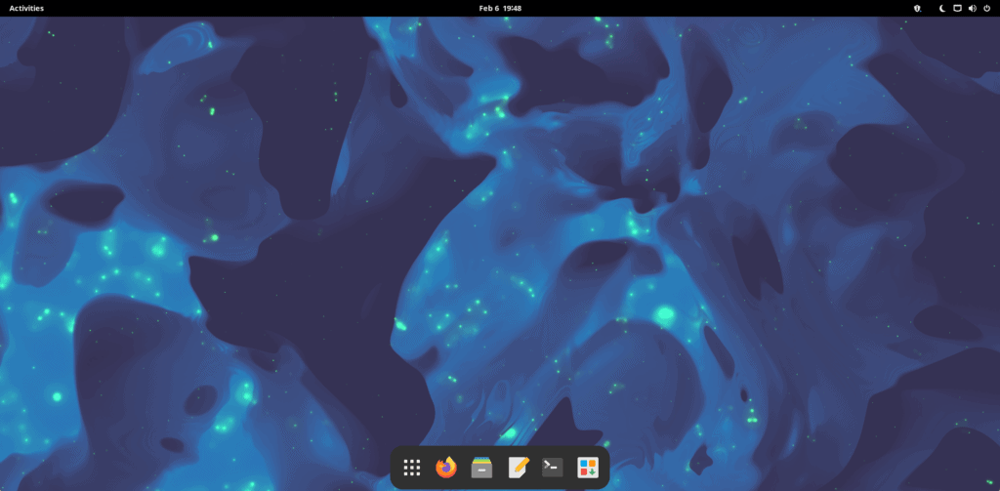

If you want to start a fight between Linux users, just ask them what Linux distro is the best, such as Ubuntu and Manjaro. Sure, you will see some commonality in the answers but you'll also see a lot of arguments over rolling release and LTS. So, in this post, we will compare Manjaro, a rolling release, and Ubuntu, an LTS Linux release. Both of which rank highly on DistroWatch. For this comparison, we will use Ubuntu 22.04 LTS and Manjaro 22.0 GNOME Edition. Why not Ubuntu 22.10? Because it isn't LTS and it's also not the version that a typical new Linux user would download.

## Manjaro Overview

[Download Manjaro](https://manjaro.org/download/)

Manjaro is based on Arch Linux, which is typically reserved for advanced Linux users. Manjaro has changed that by including a user-friendly installer and multiple choices for desktop environments. Stability typically isn't an issue based on my own 2-3 year experience with it as well as community feedback on their very active subreddit.

Manjaro is a rolling release, which means that software packages are released to end users with very little delay. Unlike Arch, Manjaro holds back packages for a week or so before releasing them in their repository. If you want a package faster, you can use the AUR or compile from source yourself.

Manjaro is not as scary or difficult to use or learn as some would have you believe. If you're scared to make the jump, you can always test it out on a Virtual Machine using VirtualBox.

Checking out [DistroWatch](https://distrowatch.com/table.php?distribution=manjaro), you will find Manjaro ranked at #4 currently on the 3 and the 6 month trend for popular Linux Distros. This is a good sign of is relevance and adoption among Linux users and Distro Hoppers.

## Ubuntu Overview

[Ubuntu Download](https://ubuntu.com/download)

If you have read anything or considered Linux in the past, you have definitely heard of Ubuntu. Many would say it is one of the best choices for new Linux users. I beg to differ on this though, I believe there are many other options that are just as good if not better, but that's not the point of this post.

Ubuntu follows a Long Term Support (LTS) release cycle where you get a new release about every 2 years. In between that time, you get security and other important updates but many packages can be quite old. Which means you are missing out on new features but gaining additional stability.

Similar to how we checked out [DistroWatch](https://distrowatch.com/table.php?distribution=ubuntu) for Manjaro's rank, we find Ubuntu ranked in the #7 spot on the 6 month trend of Linux Distros. On the 3 month trend, Ubuntu is found at number 8.

## Manjaro and Ubuntu Comparison

This chart offers a quick glimpse into the comparison of both distros. They are similar in a few different ways but there are some major differences here. Specifically, the release cycle which we have already discussed but also application availability, latest software, kernel version and the ability to deeply customize.

| Feature | Manjaro | Ubuntu |
| --- | --- | --- |
| **Parent Distro** | Arch | Debian |
| **Package Manager** | [pacman](https://credibledev.com/how-to-use-pacman-on-manjaro-linux/) / pamac | apt / Ubuntu Software |
| **Package Repository** | [Arch User Repository](https://credibledev.com/how-to-enable-the-aur-on-manjaro-linux/) (AUR) & Manjaro Repository | Ubuntu Repository |
| **Distro Agnostic Packages** | [Flatpak](https://credibledev.com/install-flatpak-endeavouros-manjaro-arch-linux/), Snap, AppImage | Flatpak, Snap, AppImage |
| **Rolling release** | Yes | No (LTS release every 2 years) |
| **Latest Software Packages** | Yes | No (Exception for Snap and Flatpack) |
| **Default Kernel Version** (2/2023) | 6.1.9-1 | 5.15.0-58 |
| **Gnome Version** (2/2023) | 43.2 | 42.5 |
| **UEFI Support** | Yes | Yes |
| **Secure Boot Support** | Possible | Yes |
| **Available Architecture** | 64-bit, ARM | 64-bit, ARM |
| **Support for Bleeding Edge Hardware** | High | Medium/Low |
| **Multi-Monitor Support** | Yes | Yes |
| **User Community Size** | Medium | Larger |
| **Default Desktop Environment** | KDE Plasma, Gnome, i3, Xfce (Others available) | Gnome (Others available) |
| **Stability** | Stable | Stable |
| **Performance** | Good | Good |
| **Customization** | High | Medium |
| **User-Friendliness** | Good | Excellent |

Ubuntu vs Manjaro Feature Comparison

## Is Manjaro Good for New Users?

If you are a new Linux user, you can still run Manjaro, especially the Gnome, KDE, and XFCE versions. KDE and XFCE will seem the most familiar to a Windows user, while Gnome feels like a tablet OS in my opinion, even in the latest version 43. Personally, I prefer the XFCE and i3 versions.

## Installation

The install process for Ubuntu and Manjaro is very similar. One you have booted into the live environment from a USB, both distros offer an excellent installer that makes installation a breeze. One issue that Manjaro can run into is when secure boot is enabled on the machine. If you are unable to boot into the live environment, this could be the cause. Ubuntu will not have this issue, which may make the installation seem easier to some users.

## Kernel Differences

As you can see in the chart above, there is a major difference between the defaul kernals offered with these two distros. This is what makes Manjaro more compatible with newer and bleeding edge hardware. At the same time, some may say that this is part of what gives Ubuntu it's stability. Speaking from personal experience, I haven't experienced any stability issue using the newer kernel on Manjaro, this could be specific to my hardware though.

## Want Old Software?

Just to give you an idea of how outdated Ubuntu's software repository can be, here are a few examples of application versions available in both Manjaro's and Ubuntu's default repositories. To be fair, Ubuntu will suggest the Snap versions which are typically much more recent versions of the software packages. Although, Snap packages are a whole other discussion. Please enable and use Flatpak instead. That goes for both Manjaro and Ubuntu.

While you can get new and hard-to-find software packages from the AUR on Manjaro, you should [understand the risks involved](https://credibledev.com/how-to-enable-the-aur-on-manjaro-linux/). Most of the time, Flatpak's are a much better choice in addition to the built-in official Manjaro repository.

| Software Title | Ubuntu | Manjaro |
| --- | --- | --- |
| Gimp | 2.10.30 | 2.10.32 |
| OBS Studio | 27.2.3 | 29.0.0 |
| LibreOffice | 7.3.7 | 7.4.5 (libreoffice-fresh) |

Ubuntu vs Manjaro Software Versions

## Package Management

Both APT and pacman are simple to use from the command line. Ubuntu and Manjaro offer GUI package managers as well, sadly Ubuntu Software is a slow experience. Pamac is available on Manjaro and it provides a decent experience for managing your applications.

## Documentation and Support

Ubuntu has been around for a really long time and throughout that time the community and documentation have grown. You won't have any trouble finding information and support for Ubuntu. While Manjaro is not as mature as Ubuntu, it benefits from the Arch Wiki but also has it's own Wiki as well. You will also find the subreddit and forums to be quite helpful. One benefit to Manjaro is that the user base tends to be more technically inclined, so the help can be superior in that aspect. Not to say that Ubuntu users aren't technically inclined at all.

## Which Distro Should You Choose?

That is a tough question to answer in a generic one size fits all way. The decision is based more on what you value, is it stability or having a Linux distro that is compatible with all of the latest hardware and has the latest software? There are some trade-offs there for sure, while Ubuntu is known to be stable, Manjaro has been quite stable for me and many others. If the device you are using is mission-critical, you probably don't want to use Manjaro, but if this is an everyday personal PC or Laptop, I'd say give it a shot. This isn't to say that I would go installing Manjaro on my grandmothers computer though LOL.
