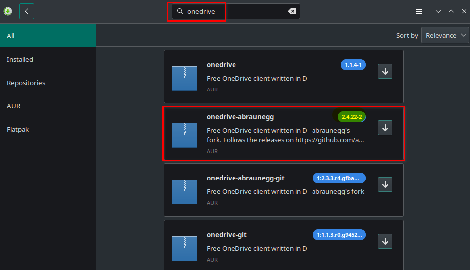
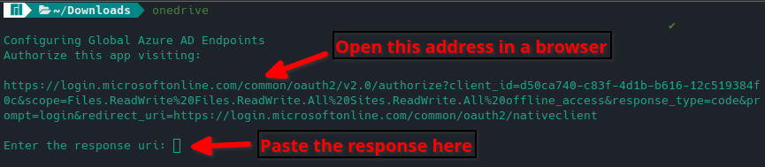
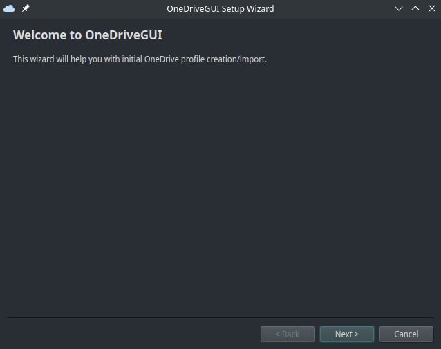
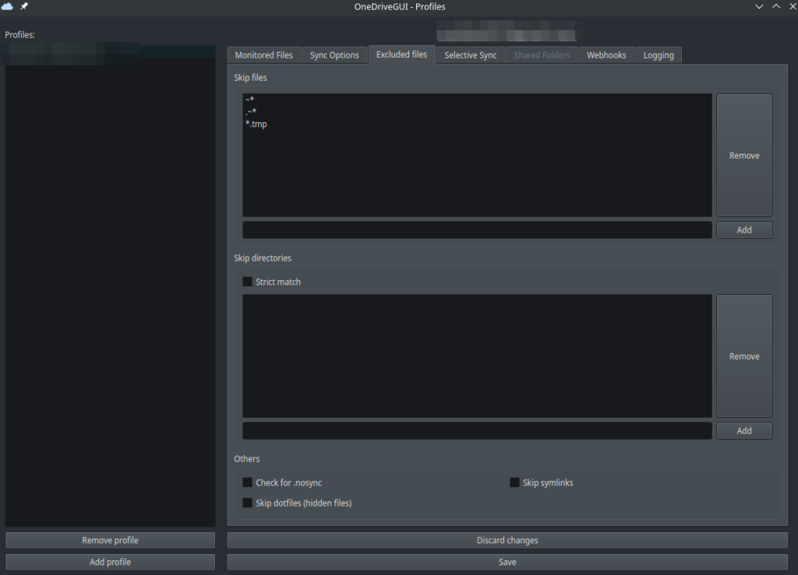
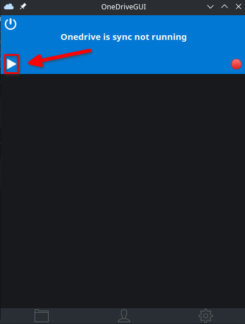
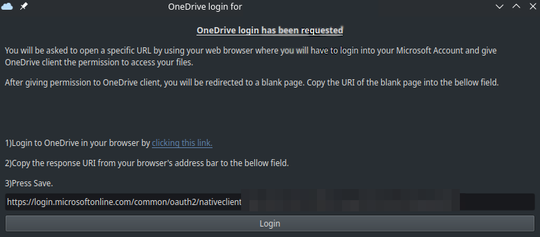
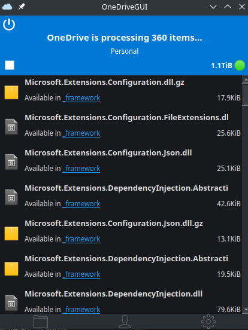

Using Ubuntu? Check our [Guide to Install OneDrive on Ubuntu](https://credibledev.com/install-onedrive-gui-on-ubuntu/)

OneDrive for Linux is a thing? Yes, yes... I know. Why would you want to install a Microsoft product on Linux? Well, if you’re like me, work and school are both heavily in the Microsoft ecosystem. So, I don’t mind and it makes my life easier if I can have access to OneDrive on my Linux machine.

If you really want to make other Linux users' blood boil, check out our guide on installing [Microsoft Edge on Manjaro Linux](https://credibledev.com/how-to-install-edge-on-manjaro/).

If you fit into this box too, I will show you how to install and set up OneDrive on Manjaro Linux. We will explore both the command line tool and an optional GUI tool for managing OneDrive as well. Both of these projects are open source, so if you want to help make them better, you can!

Let’s go ahead and get started.

## **Install OneDrive on Manjaro Linux**

The first thing we need is the core [OneDrive for Linux](https://abraunegg.github.io/) component, which is provided by a user called [abraunegg](https://github.com/abraunegg). This tool is really all you need to set up and run OneDrive on your Linux machine. It can be installed from the AUR repository in the GUI software manager or from the command line. Make sure you have AUR repository enabled in the preferences of the software manager before proceeding.

It’s important that you install version 2.4.15 or higher if you plan to use the optional GUI component. Current version as of this writing is 2.4.22

### Command Line Install

To install the core component of OneDrive for Linux, open up your terminal and run the following command. If you don't already have it installed, you will need an [AUR helper like yay](https://github.com/Jguer/yay) installed.

```
yay -S onedrive-abraunegg
```

### Software Manager Install

In order to install the OneDrive for Linux core component using the graphical software manager, search for onedrive and make sure you have the AUR repository enabled in the preferences.



## Configuring OneDrive from the Command Line

If you plan on installing the OneDrive GUI, skip ahead to the next section, as the rest of the setup is simpler via the GUI.

To get started, open up a terminal and run the following command below. This will give you a URL that you need to open in your browser. When you open the link, you may be prompted to log in to your OneDrive account. Log in if prompted, then you will be redirected to a blank page. Here, you want to copy the URL in the address bar, then paste it back into the terminal where it’s asking for a response URI.



If everything is good, you should receive a message in the terminal saying that the OneDrive for Linux application is now authorized. We can now proceed with syncing. First, we can do a test sync, which is called a dry run, by running the following command.

```
onedrive --synchronize --verbose --dry-run
```

If no errors were observed and everything looks ok, we can proceed with a real sync of OneDrive on Linux. By running the following command, everything in your OneDrive will be downloaded to your local machine in a OneDrive folder within your home directory.

If you only want to sync a single directory, check out the other command listed in the section below.

```
onedrive --synchronize
```

### Other Command Line Options

If you would like to only sync one directory you can run the following command.

```
onedrive --synchronize --single-directory 'directoryname'
```

There are many configurations that you can do to customize how OneDrive syncs on Linux, these are outside of the scope of this simple introduction. I would suggest you head over to this [documentation page](https://github.com/abraunegg/onedrive/blob/master/docs/USAGE.md) on the official GitHub repo for the project.

## Install OneDrive for Linux GUI App

This part is optional, the GUI app is nice to have and if you wish to install it you can grab the AppImage from the [official GitHub repo](https://github.com/bpozdena/OneDriveGUI/releases).

Once you have the AppImage downloaded, you will need to make it executable by running the following command in the terminal where you downloaded the file.

```
chmod +x OneDriveGUI-1.0.1_fix59-x86_64.AppImage
```

Now you can simply run the GUI app by double-clicking the file or running the following command. Once you run it, you will be taken through a setup wizard that will get you started.



This wizard will walk you through initial profile creation, then you will have a chance to configure any sync options for OneDrive prior to the first sync. The GUI application offers many advanced options such as select file/directory sync, rate limit, file permissions, download only, upload only, and many more.



When you're ready, you can begin a sync through the GUI interface by clicking the play icon.



After starting the first sync, you will be prompted to link your OneDrive account. This is done by opening the link provided in the app, logging into your OneDrive account, and then you are taken to a blank page where you will need to copy the URL in the address bar and paste it into the app.



After you complete this step, your OneDrive account is now linked to the app and the sync can begin. You will be shown a status of the number of files being downloaded and a list of those files. This provides a familiar look and feel to the Windows version of the OneDrive GUI client.



## Conclusion

That's it, you broke the Linux code of ethics and installed a Microsoft product on your Linux machine. Some of us just like to live by our own rules and that's ok. If you have questions about installing or using OneDrive on Linux, let me know in the comments!
