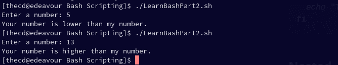
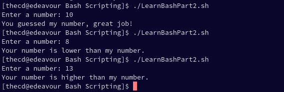

This guide is part of a series, be sure to check out the other parts as well.

- [Part 1 - Introduction to Bash, Variables, Comments, User Input](https://credibledev.com/beginners-guide-to-bash-scripting/)

- Part 2 - If/Else Statements, Looping (This Page)

- [Part 3 - Functions in Bash](https://credibledev.com/part-3-beginners-guide-to-bash-scripting/)

- [Part 4 - Creating Menus in Bash](https://credibledev.com/part-4-beginners-guide-to-bash-scripting/)

In this part, we will be covering the following topics related to **Bash scripting** on Linux.

- If/Else Statement

- Loops

Being able to control the flow, do comparisons, make decisions and loop are all core parts of any programming or scripting language. Bash offers all of these and if you're already familiar with other programming and scripting languages, you will pick up the syntax pretty easily. Let's jump in with if/else statements, you will find many **example bash scripts** below to help you.

## If/Else Statements in Bash

An **if/else statement** is exactly what it sounds like. If this, do that, else do this. It's a way to run some sort of check, like a comparison, and take a certain action based on the result of the comparison. Imagine having the user input and number, then we check if the number entered is higher or lower than our number. That's what we will do here as an example. Crack open your text editor and put in the following code.

```
mynum=10
read -p "Enter a number: " usernum

if [[ $usernum -lt $mynum ]]
then
    echo "Your number is lower than my number."
else
    echo "Your number is higher than my number."
fi
```

### Syntax for IF Statement

You'll notice that we start the if statement with "if" followed by our comparison. Our comparison is wrapped in double brackets and we use "-lt" as less than. Out action when this is true comes after the "then" keyword and our false action comes after the "else" keyword. We end the if statement block with "fi", clever huh?

### Basic IF Statement

```
if SOME CONDITION
then
  DO THIS
else
  DO THIS
fi
```

So if we run the example code we had above, this is the output we will see.



### Using Elif (Else If) in Bash

We can take this a bit further, just like in many other languages, using "elif". This is an else if condition so we can chain another condition into our if statement. Using our previous example, implementing "elif" may look something like this. The "-eq" comparison operator shown here means equal.

```
mynum=10
read -p "Enter a number: " usernum

if [[ $usernum -eq $mynum ]]
then
    echo "You guessed my number, great job!"
elif [[ $usernum -lt $mynum ]]
then
    echo "Your number is lower than my number."
else
    echo "Your number is higher than my number."
fi
```



Get creative, you are not limited to just comparing numbers, you can do much more.

### Bash Comparison Operators

In addition to what you have already seen, there are other comparison operators that you can use in your scripts. Note that the operator is different if you are working with strings. This list is not all inclusive, there are many other operators available in bash, such as "-d" to check if a directory exists or "-e" to check if a file exists.

| Operator Example | Operator Description |
| --- | --- |
| 1 -eq 1 | Equal (numbers) |
| 1 -ne 2 | Not Equal (numbers) |
| 1 -lt 2 | Less Than (Numbers) |
| 2 -gt 1 | Greater Than (Numbers) |
| 1 -le 1 | Less Than or Equal To (Numbers) |
| 2 -ge 2 | Greater Than or Equal To (Numbers) |
| "abc" = "abc" or == (depends on syntax) | Equal (strings) |
| "abc" != "def" | Not Equal (strings) |
| "a" < "b" | Less Than (strings) |
| "b" > "a" | Greater Than (strings) |
| \-n "abc" | String is not empty |
| \-z "" | String is empty |

Bash Comparison Operators

### Using AND and OR in Bash

Like many other languages, you can chain conditional together with AND (&&) and OR (||) for more complex checks. Below is an example of multiple conditionals using AND (&&).

```
lower=10
upper=20
read -p "Enter a number: " usernum

if [[ $usernum -gt $lower ]] && [[ $usernum -lt $upper ]]
then
    echo "Your number is between 10 and 20"
else
    echo "Your number is not between 10 and 20"
fi
```

## For Loop in Bash Scripting

Looping is an important function and there are multiple types of loops available. The first one we will look at is the **for loop**. For loops in bash can be slightly confusing at first if you have experience with another language. The good thing is that there are multiple variations of the for loop, so you can choose the one that best suits you.

### Standard For Loop

```
for n in 1 2 3 4 5 6;
do
  echo $n
done
```

The code above is a basic for loop in bash. This code will loop over the numbers 1 through 6, assigning them one at a time to the variable n, which will be printed 1 time on each iteration. The result is the numbers 1 through 6 being printed as shown below.


### For Loop Over a Range

The next type of for loop in bash is to loop over a range. Similar to the last example, we can loop over 1 through 6 again, but in a different way. We put our range between curly braces such as {1..10} to run our loop 10 times. A catch with this method is that you cannot use variables in the defined range. So you can't say something like {$start..$finish} for example. If this is something you need to do, take a look at the more familiar for loop version in the next section.

```
for n in {1..6};
do
  echo $n
done
```

If you run this code, the output will look exactly the same as the last example.

We can also define the increment value which is set to 1 as default. So if we want to count by 2's, we can use a range like this, {1..6..2}. Let's look at an example.

```
for n in {1..6..2}
do
  echo $n
done
```

As you can see in the output below, we start with 1 and then skip a number before printing the next.


### C Style For Loop in Bash

This is my favorite type of for loop in bash, mainly because it's the one that looks the most familiar and readable to me. So if you come from a programming background, it's likely that this format will appeal to you.

#### Basic Syntax

```
n=10
for ((i=0; i<$n; i++));
do
  echo $i
done
```

To me, this looks more like a for loop than any other variation in bash scripting. When you read it out loud, it just makes more sense to me as well. For i is equal to 0, and i is less than n(10), do this and then increment by 1.

## Continue Statement

Being able to have more control from within the for loop is important and the "continue" statement is one way we can achieve this. The continue statement is used in other programming languages so you may be familiar with it already. When you use "continue", you are not breaking out of the loop completely, you are just jumping to the next iteration of the loop. If you need to break out of the loop altogether, you can use the "break" statement, which is discussed in the next section.

```
n=10
mynum=6
for ((i=0; i<$n; i++));
do
  if [[ $i -eq $mynum ]]
  then
    echo "You found my number, it is $mynum"
    continue
  fi
  echo $i
done
```

When you run this script, you will notice that we print each value until we get to the number 6, when our comparison is true. At this point, we don't print the number by itself as we did for the other numbers. This is because the continue statement runs, which jumps to the next iteration, skipping the "echo $1" statement.

## Break Statement

The break statement is useful when we need to end the loop completely. In our last example, we looped over the numbers 0 through 9 and wrote a special statement when we found the target number, 6. What if we want to just end the loop when we find the number? That's where the break statement comes in, let's do that now. Swap out continue for break instead, then run the script again.

```
n=10
mynum=6
for ((i=0; i<$n; i++));
do
  if [[ $i -eq $mynum ]]
  then
    echo "You found my number, it is $mynum"
    break
  fi
  echo $i
done
```

Notice how now, the loop completely stops when we reach the number 6. Exactly what we wanted.

## Other Loops in Bash Scripting

A for loop is not the only type of loop you can use in bash scripting. Like many other langauges we have the "while" loop and also the "until" loop. Let's take a quick look at those.

### Bash While Loop

The **while loop** is useful, as it allows us to loop until some condition is no longer true. Careful not to create an infinite loop, you need to make sure that your condition becomes false at some point.

#### Syntax for the While Loop

```
n=0
while [[ $n -ne 5 ]];
do
  echo $n
  ((n++))
done
```

Our while loop will loop and print the value of n, starting at 0 until the condition is false. The condition becomes false when the variable n is equal to 5 and on each iteration we increment n by 1, at which point the loop stops.

### Bash Until Loop

Another type of loop is the **until loop**, which is similar to the while loop. The until loop will run until the condition is true, unlike the while loop which ran until the condition became false. If we use the same example as before, we swap out "while" with "until" and flip our conditional check to be equal instead of not equal.

#### Syntax for Until Loop

```
n=0
until [[ $n -eq 5 ]];
do
  echo $n
  ((n++))
done
```

## Conclusion

Check out [Part 3 of the Beginner's Guide to Bash Scripting](https://credibledev.com/part-3-beginners-guide-to-bash-scripting/) where we discuss how to use functions.

Looping and conditionals are important tools that help us control how our script runs and allow it to make decisions. Explore mixing loops with if statements and see what you can create.
