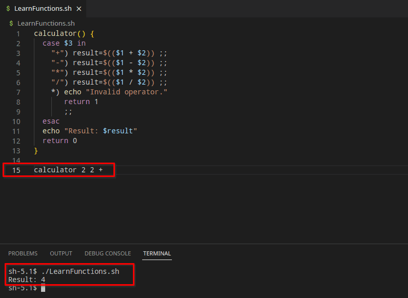
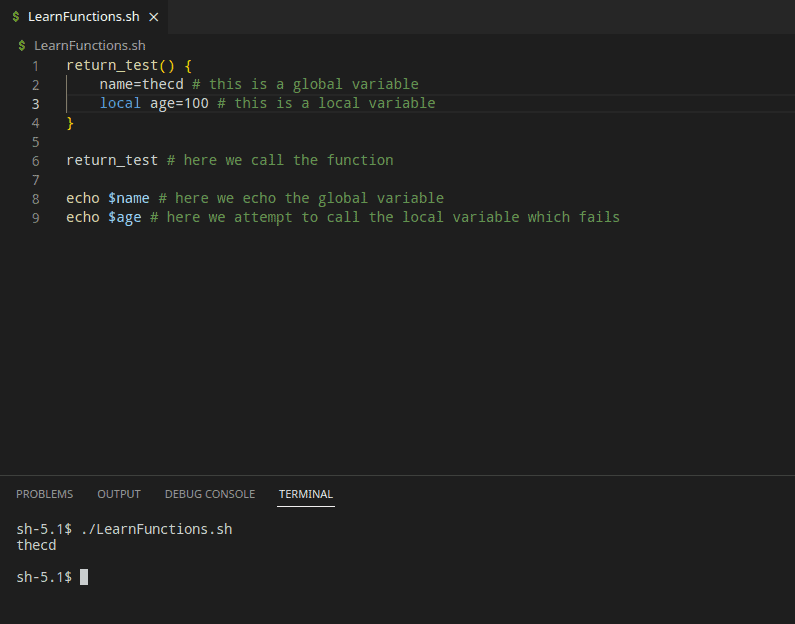
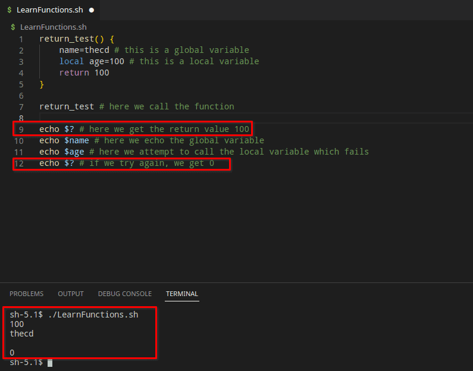
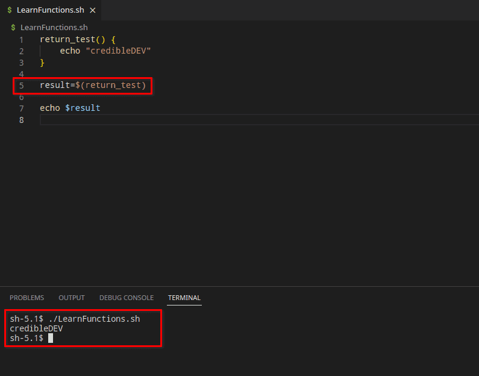

This guide is part of a series, be sure to check out the other parts as well.

- [Part 1 - Introduction to Bash, Variables, Comments, User Input](https://credibledev.com/beginners-guide-to-bash-scripting/)

- [Part 2 - If/Else Statements, Looping](https://credibledev.com/part-2-beginners-guide-to-bash-scripting/)

- Part 3 - Functions in Bash (This Page)

- [Part 4 - Creating Menus in Bash](https://credibledev.com/part-4-beginners-guide-to-bash-scripting/)

Welcome back to Part 3 of our **Beginners Guide to Bash Scripting**. In this guide, we'll be talking about **functions in bash scripting**.

Functions are a very important part of any programming or scripting language. A function can be thought of as a block of code that you give a name to and it can be run multiple times without having to rewrite the code. This allows you to reuse the same code in a clean and efficient manner. So whenever you have repeated code, you should consider using a function instead.

Functions can also take parameters or arguments, these parameters are data that you pass into the function. The function can manipulate this data or really whatever you want. Consider a calculator function, you pass in two numbers and what math operation you want it to do, then the function returns the result of the calculation.

Let's take a closer look at functions in bash scripting.

## Syntax for a Bash Script Function

If you have used other programming or scripting languages, then functions in bash scripting will look familiar and work in a similar way. Here is the basic syntax for a bash function.

### With the Function Keyword

```
# Declare a function using the "function" keyword, then give the function a name
function function_name() {
  # This is the body of the function where we put the code we want to execute
  some_command
}
```

### Without the Function Keyword

```
# This example omits the function keyword and just has the function name
function_name() {
  # This is the body of the function where we put the code we want to execute
  some_command
}
```

### Single Line Bash Functions

You may prefer to declare a short function in bash on a single line, this is valid in bash scripting. When using the single-line function syntax, be sure to include a semi-colon after your function body as shown in the example below.

```
function_name() { some_command; }
```

## How to Call or Execute a Bash Function

In order to call or use the bash function shown above, we simply use its name in our script.

```
function_name # No () or anything are needed, just the name of the function
```

## Bash Script Function Example

Let's take a look at a real **example of a bash script function**. This function is the calculator that I referenced earlier in this post.

```
calculator() {
  case $3 in
    "+") result=$(($1 + $2)) ;;
    "-") result=$(($1 - $2)) ;;
    "*") result=$(($1 * $2)) ;;
    "/") result=$(($1 / $2)) ;;
    *) echo "Invalid operator."
       return 1
       ;;
  esac
  echo "Result: $result"
  return 0
}
```

This calculator example will take three parameters or arguments. The first argument is the first number, then another number, and the third is the mathematical operator you want to use. There is limited error checking done here, just checking for an invalid operator, we do not verify the first two arguments are actual numbers. How would you call this bash function with arguments?

## Using Arguments in a Bash Function

Bash works a bit differently when it comes to arguments in a function as you can tell from the above example. Typically, when you declare a function you would also include the possible parameters, such as "function\_name(int x, int y, string z)" for example. In bash, you don't declare the arguments in the function definition at all. We simply refer to parameters within the body of the function using a "$" followed by the number of the argument in order starting with 1.

In the example above, you can see that we use arguments $1, $2, and $3. The "case" statement and usage may be unfamiliar to you and that's ok, we will cover it in a future lesson. For now, just understand that for the case we are looking at the 3rd argument which is our mathematical operator. We compare the 3rd argument with the available options +, -, \*, or /.

## Calling a Bash Function with Arguments

So, how do we call this function with three arguments? **Calling a bash function with arguments** is also different than other languages. In other languages, you would call a function like this "function\_name(1, 2, "+")" for example. In bash, we don't use parenthesis or commas. To add "2+2", this is how the function call would look.

```
calculator 2 2 + # We make sure to put spaces between each argument.
```

If you add that line to the bottom of the script we used above you should see "Result: 4" output in the terminal. It's important to note that in bash scripts you must declare the function before you use it. If you call a bash function before declaring it, you will get a "command not found" error message.



## How to Return Values in Bash Functions

Using return values in bash functions is a bit different than in other programming languages too. One of the simplest methods to return something from a function is to set a global variable. By default in bash, all variables declared inside of a function are global. This is another difference when comparing bash with other languages. If you want the variable to be local to the function, you must use the "local" keyword before the name of the variable.

### Return Using a Global Variable

In the example below, we simply set a global variable and a local variable inside the function body, then reference both variables outside of the function itself. Notice that we fail to get the value of the local variable since it is only valid from within the function body. In order to reference the global variable, we must first call the function.

```
return_test() {
    name=thecd # this is a global variable
    local age=100 # this is a local variable
}

return_test # here we call the function

echo $name # here we echo the global variable
echo $age # here we attempt to call the local variable which fails
```



### Using the Return Keyword

In most programming languages, you can use the "return" keyword to return some type of data. In bash, you can only return a numeric value such as an exit code. You also must access this return value immediately after running the function. In the example below, you'll see that we return 100 and it shows up in the output the first time. The next time we try to access it, we get 0 instead of 100. This is because we access the return value using the special variable "#?". This variable gives us the exit code of the last thing that bash ran. The second time we call "#?", the function was no longer the last thing that ran, which is why we don't get 100 as you might expect.



### Assign the Output of a Function to a Variable

One last example of getting a return value from a function is to assign the result to a variable. In this **bash function example**, we echo "credibleDEV" in the body of the function, then we assign the function to a variable rather than calling it as we have been.

```
return_test() {
    echo "credibleDEV"
}

result=$(return_test)

echo $result
```



## Conclusion

That's it for part 3 of the beginner's guide to bash scripting. Stay tuned for part 4 as we continue learning! Give us a follow on [Twitter](https://twitter.com/thecredibleDEV) so you don't miss out and check out our [YouTube channel](https://www.youtube.com/@credibledev) as well for more content!
