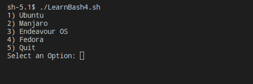
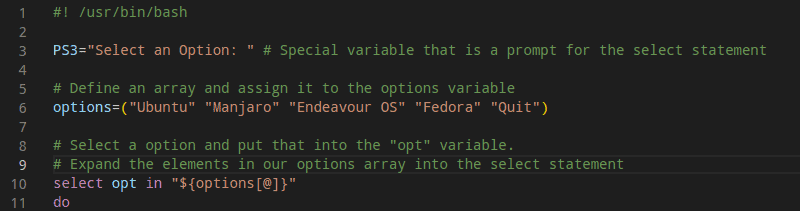
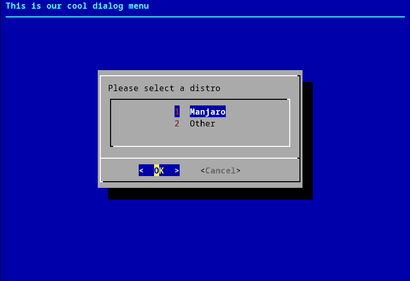

This guide is part of a series, be sure to check out the other parts as well.

- [Part 1 - Introduction to Bash, Variables, Comments, User Input](https://credibledev.com/beginners-guide-to-bash-scripting/)

- [Part 2 - If/Else Statements, Looping](https://credibledev.com/part-2-beginners-guide-to-bash-scripting/)

- [Part 3 - Functions in Bash](https://credibledev.com/part-3-beginners-guide-to-bash-scripting/)

- Part 4 - Creating Menus in Bash (This Page)

In this part, we will be covering how to create menus in **Bash scripting** on Linux. We will first cover a basic menu that is really simple to set up and use but also flexible and works for most cases. We will also go over a more advanced menu that offers a very different user experience which is more like a GUI, just in the terminal instead.

## Basic Bash Menu

The basic menu will make use of echo, case, and select statements to allow our users to make choices and take action based on that choice. No additional packages are needed to set up this style of menu in your bash script, everything you need is already part of your Linux system.



```
#! /usr/bin/bash

PS3="Select an Option: " # Special variable that is a prompt for the select statement

# Select a option and put that into the "opt" variable.
select opt in Ubuntu Manjaro "Endeavour OS" Fedora Quit
do
# The opt variable is then used for matching in our case statement
    case $opt in
        "Ubuntu")
            echo "You chose $opt";;
        "Manjaro")
            # If the user types 2 at the prompt, the following echo statement is ran
            echo "You chose $opt";;
        "Endeavour OS")
            echo "You chose $opt";;
        "Fedora")
            echo "You chose $opt";;
        "Quit")
            # If the users types 5, the echo statement runs and then the menu ends
            # this is because we use "break", which exits the case block.
            echo "Exiting...."
            break;;
        *)
        # This is the default option, in the case that the user enters
        # something that doesn't match anything above.
        echo "Sorry, your choice was invalid. Please Try Again.";;
    esac
done
```

Let's break down what is going on in this script, starting with the "PS3" variable that we have at the start.

### PS3 Variable

PS3 is a special variable in bash that is tied to the select statement. PS3 represents the prompt that we want to use in conjunction with the select statement. This prompt will be displayed to the user after the menu displays on the screen.

### Select Statement

Next, we have the "select" statement. This statement takes in a list of possible choices. If one of your list items has a space, be sure to wrap it in quotes as you see in the example above. You can also include numbers or variables as items instead of strings. What do we want to do with the selection that the user makes? In this instance, we are feeding it into a case statement.

### Case Statement

The case statement, which we saw briefly in the previous lesson, matches on the menu option the user chooses. The script falls through the options until a match is found, if no match is found then it falls to the default represented by the asterisk. When a match is found, the commands after the closing parentheses and before the double semi-colon are executed. The double semi-colon represents the end of the commands that should be executed for that specific option. We end the case statement block with case backward, "esac" and then we end the entire select block with "done".

## Using an Array

If you have a lot of options, the select statement could get pretty long and ugly. An alternative to listing your options in the select statement is to put them into an array. You can then use that array in the select statement.

### Create a Bash Array

We need to create an array with the same menu options as before, then assign it to a variable called "options". In bash, you separate each element of the array with a space.



```
options=("Ubuntu" "Manjaro" "Endeavour OS" "Fedora" "Quit")
```

To use this array, we need to update the select statement. We will "expand" the array inside the select statement using "\[@thecd\]".

```
select opt in "${options[@]}"
```

## Advanced Bash Menu

To give ourselves more options in creating our bash menu, we can use an additional package called "dialog". This package is available on most Linux distributions, you can install it using [pacman](https://credibledev.com/how-to-use-pacman-on-manjaro-linux/), apt, dnf etc. Be sure to install it before proceeding. [Dialog has a large man page](https://linux.die.net/man/3/dialog) that outlines the many options that it provides, be sure to look over that.

There are some applications out there that you may have used before that have similar menus to the one we are about to create. Such as part of the MySQL setup for example.



```
#! /usr/bin/bash

dialog \
    --backtitle "This is our cool dialog menu" \
    --menu "Please select a distro" \
    10 40 3 \
    1 "Manjaro" \
    2 "Other"
```

Go ahead and put this code in your editor and save it. You will need to run this in an actual terminal, not something like the built in terminal in VS Code for example, as it won't work properly there.

You'll notice that the "--backtitle" is shown at the very top of the window. The next line, "--menu" is telling dialog that we want a basic menu and then provides text that will display directly above the menu options. The numbers listed on the next line represent the height, width, etc. which dictate how the menu is sized.

The remaining lines are our menu options, one and two. The text next to them for Manjaro and Ubuntu will be listed in the menu as well.

### How Do We Get Data Back?

So, you may be asking yourself how do we get the option the user chose? The easiest way is just to set the dialog itself to a variable and then reference that variable wherever you need, like a case statement we've used before maybe. The important thing to know about the dialog is that the choice the user makes goes to the standard error output stream. So we need to redirect that in order for this to work.

```
#! /usr/bin/bash

choice=$(dialog \
    --backtitle "This is our cool dialog menu" \
    --menu "Please select a distro" \
    10 40 3 \
    1 "Manjaro" \
    2 "Other" \
    3>&1 1>&2 2>&3 3>&-)

echo "$choice"
```

Output redirects are common in bash scripts and here we will use 3>&1 1>&2 2>&3 3>&- to essentially redirect standard error (2) to standard output (1) but we need to create a temporary file descriptor (3) to accomplish this. What we are doing is creating the new file descriptor (3) and pointing it to the standard output, then we redirect the standard output (1) to standard error (2) and finally redirect standard error (2) to our temporary file descriptor (3). The last part cleans up the temporary file descriptor we used.

When running this modified version, once you choose a menu option, it is loaded into the "choice" variable and output to the screen. In a real application, you may want to use this variable in a function or case statement for example. You can do much more with Dialog, such as password boxes, work with files, progress bars, and more.

## Conclusion

Menus are an essential part of many bash scripts, especially those that require user input such as an installer. Get creative with your installer and be sure to check out the documentation for Dialog to get more ideas on how to use it.
