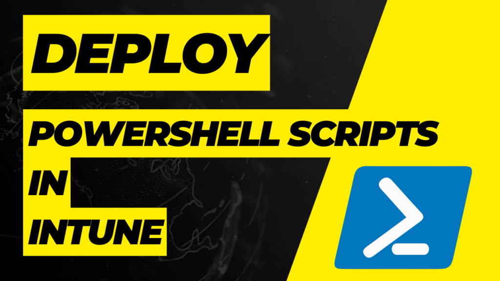

So you need to deploy PowerShell scripts in Intune, also known as Microsoft Endpoint Manager, or MEM? We've got you covered with 3 different ways to get your PowerShell scripts to Intune endpoint machines. We will cover deploying a single PowerShell script to run one time, deploying proactive remediations, and deploying a PowerShell script packaged as a Win32 app.

There are a few reasons you may want to deploy PowerShell scripts to Intune endpoint devices, such as Windows 10 computers and servers.

- Remediate or resolve security vulnerabilities on endpoint devices.

- Use a PowerShell script to install a complex piece of software that needs additional configuration.

- Run a quick script to change registry keys, modify files, or change settings.

Whatever your reason for needing to deploy a PowerShell script, one of these three methods will be perfect for your needs.

## Deploy a Single PowerShell Script to Run One Time

The fastest and easiest method to deploy PowerShell scripts in Intune is to use the "Script" feature found under Devices in the Microsoft Endpoint Manager console. Using this feature, your PowerShell script will run one time and you will get some limited reporting. You will get feedback if the script ran or not, but you will not get reporting on if the script did what was intended necessarily.

Open your browser to the [Microsoft Endpoint Manager/Intune site](https://endpoint.microsoft.com), and click Devices from the menu on the left. Next, find the Scripts link in the Devices sub-menu, and click Add at the top to add your PowerShell script.

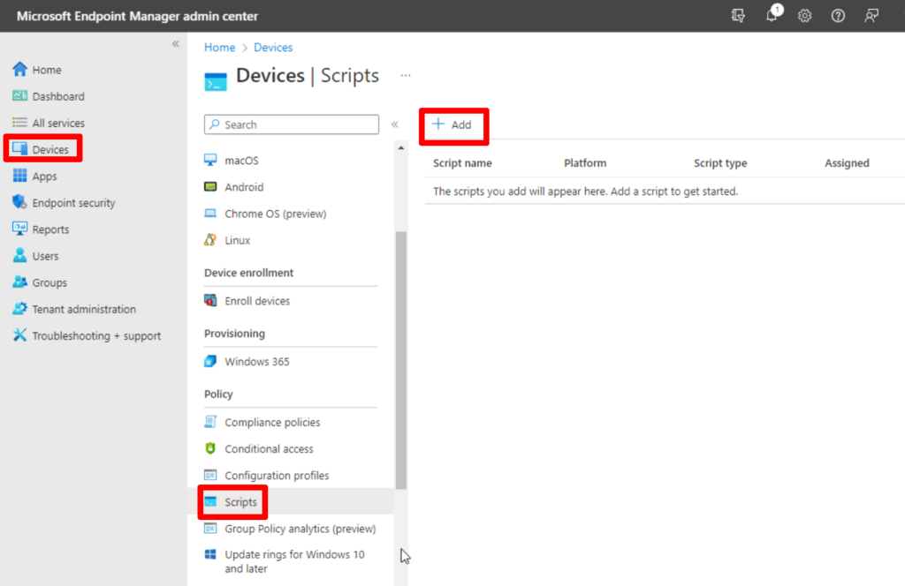

After clicking Add, you will select the platform you are deploying to, either Mac or Windows devices at the time of writing. Next, you will name your script and provide a description. Once this is complete, you will select your PowerShell script file and configure these additional options.

## Configure PowerShell Script Options

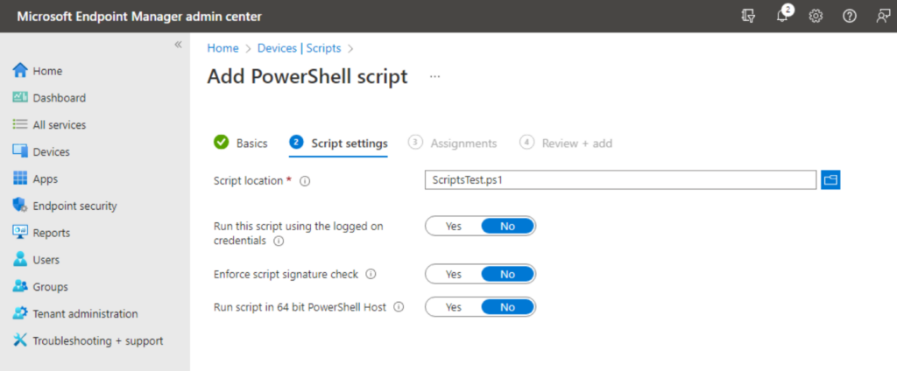

- **Run this script using the logged-on credentials.**
    - This will run the script as the currently logged-in user. Useful for when you need to make registry changes to the HKEY Current User registry hive with PowerShell.

- **Enforce script signature check.**
    - This will enforce code signing restrictions, meaning that your code must be signed. By default, the script will run with the ByPass Execution Policy mode.

- **Run the script in a 64-bit PowerShell host.**
    - In some situations, this may be needed, particularly when modifying registry keys. Without this option, you may be trying to modify keys in the SOFTWARE registry hive and your script is actually modifying the WOW6432Node hive instead.

After you've selected your script and the necessary options, you will then assign the script to users or devices. That's it, now you have your PowerShell script uploaded to Intune.

## Using Proactive Remediations to Deploy a PowerShell Script in Intune

As I stated earlier, Proactive Remediations are perfect for resolving security vulnerabilities. PowerShell scripts that are added to Intune using this method will include a detection script and a remediation script. The detection script is used to verify if the device needs to be remediated, if not, then nothing happens. If the detection script determines the device needs to be remediated, then the remediation script will be run on the device.

### Proactive Remediation Script Requirements

#### PowerShell Script Encoding Format UTF-8

Another important note here is that the scripts must be in UTF-8 encoding format, not UTF-8-BOM which the PowerShell ISE editor typically saves the scripts in. You can use an editor like [Visual Studio Code](https://credibledev.com/install-vs-code-on-manjaro-linux/) or [Notepad++](https://notepad-plus-plus.org/downloads/) to set or change the encoding of a new or existing PowerShell script.

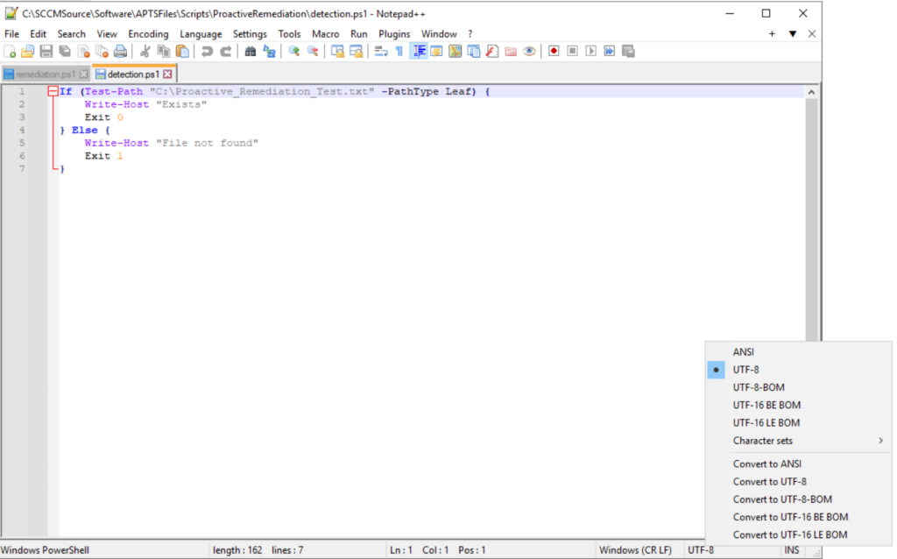

#### PowerShell Exit Code Requirement

For our detection script to work properly, we need to use the proper exit code to tell Intune if it needs to be remediated or not. As you can see in the screenshot above, the script uses "Exit 0" to say no we don't need to remediate and "Exit 1" to say that it does need to be remediated.

- Use **Exit code 1** so that Intune will run your remediation script.

- Use **Exit code 0** to say that remediation is not needed.

In our example PowerShell script below, which we are using for a Proactive Remediation, we are looking for a file located on the C:\\ drive that is named Proactive\_Remediation\_Test.txt. Our detection script checks for the existence of this file. If the file is not found on the device, it returns with "Exit 1", which means the device needs to be remediated. If the file is found, it returns with "Exit 0", which means the machine is good and nothing additional needs to be done.

#### Intune Proactive Remediation - Creating a Detection Script

```
# PowerShell Proactive Remediation Detection Script

If (Test-Path "C:\Proactive_Remediation_Test.txt" -PathType Leaf) {
    Write-Host "Exists"
    Exit 0
} Else {
    Write-Host "File Not Found"
    Exit 1
}
```

#### Intune Proactive Remediation - Creating a Remediation Script

Our remediation script is very simple in this case, as it just creates the text file.

```
# PowerShell Remediation Script

New-Item -Path "C:\Proactive_Remediation_Test.txt" -ItemType File
```

### Creating the PowerShell Script Proactive Remediation Package

To upload your PowerShell scripts and create a proactive remediation, go to reports, then endpoint analytics, and choose Proactive Remediations from the menu. From here, you will click create script package from the top menu.

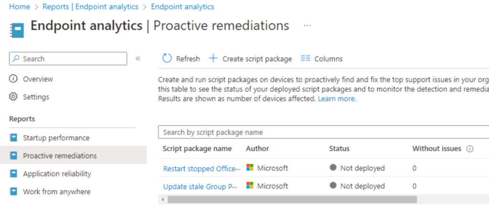

Now you will configure your script package on the following pages.

- Create a name for your script package and provide a description.

- Upload your detection and remediation scripts.

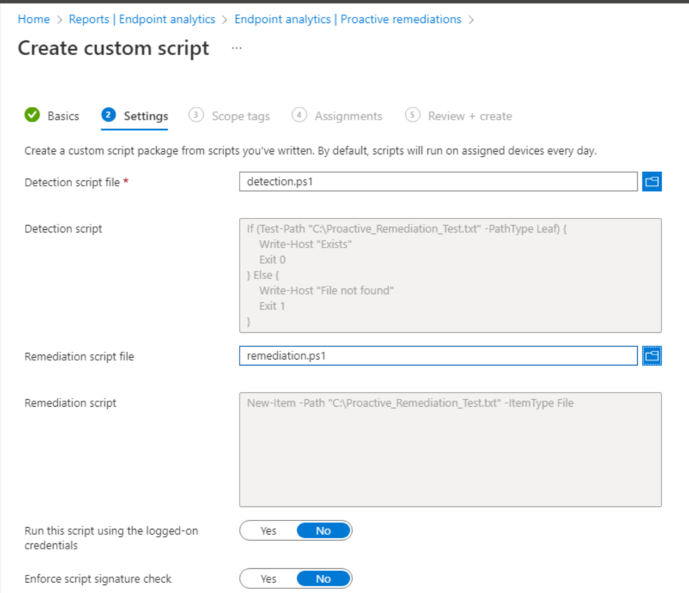

- Configure options such as running the script as the logged-in user, signature check, etc. If you need more details about these options, see the previous section where those were discussed in more detail.

- Apply Scope Tags

- Assign the Proactive Remediation to a specific user or device groups and configure the run frequency. This is how often you want to run the detection on each device.

- Review and Finish, congrats. You have added PowerShell scripts in Intune using Proactive Remediations.

## Deploy PowerShell Scripts in Intune as a Win32 App

Our last method for deploying PowerShell scripts in Intune is to package them as a Win32 app package. This method is very flexible and is commonly used for complex app installs. If you have an MSI that you need to install with further customization, this can be a great option for you.

You can package a single PowerShell script that completes whatever action you need. You should also consider creating a uninstall script that will serve as a way to reverse or remove whatever action your install script completes.

You may also want to consider a detection script that will help Intune detect whether your app is installed correctly or not.

- Install Script (Required)

- Uninstall Script (Optional but recommended)

- Detection Script (Optional depending on what your app does)

### Download the Win32 Content Prep Tool for Intune

To package PowerShell scripts as a Win32 App, we need to use the [Win32 Content Prep Tool](https://github.com/microsoft/Microsoft-Win32-Content-Prep-Tool) provided by Microsoft. Go ahead and download the tool and extract it to a location on your local machine. Using a command prompt, navigate to the directory where you extracted the tool and run the "IntuneWinApp.exe" executable file.

### Using the Win32 Content Prep Tool to Package a PowerShell Script

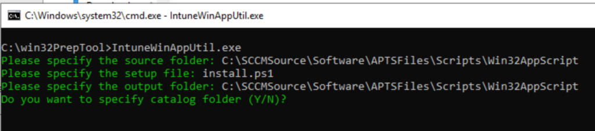

- After running the IntuneWinApp utility, you will be prompted for a source directory, this is the directory where your PowerShell script and any other needed files are.

- Next, you will be prompted for a setup file. If the PowerShell script is the first thing that needs to run, you will input the PowerShell script file name, including the file extensions, such as ".ps1".

- Lastly, you will be asked for the output directory. This is where you want to output the Win32 app package file that will we upload to Intune. This can be anywhere but I typically use the same directory that I used for the source directory. You can answer "no" to the catalog folder option unless you have a specific need for it.

### Creating a PowerShell Win32 App in Intune

At this point, you should have a ".intunwin" file that can be uploaded to Intune. This is how we will use a Win32 app package to get PowerShell scripts in Intune.

In Microsoft Endpoint Manager, click on Apps from the left-side menu. On the Apps page, select "Windows" from the menu and then click "Add" from the top menu.

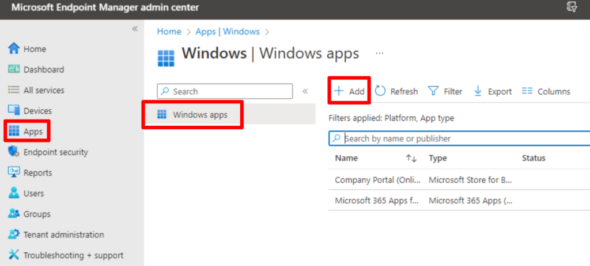

Next, you will select "Win32" as the app type from the dropdown box.

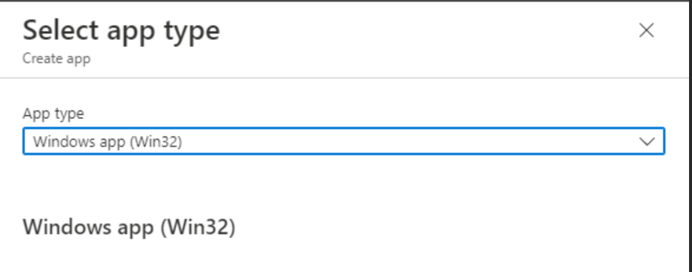

On the following page, you will upload the "intunewin" file that you created using the Win32 Content Prep tool earlier.

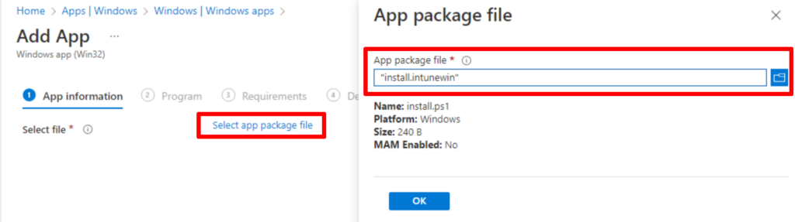

After uploading the package, you will then be prompted to name the app, provide a description, etc. Fill out the required information and proceed to the next page.

We now need to tell Intune how to execute our Win32 PowerShell script package. We do this by calling the PowerShell executable using the ByPass ExecutionPolicy mode and the name of our PowerShell script. In the following example, replace "install.ps1" with your script name. You can use this for the uninstall command as well, just replace the script name.

```
Powershell.exe -ExecutionPolicy ByPass -File .\install.ps1
```

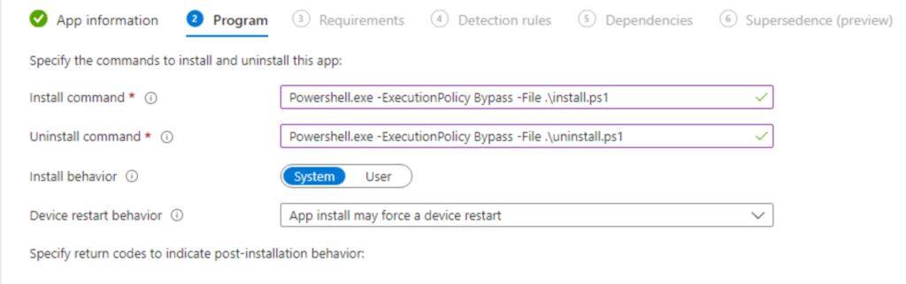

Continue on through the process to configure the required system architecture and the minimum Windows version to target. For the detection rule, if you created a custom detection script, you will upload this here. Otherwise, you can use a built-in option to verify a registry key or that a file or folder exists for example. Finish the setup by assigning the app, and setting up any dependencies or supersedence rules.

## Conclusion

That's it, you now know how to successfully deploy PowerShell script in Intune using three different methods. If you have any questions or need more detail on anything, please leave a comment down below. Thanks!
